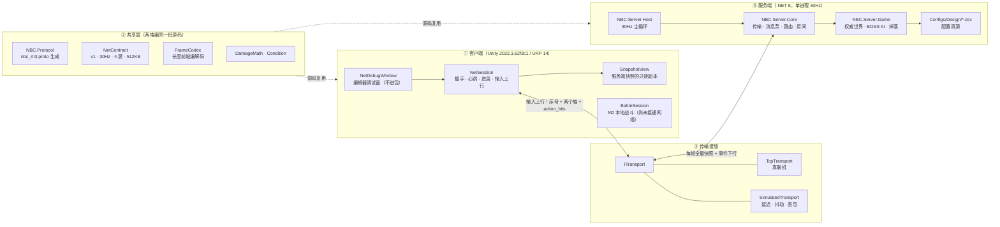
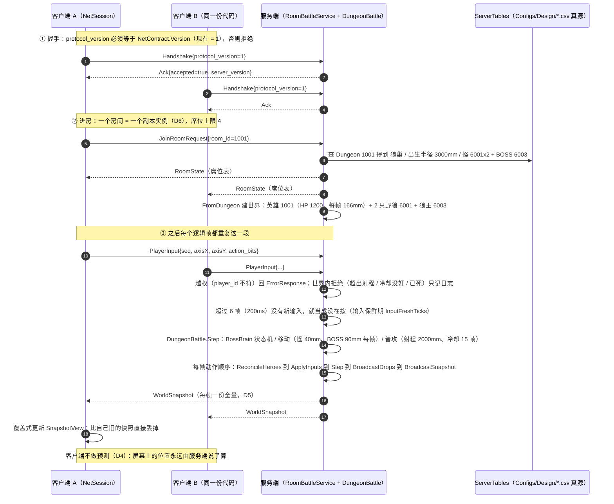

# 图 01 · M3 网络架构与状态同步数据流

> 用途：面试/复习时 30 秒讲清"M3 的网络是怎么搭的、一帧里数据怎么走"。
> 所有数字与文件名都**从代码里抄的**（出处见 §四表格），不是印象。
> 渲染好的图：`out\01-M3网络架构与状态同步-1.svg`（分层）、`-2.svg`（一帧数据流）。

---

## 一、静态分层（谁在哪一层、谁依赖谁）

**这张图要讲的三件事**：

1. **共享层是"同一份源码编两次"**（不是 DLL 互相引用）：`Server\NBC.Shared\NBC.Shared.csproj` 里写的是
   `<Compile Include="..\..\Client\Assets\_Project\Shared\**\*.cs" />`。所以共享层的代码**不准有引擎依赖** ——
   一旦有人写了一句 `Debug.LogWarning`，服务端这边就直接编不过（这就是 `UnityEngineDebugShim.cs` 存在的原因）。
2. **传输是一个接缝（`ITransport`）**：真联机走 `TcpTransport`，测试走 `SimulatedTransport`（注入延迟/抖动/丢包）——
   于是"网络不好"这件偶发的事，能在 EditMode 里**变成必然**。
3. **权威只在服务端**：客户端 `SnapshotView` 是**只读副本**，没有任何"我先猜一下位置"的逻辑（D4）。

---

## 二、一帧里的数据流（30Hz = 每 33ms 走一遍）

**为什么"移动是状态、动作是事件"**：位置每帧都在变，用"全量快照覆盖"最省心（不需要补发、不需要对账）；
而"打了一下""掉了个东西"是**离散事件**，只发生一次，所以单独发事件（`ServerEvent`）。
两者混在一份包里的前提是：**同一 tick 的快照对全房是同一条**，每人只看到属于自己的那部分（D5）。

---

## 三、两种"拒绝"为什么分开

| 情况 | 例子 | 回什么 | 为什么 |
| --- | --- | --- | --- |
| **越权** | 客户端发的 `player_id` 和自己席位不符 | `ErrorResponse` | 这是**不该发生**的事（改了客户端/重放攻击），必须让对面知道并留痕 |
| **世界内拒绝** | 超出射程、冷却没好、目标已死 | 服务端**只记日志**，什么都不回 | 这属于**正常的输赢**（两边看到的位置本来就差几十毫秒），每帧回一条错误 = 刷屏，真错误会被淹掉 |

---

## 四、图里每个数字的出处（都能一键核对）

| 事实 | 值 | 出处 |
| --- | --- | --- |
| 协议版本 | `Version = 1` | `Client\Assets\_Project\Shared\Net\NetContract.cs` |
| 逻辑帧率 | `TickRate = 30`（每帧 33ms） | 同上 |
| 房间上限 | `MaxRoomMembers = 4` | 同上 |
| 长度前缀 | `FrameLengthPrefixBytes = 4`（小端 uint32） | 同上 |
| 单帧上限 | `MaxFrameBytes = 512KB` | 同上 |
| 输入保鲜期 | `InputFreshTicks = 6`（200ms） | `Server\NBC.Server.Game\RoomBattleService.cs` |
| 每帧动作顺序 | ReconcileHeroes → ApplyInputs → Step → BroadcastDrops → BroadcastSnapshot | 同上 `Tick()` |
| 场地半边长 | `PlayAreaHalfExtentMm = 5000` | `Server\NBC.Server.Game\DungeonBattle.cs` |
| 普攻射程 | `BasicAttackRangeMm = 2000` | 同上 |
| 普攻冷却 | `BasicAttackCooldownTicks = 15`（0.5s） | 同上 |
| 怪 / BOSS 移速 | `MonsterMoveMmPerTick = 40` / `BossMoveMmPerTick = 90` | 同上 |
| 英雄移速 | 5000 mm/s ÷ 30Hz = **166 mm/帧** | `Configs\Design\Hero.csv` + 上面那行除法 |
| 掉落条数上限（界面） | `MaxRecentDrops = 20` | `Client\Assets\_Project\Game\Net\NetSession.cs` |
| 房间 1001 阵容 | 狼巢 / 4 人 / 半径 3000mm / 怪 6001,6001 / BOSS 6003 | `Configs\Design\Dungeon.csv` |

---

## 五、M3 的 8 条定案（D1~D8）分别落在图上哪里

| 编号 | 定案 | 图上体现 |
| --- | --- | --- |
| D1 | TCP + 4 字节长度前缀 + protobuf | ③ 传输接缝、② 共享层 `FrameCodec` |
| D2 | 30Hz | ② 一帧数据流、`TickRate` |
| D3 | 服务端权威 | ④ 服务端只有它推进世界 |
| D4 | 不做客户端预测 | 客户端只覆盖式更新 `SnapshotView` |
| D5 | 每 tick 全量快照 | 每帧一份 `WorldSnapshot` |
| D6 | 一房间 = 一副本，2~4 席 | 进房那一段 + `RoomRegistry` |
| D7 | 协议与伤害/条件逻辑两端共用 | ② 共享层同一份源码 |
| D8 | 两个客户端（Editor + 打包/克隆） | 客户端 A / B 是**同一份代码** |

---

## 六、面试版（30 秒）

> M3 是**状态同步**：客户端只发"意图"（输入 + 动作位），服务端在 30Hz 的定长帧里权威推进世界，
> 每帧把**全量快照**下发给房里所有人；玩家位置这类连续量走快照，命中/掉落这类离散量走事件。
> 两端共用同一份协议、编解码与伤害/条件逻辑（服务端直接把客户端的 `Shared` 源码 `Compile Include` 进来），
> 所以"同一份字节"保证两端看到一致，而不是"各算一遍正好一样"。
> 传输入那条链路我留成了 `ITransport` 接缝，测试时换成注入延迟/抖动/丢包的实现，把偶发问题变成必现。
