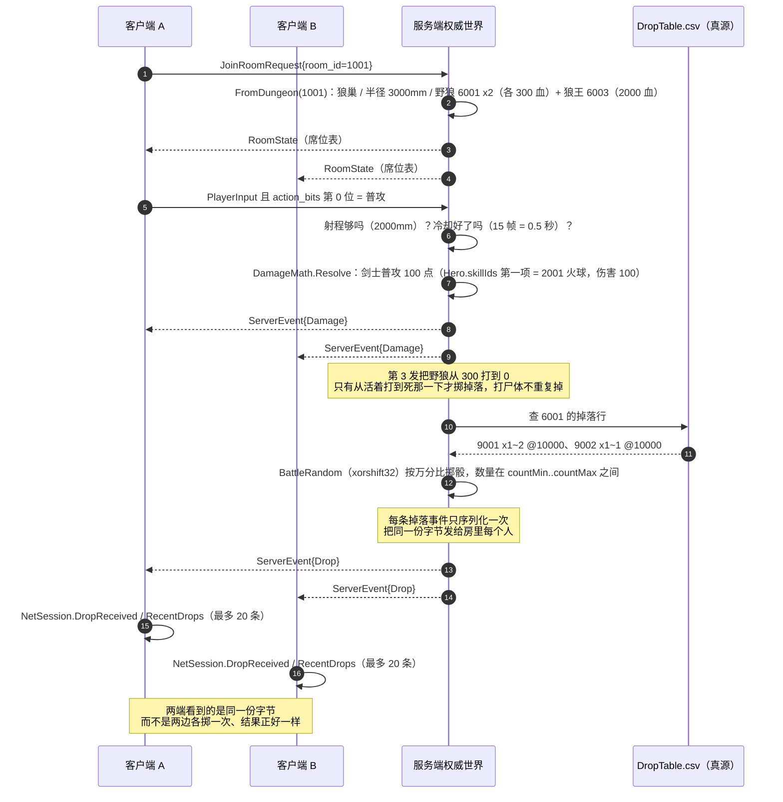
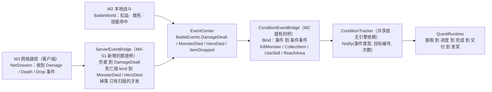

# 图 02 · 副本 · 掉落 · 任务闭环

> 用途：讲清"进副本 → 打死怪 → 掉东西 → **两端看到同一份**"这条闭环，
> 以及**任务系统现在接在哪、还没接在哪**（不粉饰）。
> 渲染好的图：`out\02-副本·掉落·任务闭环-1.svg`、`-2.svg`。

---

## 一、闭环主链路（进房 → 打死 → 掉落 → 两端一致）

**三个值得讲的取舍**：

| 取舍 | 怎么做 | 为什么 |
| --- | --- | --- |
| 掷骰用什么随机数 | 自己写 `BattleRandom`（xorshift32），不用 `System.Random` | `System.Random` 的算法**跨 .NET 版本变过**；掉落是"两端必须一致"的东西，随机数一旦不可复现，单端测试全绿、联机时才表现为"两边掉的不是同一个" |
| 谁掷骰 | **只有服务端**掷，然后把结果发下去 | 客户端不掷 = 不给作弊留口子；也不需要"同步随机种子"那套 |
| 掉落归谁 | `DropEvent.WinnerPlayerId`（M3 = 击杀者） | 把"归属"留在协议里，M4 做组队分配时不用改协议结构 |

---

## 二、任务闭环：这条链**已经接通了**（2026-09-26，M4-S1）

**这张图要讲的三件事**：

- **两条入口，一个出口**：本地战斗与联机战斗**都只往 `EventCenter` 里发事件**，
  下游（条件桥 → 条件系统 → 任务）**完全不知道事件是从哪来的**。
  这正是"任务模块至今不认识网络"的实现方式。
- **接这条线只加了一个类，任务模块一行没改**：`ServerEventBridge` 把服务端事件翻译成
  `BattleEvents.*`，于是 M2 就写好的 `ConditionEventBridge` 自动把它接进条件系统。
  ⇒ 这是 M2 那个"生产事件的模块完全不知道任务存在"设计的**直接兑现**。
- **两处判断被刻意放在产生事件的那一侧**：
  ① 死亡按 `kind` 分成 `MonsterDied` / `HeroDied`（合并会让"玩家死了"被当成"击杀目标 0"，
  而 0 = 任意目标 ⇒ 任何击杀任务都会涨）；
  ② 掉落**只在归我时**才发 `ItemDropped`（别人的战利品若算成"我获得了"，收集任务会被别人推进）。
  两条都是**静默**错，所以都用回归用例钉住了（`ServerEventBridgeTests`）。

**证据**（都能复现）：`Server\_net-probe` 第【十三】节 5 条（真 socket + 两个客户端）——
伤害两端逐字段一致、`applied` 是实际扣血、死亡带 `kind`/`config_id`/`killer_id`、
同帧**先伤害后死亡**、服务端计数如实；`EditMode` 里 `ServerDeathEvents_ProgressQuestCondition`
跑的是产品代码的真实链路（喂 3 只野狼的死亡事件 → 条件 3/3 达成）。

---

## 三、这一段踩过的两个坑（都是"改了却没生效"）

| 现象 | 根因 | 防复发（已落成代码/流程） |
| --- | --- | --- |
| **打死了什么都不掉**（且不报错） | 服务端读的是 `Configs\Design\DropTable.csv`（**真源**），而当时只改了 Unity 侧的 SO `DropTableConfig.asset` → 服务端那 5000/3000（35% 什么都不掉） | 服务端**启动时逐条念出它真正读到的掉落**：`掉落：怪 6001 → 物品 9001 x1~2@10000、…` |
| **重启服务端后新日志没出现** | 跑的是**旧的 exe**（08:56 编的），而配置表接入是 09:34、掉落是 09:58 —— 那个 exe 里**既没有配置表也没有掉落**，所以"看不到狼"和"不掉东西"**是同一个根因** | 启动横幅打印 `Built :`（上一次编译时间）+ **源码比产物新就大声报警** |

> 📌 这两条现在都在 `Docs\排查手册\06-改了却没生效（旧产物·生成物·真源）.md` 里，含四个实测对照。

---

## 四、图里每个数字的出处

| 事实 | 值 | 出处 |
| --- | --- | --- |
| 副本 1001 | 狼巢 / 4 人 / 半径 3000mm / 怪 `6001,6001` / BOSS 6003 | `Configs\Design\Dungeon.csv` |
| 野狼 6001 | HP 300 / 攻击 20 / 技能 `2003` | `Configs\Design\Monster.csv` |
| 狼王 6003 | HP 2000 / 攻击 60 / 技能 `2001,2002` | 同上 |
| 剑士 1001 | HP 1200 / 移速 5000mm 每秒 / 技能 `2001,2002` | `Configs\Design\Hero.csv` |
| 普攻伤害 | 100（= `Hero.skillIds` 第一项 2001 火球） | `Skill.csv` + `DungeonBattle.FromDungeon` |
| 狼 6001 掉落 | 9001 x1~2 @10000、9002 x1~1 @10000（万分比，10000 = 必掉） | `Configs\Design\DropTable.csv` |
| **只有从活着打到死才掷骰** | `wasAlive && !target.Alive` | `Server\NBC.Server.Game\DungeonBattle.cs` |
| 掉落事件序列化次数 | 每条事件 1 次，然后发给全房 | `Server\NBC.Server.Game\RoomBattleService.cs` `BroadcastDrops` |
| 任务/成就共用条件系统 | 同一个 `ConditionTracker` | `Client\Assets\_Project\Game\Quest\QuestRuntime.cs` 文件头 |

---

## 五、面试版（30 秒）

> 副本这一段的核心是"**同一份字节**"：怪一死，服务端用自己那份 `BattleRandom`（xorshift32，
> 不用 `System.Random`，因为它跨 .NET 版本换过算法）按万分比掷骰，然后把掉落**序列化一次**、
> 同一份字节发给房里所有人 —— 两端一致是**保证**出来的，不是"各算一遍碰巧一样"。
> 掷骰只在"从活着打到死"那一下发生，打尸体不重复掉。
> 任务那边我把边界画清楚了：M2 的本地战斗已经通过 `ConditionEventBridge` 接进 `ConditionTracker`，
> 但 M3 联机战斗的结果目前还停在 `NetSession`，**没有进事件中心**，所以联机打死怪任务不涨进度；
> 这是 M4 第一件要接的线，接法是在 `NetSession` 与 `EventCenter` 之间加一层适配 ——
> 任务模块一行都不用改，因为它至今不认识网络。
