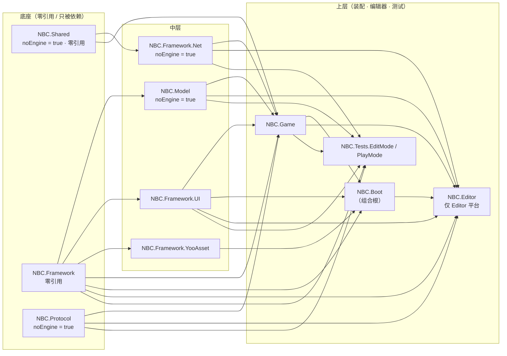
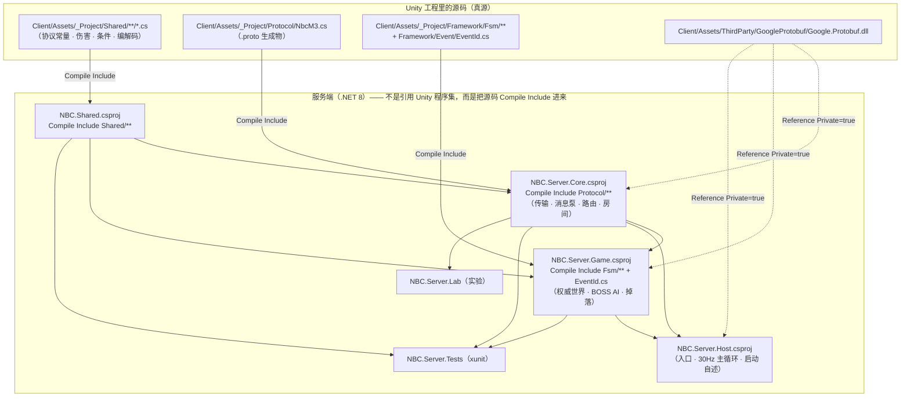

# 图 03 · 程序集与模块依赖

> 用途：讲清"哪些代码能互相看见"，以及本项目**踩了 9 次**的那条规律：**引用不传递**。
> 所有依赖关系都是**从 `.asmdef` / `.csproj` 文件里读出来的**（脚本抄的，见 §五）。
> 渲染好的图：`out\03-程序集与模块依赖-1.svg`（Unity 侧）、`-2.svg`（服务端 + 双端源码复用）。

---

## 一、Unity 侧（asmdef 的真实依赖）



**第三方引用（不画进图里，避免长边绕回来；这是它们的真源）**：

| 程序集 | 引用的第三方 | 说明 |
| --- | --- | --- |
| `NBC.Protocol` | `Google.Protobuf.dll` | `overrideReferences = true` ⇒ **只**能引它列出来的预编译 DLL |
| `NBC.Framework.UI` | `UnityEngine.UI` | |
| `NBC.Framework.YooAsset` | `YooAsset` | |
| `NBC.Game` | `Unity.TextMeshPro` · `UnityEngine.UI` | `overrideReferences = false` ⇒ 自动引用全部预编译 DLL（含 `Google.Protobuf.dll`） |
| `NBC.Editor` | `Unity.TextMeshPro` | |
| `NBC.Tests.EditMode` | `UnityEngine.UI` · `UnityEngine.TestRunner` · `UnityEditor.TestRunner` · `Google.Protobuf.dll` · `nunit.framework.dll` | `overrideReferences = true`；另有 `defineConstraints = UNITY_INCLUDE_TESTS` |

**三个"看一眼就懂"的点**：

1. **`NBC.Shared` 一个引用都没有**（连 `NBC.Framework` 都不引）—— 这是它能被服务端直接编进去的前提。
2. **`NBC.Boot` 是全项目最上层**：它引 `NBC.Game` 与三个框架包，是"装配处"（组合根）。
   ⚠️ 装配处最容易撞 `CS0012`：只要它用到某个**基类**的成员（例如 `QuestPanel.Initialize()` 来自
   `NBC.Framework.UI` 的 `BasePanel`），就必须**自己引用那个程序集** —— 因为 `NBC.Game` 引了不算数。
3. **`NBC.Editor` 只在编辑器平台**：网络调试窗口（`NetDebugWindow`）属于它，所以**打包后没有这个窗口** ——
   这也是"打包版怎么进联机"至今还是缺口的原因（见 §四）。

---

## 二、服务端侧（csproj）与**双端源码复用**



**这张图解释了三件常被问的事**：

| 问题 | 答案 |
| --- | --- |
| 服务端怎么复用客户端的战斗逻辑？ | **不是**引 Unity 编译出来的 DLL，而是 `<Compile Include="..\..\Client\Assets\_Project\Shared\**\*.cs" />` —— 同一份源码编两次 ⇒ 共享层**必须**没有引擎依赖 |
| 那 `EventId.cs` 为什么也编进服务端？ | `StateBase.OnEvent(EventId)` 用到它 ⇒ **判"能不能进服务端"要看整条依赖链**（D14 结论的第二层）。它里面那句 `Debug.LogWarning` 靠 `UnityEngineDebugShim.cs` 垫过去 |
| 为什么每个服务端工程都自己引 `Google.Protobuf`？ | `<Reference>`（裸程序集）与 `ProjectReference` 一样**不传递**。Host 报的是 `CS0012`（原文**点名**了 `Google.Protobuf, Version=3.21.1.0`），Game 报的是 `CS0246`（不点名，得自己推断） |

---

## 三、**引用不传递**：本项目栽过的 9 次里，两次有代表性的报错

| 场景 | 报错 | 判据 |
| --- | --- | --- |
| Unity：`NBC.Boot` 用 `QuestPanel.Initialize()`（继承自 `NBC.Framework.UI` 的 `BasePanel`），但 Boot 没引那个程序集 | `CS0012`（**点名**要加哪个程序集） | 读原文：CS0012 **会**说缺谁 |
| 服务端：`NBC.Server.Game` 用 `ServerMessage.ToByteArray()`（`Google.Protobuf` 的扩展方法），Game 没直接引它 | `CS0246: 未能找到类型或命名空间名"Google"` | CS0246 **不会**说缺谁 → 要自己从"这个类型属于哪个程序集"倒推 |

> ⚠️ **闸门盲区**：`Server\_api-probe\ApiProbe.csproj` 把**全部代码编进一个程序集**，
> 所以它**再绿也抓不到 asmdef 级的边界错误**。规则已收紧为：**改 asmdef、或跨程序集用类型时，
> 必须有一次 Unity 编译兜底** —— "闸门绿 ≠ Unity 绿"。

---

## 四、已知的两个缺口（写在图上，不藏着）

1. **`NBC.Editor` 里的网络调试窗口不进包** ⇒ 打包后的客户端**目前没有联机入口**：
   `NetSession` 只被编辑器窗口使用。补法是把 `NetSession` 接进 `M2DemoBehaviour`（下一个切片要做的）。
2. **共享层是"源码级复用"** ⇒ 好处是零成本、不会被 DLL 版本坑；代价是**任何一句引擎调用都会让服务端编不过**
   （`UnityEngineDebugShim.cs` 就是这条代价的化石）。

---

## 五、§一/§二 的依赖关系是怎么来的

```powershell
# Unity 侧：从每个 .asmdef 里读 name / references / noEngineReferences
Get-ChildItem -Recurse Client\Assets\_Project -Filter *.asmdef |
    ForEach-Object { Get-Content $_.FullName -Raw | ConvertFrom-Json } |
    Select-Object name, references, noEngineReferences

# 服务端：看每个 csproj 的 ProjectReference / Compile Include / Reference
Select-String -Path Server\*\*.csproj -Pattern 'ProjectReference|Compile Include|Reference Include|HintPath'
```

> 📌 这两条命令就是"**图不能靠记忆画**"的机械化保证：改了 asmdef 或 csproj，重跑一遍就能发现图过期了。

---

## 六、面试版（30 秒）

> 这个项目的模块边界是**按"能不能进服务端"划的**：`NBC.Shared`、`NBC.Framework.Net`、`NBC.Model`、`NBC.Protocol`
> 全是 `noEngineReferences = true`（一个 UnityEngine 都不能碰），因为服务端不是引 Unity 的 DLL，
> 而是**把同一份源码 `Compile Include` 进去**编第二遍。
> 好处是共享逻辑零成本复用；代价是"能不能进服务端"要按**整条依赖链**判断 ——
> 我们的状态机那 5 个文件是纯 C#，但它引的 `EventId` 里有一句 `Debug.LogWarning`，就得加个编译期垫片。
> 另外我把"引用不传递"栽过 9 次这件事也画进来了：`CS0012` 会点名缺哪个程序集，`CS0246` 不会；
> 而且我们的编译闸门是把所有代码编进一个程序集，**抓不到 asmdef 级错误**，所以改边界必须有一次 Unity 编译兜底。
