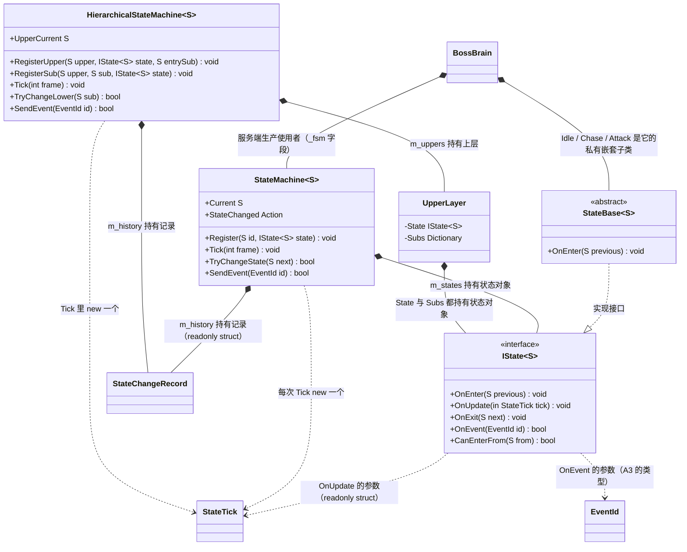
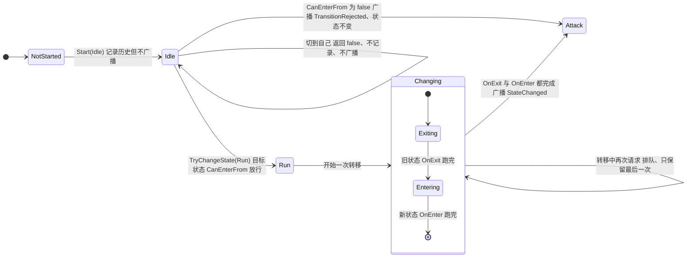
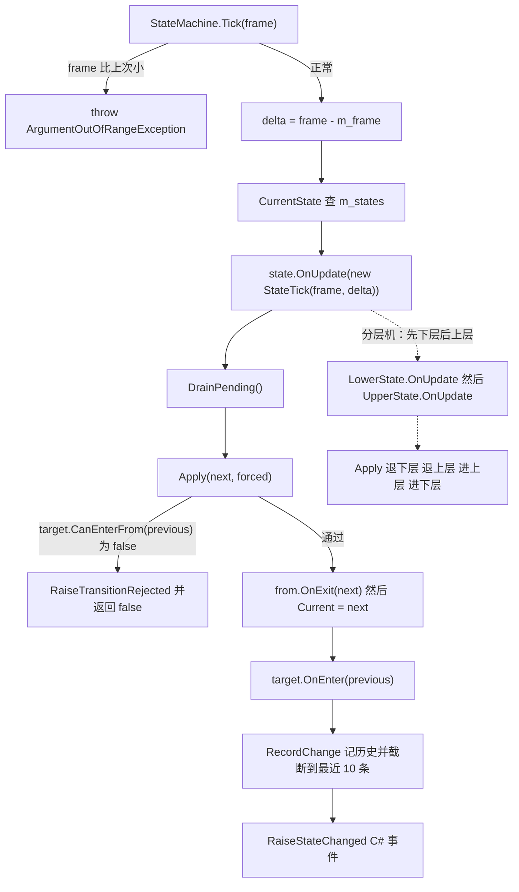

# A10 · 通用状态机（`StateMachine` + `HierarchicalStateMachine`）

> **留档说明**：本文按 `Docs\00` §15.3.1 留档，写法遵循 **§15.3.1.1「说人话」**：
> 专业词第一次出现当场解释；代码示例尽量给；语言自然。
>
> ⚠️ A10 和前几个模块不一样：**它不是"改原框架的毛病"，是"新写一个原框架没有的东西"**。
> 所以第 ③ 节不是"原版错在哪"，而是"**需求到底要什么**"。

| 项 | 位置 |
| --- | --- |
| **代码** | `Client\Assets\_Project\Framework\Fsm\`（`StateTypes` / `IState` / `StateBase` / `StateMachine` / `HierarchicalStateMachine`） |
| **测试** | `Tests\EditMode\Framework\`：`StateMachineTests`(21) + `HierarchicalStateMachineTests`(21) = **42 条** |
| **需求** | `Docs\01` **§8.3**（玩家 HFSM）、**FSM-01~09** |
| **明细** | `Docs\16` §10.2.14 |
| **收关** | 2026-09-21，EditMode **270/270** 全绿 |

---

# ① 问题是什么

## 先看一个具体场景

玩家角色要能站着、跑、跳、砍、放技能、被打了往后仰、血空了倒下。

不用状态机的话，代码大概长这样：

```csharp
void Update()
{
    if (isDead) { ... }
    else if (isStunned) { ... }
    else if (isHit) { ... }
    else if (isAttacking)
    {
        if (attackTimer < 0.3f) { /* 前摇 */ }
        else if (attackTimer < 0.5f) { /* 判定 */ }
        else { /* 后摇 */ }
    }
    else if (isJumping) { ... }
    else if (isRunning) { ... }
    else { /* idle */ }
}
```

这段代码能跑。但**加一个状态就要改一遍这个 if 链**，而且很快会出现这些问题：

- **"跳起来能不能砍"这种问题，答案散在四个地方**，没人能一眼说出来
- 两个条件同时为真时，谁赢**取决于 if 的顺序**（顺序一变行为就变）
- 想加"连招第 2 段"，得再塞一层嵌套

## 状态机的核心想法只有一句话

> **把"现在处于什么状态"变成一个显式的值，把"什么时候能换"变成集中检查的规则。**

换成状态机之后：

```csharp
enum PlayerState { Idle, Run, Attack1, Attack2, Dodge, Hit, Dead }
```

- **当前状态是哪个**，随时能报出来（调试面板直接显示）
- **能不能从 A 换到 B**，是 B 自己回答的一个问题（`CanEnterFrom`）
- 每个状态的逻辑**各写各的**，改一个不会牵动另一个

## 但这个项目还多两条硬要求

**要求一：状态机必须是纯 C#，不能用 MonoBehaviour。**

这是 **FSM-09**，理由只有一个字：**帧同步**。

> 帧同步的核心假设是"**同样的输入序列 → 同样的结果**"。
> 服务端要拿客户端的输入，自己算一遍，用来校验。**服务端没有 Unity 环境。**
> 所以战斗逻辑（包括玩家状态机）必须是一份**两边都能跑的纯 C# 代码**。

**要求二：时间必须由外部注入，不许用 `Time.deltaTime`。**

这是 **FSM-04**。如果状态机自己读真实时间，那么"这一跳持续 0.42 秒"在服务端和客户端会算出不同的帧数——
**两边就不一样了**。

所以时间要**从外面喂进来**（和 A5 的场景加载、A7 的输入、A8 的音频是同一个手法）：

```csharp
machine.Tick(logicFrame);   // frame 是**逻辑帧号**，由逻辑层给
```

---

# ② 最小例子

```csharp
// 1) 状态标识：用 enum，不用字符串（拼错就编译不过）
enum PlayerState { Idle, Run, Attack }

// 2) 一个状态：继承 StateBase，只覆写关心的
class RunState : StateBase<PlayerState>
{
    public override void OnEnter(PlayerState previous) { /* 开始播跑步动画 */ }
    public override void OnUpdate(in StateTick tick)   { /* 按帧推进移动 */ }
    public override void OnExit(PlayerState next)      { /* 停下来 */ }
}

// 3) 组装
var machine = new StateMachine<PlayerState>();
machine.Register(PlayerState.Idle,   new IdleState());
machine.Register(PlayerState.Run,    new RunState());
machine.Register(PlayerState.Attack, new AttackState());

machine.Start(PlayerState.Idle);

// 4) 逻辑层每逻辑帧推一次
machine.Tick(frame);                       // ← 不是 Unity 的 Update，也不传 deltaTime

// 5) 切状态 / 发事件
machine.TryChangeState(PlayerState.Run);
machine.SendEvent(InputEvents.JumpPressed);
```

**一句话总结**：**"我现在是什么"变成一个值；"能不能换"变成一次集中检查。**

---

# ③ 需求到底要什么

新写的东西没有"原版代码"可以对照，所以这一节直接看需求。
`Docs\01` §8.3 列了 9 条（FSM-01~09），我按"框架该管 / 游戏层该管"分成两类：

| 编号 | 要求 | 谁管 | 这一轮做了吗 |
| --- | --- | --- | --- |
| FSM-01 | 通用 HFSM 基类 | **框架** | ✅ `StateMachine` + `HierarchicalStateMachine` |
| FSM-02 | 状态接口 | **框架** | ✅ `IState<S>` / `StateBase<S>` |
| FSM-04 | **逻辑帧驱动**（不用协程计时） | **框架** | ✅ `Tick(int frame)`，`StateTick` 只有帧字段 |
| FSM-05 | **上层互斥、下层跟随上层切换** | **框架** | ✅ 见下面 §4.4 |
| FSM-08 | 调试可视化：当前状态名 + 最近 10 次转移 | **框架给数据** | ✅ `CurrentPath` + `CopyHistory` |
| FSM-09 | **纯 C#，服务端可复用** | **框架** | ✅ 有机械检查守着 |
| FSM-03 | 转移表外部化 | 游戏层 | ➖ 框架给钩子，具体转移表是 M2 的事 |
| FSM-06 | 连招窗口 | 游戏层 | ➖ M2 |
| FSM-07 | 中断规则 + 霸体等级 | 游戏层 | ➖ M2（框架的 `CanEnterFrom` 就是它的落点） |

> **为什么 FSM-03/06/07 不在框架做**：它们是**这个游戏的规则**（"普攻第 2 段只有 12 帧内再按才出"）。
> 框架提供"每个状态可以自己回答能不能被进入"这个钩子就够了；
> 具体规则写进框架，就等于把业务烧进底座 —— 那正是 FW-12 要修的病。

---

# ④ 做法

## 4.1 五个文件，各管一件事

| 文件 | 职责 |
| --- | --- |
| `StateTypes.cs` | `StateTick`（推进信息）、`StateChangeRecord`（一条转移记录） |
| `IState.cs` | 状态接口 |
| `StateBase.cs` | 可选基类（所有方法空实现） |
| `StateMachine.cs` | 单层状态机 |
| `HierarchicalStateMachine.cs` | **固定两层**的分层状态机 |

**为什么是"纯 C#"能被机械检查**：整个 `Fsm\` 目录里**一个 `UnityEngine` 都不引用**
（扫源码、排除注释行、看有没有 `MonoBehaviour` / 协程 / `Time.deltaTime`）。

⚠️ 反过来说：**如果哪天 A10 的测试需要 PlayMode 才能跑，说明有人往状态机里塞了 MonoBehaviour。**
这和 A1 那些用例"必须搬去 PlayMode"正好相反 —— 位置本身就是设计的一部分。

## 4.2 状态接口：六个成员，其中一个是"刻意的扩展"

```csharp
public interface IState<S>
{
    string Name { get; }                          // 调试面板用
    void OnEnter(S previous);                     // 进来
    void OnUpdate(in StateTick tick);             // 每逻辑帧
    void OnExit(S next);                          // 出去
    bool OnEvent(EventId id);                     // 收事件（**返回值是我的扩展**）
    bool CanEnterFrom(S from);                    // 能不能从 from 进来
}
```

四个细节值得说：

**① `S` 是状态标识，通常是 enum。** 用泛型 + enum 而不是字符串，理由和 A3 一样：
**拼错就编译不过**，而不是运行期静默不触发（那是 FW-06 的毛病）。

**② 事件用 A3 的 `EventId`，不是字符串。** 同理 —— 强类型事件标识。

**③ `CanEnterFrom` 问的是目标状态**（"你允许从那边过来吗"），不是当前状态。

```csharp
// 判断写在"目标"身上：
if (!target.CanEnterFrom(previous)) return false;
```

这样"谁能打断谁"的规则**集中在目标状态里**。
如果反过来问当前状态，那么每加一个新状态，都要去改**所有已有状态**（"我要不要放它过去"）—— 那就退化成 if 链了。

**④ `OnEvent` 的返回值是我加的**（需求 FSM-02 原文写的是 `OnEvent(e)`，没有返回值）。

```csharp
bool OnEvent(EventId id)   // true = "我处理了，不用再往上传"
```

**为什么**：分层状态机需要知道"事件有没有被下层消化掉"。
没有这个返回值，两级只能**都收到同一个事件** ——
于是"按下闪避"可能被下层和上层各处理一次，**那是一种很难查的重复触发**。

⚠️ 这是**对需求签名的扩展，已经写进 `Docs\16` §10.2.14 请负责人过目**，不是偷偷改。

## 4.3 时间：`StateTick` **刻意没有"秒"字段**

```csharp
public readonly struct StateTick
{
    public readonly int Frame;        // 当前逻辑帧号
    public readonly int DeltaFrames;  // 距上次推进过了几帧
    // ⚠️ 这里**故意没有** DeltaTime
}
```

**为什么不给一个"秒"字段？** 因为给了就会有人用。

一旦状态里写了 `tick.DeltaTime > 0.3f`，这个状态的推进就**依赖真实时间**：
服务端跑得快、客户端掉帧、编辑器卡一下，都会让它走到不同的分支。
**单机看不出问题，一进帧同步就是"两端不同步"，而且极难定位。**

> **让它不可能发生，比写一句注释管用。**

要"持续 0.3 秒"，就换算成帧数（60 帧/秒下 = 18 帧），用帧计数器判断：

```csharp
public override void OnUpdate(in StateTick tick)
{
    m_elapsedFrames += tick.DeltaFrames;     // 累加的是**帧**，不是秒
    if (m_elapsedFrames >= StartupFrames) { /* 前摇结束 */ }
}
```

**另外还写死了两条**：

- **帧号只增不减**，倒退**当场抛异常**（倒退会让所有"持续 N 帧"的判断失效，而且很难查）
- 第一次推进时 `DeltaFrames` 是 0（还没有上一帧）

## 4.4 分层：固定两层，以及"分层"到底约束了什么

⚠️ **2026-09-21 经负责人确认：做固定两层，不做通用 N 层。**

**为什么**：§8.3 要的就是两级（上层 Ground/Action/Special，下层 Idle/Run/Attack…）。
通用 N 层要多处理一大类问题：子状态机怎么向上报事件、深层"当前路径"怎么拼、调试面板怎么递归画。
**而需求一个都用不上。**

### 关键是"下层属于某一个上层"

```csharp
machine.RegisterUpper(LayeredId.Ground, groundState, LayeredId.Idle);  // 上层 + 入口下层
machine.RegisterSub(LayeredId.Ground, LayeredId.Idle, idleState);
machine.RegisterSub(LayeredId.Ground, LayeredId.Run, runState);

machine.RegisterUpper(LayeredId.Action, actionState, LayeredId.Attack);
machine.RegisterSub(LayeredId.Action, LayeredId.Attack, attackState);
```

注意 `Run` 注册在 `Ground` 下面，`Attack` 注册在 `Action` 下面 —— **它们不共享**。

于是：

```csharp
machine.Start(LayeredId.Ground);            // 当前 Ground/Idle
machine.TryChangeLower(LayeredId.Attack);   // ❌ 抛异常！
```

因为 **`Ground` 下面根本没有 `Attack`**。报错长这样：

```
[HierarchicalStateMachine] 上层 «Ground» 下面没有下层状态 «Attack»。
⚠️ 这就是**分层**在起作用：下层只属于某一个上层，不能跨上层乱跳。
（如果 «Attack» 确实属于 «Ground»，请先 RegisterSub 注册它。）
```

**这就是"分层"的意义**：不是"两个状态机拼在一起"，而是**下层不能跨上层乱跳**。

### 切上层时，下层一定跟着换

```csharp
machine.Start(LayeredId.Ground);
machine.TryChangeLower(LayeredId.Run);      // Ground/Run
machine.TryChangeUpper(LayeredId.Action);   // → Action/Attack（自动进 Action 的入口下层）
```

这就是 FSM-05 说的"下层状态跟随上层切换"。

### 进退顺序写死了

> **退下层 → 退上层 → 进上层 → 进下层**

为什么要写死？因为顺序会**实际影响行为**（比如"退出跑步时停下移动"必须在"进入攻击"之前完成）。
含糊其辞的结果是每个状态作者自己猜，猜错就出怪现象。所以有专门一条测试用调用顺序列表比对它。

### 事件派发：先下层、后上层，下层说"我处理了"就停

```csharp
IState<S> lower = LowerState;
if (lower != null && lower.OnEvent(id)) return true;   // 下层处理了就停

IState<S> upper = UpperState;
return upper != null && upper.OnEvent(id);             // 否则冒泡到上层
```

`Tick` 的顺序也保持一致（**先下层、后上层**）——
不一致的话你就得记两条规则，记混了很难发现。

## 4.5 一个容易写错的地方：**转移过程中再请求转移**

`OnEnter` 里判断"我该直接切走"是很常见的写法：

```csharp
public override void OnEnter(PlayerState previous)
{
    if (ShouldGoStraightToRun) machine.TryChangeState(PlayerState.Run);
}
```

如果这里**立刻递归执行**，就变成"在别人的 `OnEnter` 里跑自己的 `OnEnter`"，顺序很难预料
（比如"退出 A"还没跑完，"进入 B"就已经开始了）。

所以做法是**排队**：

```csharp
private bool RequestChange(S next, bool forced)
{
    ...
    // 正在转移中就排队，等这次转移完整结束再执行
    if (m_changing)
    {
        m_hasPending = true;
        m_pendingNext = next;
        m_pendingForced = forced;
        return true;
    }

    return Apply(next, forced);
}
```

⚠️ **队列只有一个位置**：连续请求多次，**后面的覆盖前面的**。
这是刻意的 —— 状态机的语义是"**最终停在哪个状态**"，不是"按顺序播一遍"。

## 4.6 调试可视化（FSM-08）—— 面试演示的那个

需求里写的是"运行时显示当前状态名 + 最近 10 次状态转移"。框架这边只要**把数据准备好**：

```csharp
machine.CurrentPath;                                  // "Action/Attack"
machine.CopyHistory(buffer);                          // 最近 10 条，**新的在前**
```

`CopyHistory` 给的是新的在前，因为调试面板是从上往下显示的 —— **让调用方少转一次**。

另外状态切换会广播：

```csharp
machine.StateChanged += record => { ... };            // 切换完成**之后**才广播
machine.TransitionRejected += record => { ... };      // 被拒绝也要能看见
```

> **"被拒绝"也要广播**，因为"按了跳跃却跳不起来"是最常见的 bug 报告。
> 只有成功事件的话，你根本不知道那次输入去哪了。

⚠️ 这里**不走 A3 的 `EventCenter`**，用的是普通 C# 事件。
理由和 A7 的"命令不走事件中心"一致：**状态切换是每帧都可能发生的数据**，
而事件中心是给**低频"游戏事件"**的工具（字典查找 + 委托链 + 类型检查）。
需要它出现在全局事件流里的场合，由游戏层自己转发。

---

# ⑤ 自测 5 题

**1.** 为什么状态机必须是纯 C#、不能继承 `MonoBehaviour`？（提示：想服务端）
**2.** `StateTick` 为什么不给"秒"字段？给了会出什么事？
**3.** `CanEnterFrom` 为什么问**目标状态**，而不是问当前状态"你放不放行"？
**4.** "分层"到底约束了什么？举一个会被它挡住的例子。
**5.** `OnEvent` 为什么要返回 `bool`？

<details>
<summary>点开看答案</summary>

**1.** 因为**帧同步**：服务端要拿客户端输入自己算一遍做校验，而**服务端没有 Unity 环境**。
所以战斗逻辑（含状态机）必须是两边都能跑的纯 C#。

**2.** 因为给了就会有人用。一旦状态里写 `tick.DeltaTime > 0.3f`，推进就**依赖真实时间**——
服务端跑得快、客户端掉帧都会走到不同分支。**单机看不出来，帧同步时表现为"两端不同步"且极难定位。**
不给，就写不出来。

**3.** 因为规则要**集中**。问目标状态的话，"谁能打断谁"写在目标自己身上，加新状态不用动老状态；
问当前状态的话，每加一个状态都要去改**所有已有状态**，那就退化成 if 链了。

**4.** 约束的是"**下层属于某一个上层，不能跨上层乱跳**"。
例子：`Attack` 只在 `Action` 下面，在 `Ground/Idle` 时 `TryChangeLower(Attack)` 会抛异常。

**5.** 因为分层派发需要知道"事件有没有被下层消化掉"。
没有返回值，两级只能都收到同一个事件 → "按下闪避"可能被处理两次。

</details>

---

# ⑥ 30 秒验证

Unity → `Window / General / Test Runner` → **EditMode** → **Run All**：

| 测试类 | 条数 |
| --- | --- |
| `StateMachineTests` | 21 |
| `HierarchicalStateMachineTests` | 21 |
| **EditMode 总数** | **270/270** |

**最值得单独看的四条**：

| 用例 | 它在证明什么 |
| --- | --- |
| `ChangeLower_AcrossUpper_ThrowsWithLayeringExplanation` | **"分层"真正的约束**：下层不能跨上层乱跳，且报错要说清原因 |
| `ChangeUpper_ExitsLowerBeforeUpper_AndEntersUpperBeforeLower` | 进退顺序写死（用调用顺序列表比对） |
| `TransitionRequestedFromOnEnter_IsQueuedAndAppliedAfter` | `OnEnter` 里再请求转移会被排队，不递归 |
| `Tick_FrameGoesBackwards_Throws` | 帧号倒退当场炸，不让"持续 N 帧"静默失效 |

**两条机械检查**（不是测试，是脚本级验证，随时可以重跑）：

```powershell
# FSM-09：状态机里不许出现 MonoBehaviour / 协程 / Time.deltaTime / UnityEngine
# ⚠️ 必须排除注释行 —— 第一次没排除，报了 7 处"违规"，全是解释这条规则的注释
Get-ChildItem 'Client\Assets\_Project\Framework\Fsm' -Filter *.cs | ForEach-Object {
  $lines = Get-Content $_.FullName
  for ($i=0; $i -lt $lines.Count; $i++) {
    $t = $lines[$i].Trim()
    if ($t.StartsWith('//')) { continue }
    if ($t -match 'MonoBehaviour|IEnumerator|yield return|Time\.deltaTime|UnityEngine') {
      '{0}:{1}  {2}' -f $_.Name, ($i+1), $t
    }
  }
}
# 没有任何输出 = 通过
```

**负向对照**（证明测试真的在测东西）：把 `HierarchicalStateMachine.RequireSub` 里的
`throw` 改成 `return null`，`ChangeLower_AcrossUpper_ThrowsWithLayeringExplanation` 应该**立刻变红**。

---

# ⑦ 一分钟面试版

> 玩家控制我用的是**两级分层状态机**，纯 C# 写的，不依赖 Unity。
>
> 不用状态机的话就是一条大 if 链：加一个状态要改一遍，"跳起来能不能砍"这种问题的答案散在四个地方，
> 两个条件同时为真时谁赢还取决于 if 的顺序。状态机的核心就一句话：
> **把"现在处于什么状态"变成显式的值，把"能不能换"变成集中检查的规则。**
>
> 两个设计点我想说：
>
> 第一，**它必须是纯 C#**。因为帧同步下服务端要拿客户端输入自己算一遍做校验，
> 而服务端没有 Unity 环境。所以时间也是**注入**的 —— 我传的是逻辑帧号，
> 而且 `StateTick` 里**刻意不给"秒"字段**：给了就会有人写 `deltaTime > 0.3f`，
> 那样推进就依赖真实时间，单机看不出来、一进帧同步就是两端不同步。**让它不可能发生比写注释管用。**
>
> 第二，**"分层"真正的约束是"下层属于某一个上层，不能跨上层乱跳"** ——
> 不是两个状态机拼在一起。所以切上层时下层一定跟着换到新上层的入口状态；
> 在 `Ground` 下想切到只属于 `Action` 的 `Attack`，会被拒绝，而且报错会告诉你"这就是分层在起作用"。
>
> 另外"能不能被进入"是问**目标状态**的，规则集中在目标身上，这样加新状态不用动老状态。
> 事件派发是先下层后上层，下层说"我处理了"就停 —— 这也是我把 `OnEvent` 的返回值定成 `bool` 的原因。
>
> 调试上给了当前路径（`Action/Attack`）和最近 10 次转移历史，接一个面板就是运行时可看的。
> **被拒绝的转移也广播** —— 因为"按了跳跃却跳不起来"是最常见的 bug 报告，
> 只有成功事件的话你不知道那次输入去哪了。

---

# 附：术语速查

| 术语 | 一句白话 |
| --- | --- |
| **状态机（FSM）** | 把"现在处于什么状态"变成显式的值，"能不能换"变成集中检查的规则 |
| **分层状态机（HFSM）** | 状态里再套一层状态。本项目是两级：上层（Ground/Action）+ 下层（Idle/Run/Attack） |
| **入口状态** | 切到某个上层时，下层先进哪个 |
| **`CanEnterFrom`** | "能不能从某个状态切进我"—— 规则写在**目标**状态上 |
| **转移（Transition）** | 从一个状态换到另一个状态 |
| **逻辑帧** | 逻辑层的帧号（不是 Unity 的渲染帧）。帧同步里"时间"就是它 |
| **帧同步** | 两端跑同一份逻辑、喂同样的输入，靠"结果一致"互相校验 |
| **纯 C#** | 不依赖 `UnityEngine`，服务端也能编译运行 |
| **确定性** | 同样的输入序列一定得到同样的结果。依赖真实时间就会破坏它 |
| **冒泡（事件）** | 下层不处理就交给上层 |
| **转移历史** | 最近若干次状态切换的记录，调试面板用它 |

---

## 附 · 类图与数据流（2026-09-26 补）

**这张图解决什么问题**：`StateMachine<S>` 与 `HierarchicalStateMachine<S>` **不是父子关系**，它们是两份**互不相干**的实现（各自持有 `Dictionary` / `List` / `m_frame` 和自己的 `StateChanged`）；共享的只有 `IState<S>` / `StateBase<S>` 与两个 `readonly struct`。`UpperLayer` 是分层机的**私有嵌套类**，「下层只属于某一个上层」这条约束就落在它身上（`BossBrain` 是服务端的生产使用者，见下面的事实更正）。



**看图时最容易画错的 5 处**

| # | 容易画错 | 事实 | 证据 |
| --- | --- | --- | --- |
| 1 | 画成 `HierarchicalStateMachine` 继承 `StateMachine`；或把 `UpperLayer` 画成顶层类 | 两者**互不相干**（各自声明事件与私有字段）；`UpperLayer` 是 **private 嵌套**类，不进公开 API | `StateMachine.cs:58` vs `HierarchicalStateMachine.cs:57`；嵌套在 `:63` |
| 2 | 给 `S` 画上泛型约束 | 四个类型**都写了 `where` 吗？没有**——`IState<S>` / `StateBase<S>` / 两个状态机都没有约束子句 | `IState.cs:42`、`StateBase.cs:37`、`StateMachine.cs:58`、`HierarchicalStateMachine.cs:57` |
| 3 | 把 `StateTick` / `StateChangeRecord` 画成 class | 两个都是 **`readonly struct`**；`StateTick` **刻意没有秒字段** | `StateTypes.cs:40`、`:68`；`:32` |
| 4 | 把 `StateChangeRecord.From/To` 画成 `S` | 它们是 **`string`**（状态名 / `Ground/Run` 路径） | `StateTypes.cs:74`、`:77`；`:456`、`:571` |
| 5 | 把状态切换画成走 `EventCenter`；把帧号倒退画成一次转移 | 状态机用的是 **C# 事件**，不走 A3 的事件中心；帧号倒退是**当场抛异常**，不是转移 | `StateMachine.cs:467`、`:471`、`:216`；`HierarchicalStateMachine.cs:274` |

⚠️ **事实更正（补图时核实，2026-09-26）**：① **勘误**——本文 §4.1 说「整个 `Fsm\` 目录里一个 `UnityEngine` 都不引用」**对那 5 个文件自身成立**，但**整条依赖链不成立**：`IState.OnEvent(EventId)`（`IState.cs:80`）把 A3 的 `EventId.cs` 拖了进来，而它第 57 行有 `using UnityEngine;`（唯一用法是 `:119` 的 `Debug.LogWarning`）。
② ✅ **服务端生产使用者已核实**：`Server\NBC.Server.Game\BossBrain.cs:67` 就是 `private readonly StateMachine<EBossState> _fsm = new StateMachine<EBossState>();`（三个状态见 `:128` / `:155` / `:194`，都是 `StateBase<EBossState>` 的私有嵌套子类）；服务端靠 `Server\NBC.Server.Game\NBC.Server.Game.csproj:40`–`:41` 的 `<Compile Include>` 直接编这两个目录的源码，并由同目录 `UnityEngineDebugShim.cs:53`–`:57` 垫掉那句 `Debug.LogWarning`。

**状态迁移、准入与排队语义**



**一次 `Tick` 的数据流**（节点名写源码标识符，中文只在箭头上）



**面试版怎么讲（3 句）**

- 「`StateMachine<S>` 和两层的 `HierarchicalStateMachine<S>` 是**两份独立实现**，共享的只有 `IState<S>` / `StateBase<S>` 和两个 `readonly struct`；`S` 没有泛型约束，`StateTick` 里**刻意没有秒字段**，时间只能以逻辑帧注入。」
- 「准入问的是**目标状态**（`target.CanEnterFrom(previous)`），转移中再请求只**排队一个位置**（后覆盖前），切到当前状态是空操作，帧号倒退直接抛异常。」
- 「它服务端真在用：`BossBrain.cs:67` 用 `StateMachine<EBossState>` 驱动 BOSS AI，靠 csproj 的 `<Compile Include>` 编同一份源码——但依赖链上 `EventId` 带了一句 `Debug.LogWarning`，所以服务端靠一个 10 行的 `Debug` 垫片垫过去。」
