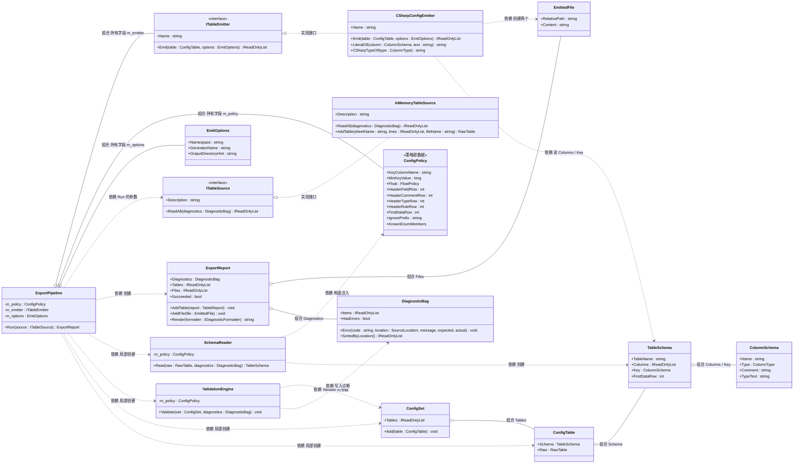
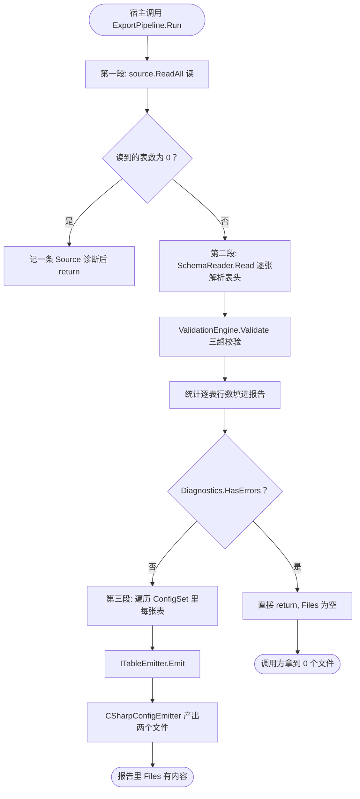

# C2 · 配置表工具链（ConfigKit）

> **对应**：需求 8 / 需求 13、`Docs\17-配置表规范.md`（C1 契约）、`Docs\16` C 组、`Tools\ConfigKit\README.md`
>
> ✅ **已收关（2026-09-22）**：Core（诊断 / 类型 / 表头 / 校验）、CSV 来源、xlsx 来源（NPOI）、
> **代码生成**、**命令行**、**TSV + JSON 两种产物**、**Unity 侧导入器**全部完成；
> **自测 49/49 全绿**，**xlsx 探针 9/9 全绿**（真 .xlsx 读写），
> 编译闸门 0 警告 0 错误（**含 Editor 代码**），**导入器已由负责人点击验证成功**。
> 凡"实测"字样都有出处。
>
> ⚠️ 这篇讲的是**工具链本身**（怎么把"人填的表"变成"程序能用的东西"），
> 不是 Excel 用法。重点在**四个接缝**和**三趟校验**。

---

# ① 问题是什么

**一句话**：策划在 Excel 里填数，程序要用这些数；而**填错的时候得有人告诉他错在第几行第几列**。

听起来只是"读个 Excel"，但真做起来会撞上三件事：

| 撞上的事 | 不处理的后果 |
| --- | --- |
| **策划会填错**，而且填错的方式千奇百怪 | 程序拿到"一个看起来正常的假值"：漏填 `hp` → `0`；写了 `-` 表示"无" → 字符串 `"-"` |
| **报错要说清"在哪"** | 只说"配置有错"，策划要一行行自己找；几千行的表能找一下午 |
| **表会一直改** | 写成"一次性脚本" → 加一条规则就要动主流程；换个项目直接废掉 |

`Docs\16` 把第三条写成了风险条目 **M1-R3**：

> 配置表工具做成"一次性脚本" → 表一改就崩

这篇文档基本上就是在讲**怎么不写成一次性脚本**。

---

# ② 最小例子

### 错的写法（很多人第一版就是这个）

```csharp
// 一次性脚本的形状
var workbook = new XSSFWorkbook("Hero.xlsx");
var sheet = workbook.GetSheetAt(0);
for (int r = 4; r <= sheet.LastRowNum; r++)
{
    var row = sheet.GetRow(r);
    var hero = ScriptableObject.CreateInstance<HeroConfig>();
    hero.id = (int)row.GetCell(0).NumericCellValue;      // ← 空单元格 = 0，不报错
    hero.hp = (int)row.GetCell(2).NumericCellValue;      // ← 列号写死，插一列就全错位
    AssetDatabase.CreateAsset(hero, $"Assets/Configs/Hero_{hero.id}.asset");
}
```

三个致命处：

1. **列号写死**（`GetCell(2)`）：策划在中间插一列，**所有数据静默错位**，而且不报错。
2. **空单元格当 0**：漏填 = 0，看上去完全正常。
3. **校验、读表、生成 SO 三件事缠在一起**：想单独测"校验对不对"必须先准备一个真 Excel 文件，
   而 Excel 由 NPOI 读 —— 于是**测试依赖第三方库 + 文件系统**。

### 对的形状（本工具链）

```csharp
// 读表 → 归一成中立的形状（带位置）
IReadOnlyList<RawTable> tables = source.ReadAll(diagnostics);

// 解析表头 → 有类型的结构
TableSchema schema = schemaReader.Read(raw, diagnostics);

// 校验 → 结构化诊断（不抛异常）
engine.Validate(set, diagnostics);

// 有错就不产出任何东西
if (diagnostics.HasErrors) { return 1; }
```

**一眼看出差别**：**读取、解析、校验、生成是四件事**，而且**校验完全不认识 NPOI**。

---

# ③ 需求要什么

需求原文第 8 条：

> 对于角色数据等要使用 **ScriptableObject** 进行配置，可以写个工具将 **Excel** 表数据转成 SO 数据，方便策划填写。

三个关键点：**SO 是运行时载体**、**Excel 是策划的界面**、**要有工具**。
需求 13 还补了一条（`Docs\05` 里记着）：这套工具**要能复用到别的项目**。

> ⚠️ **"能复用"这句话是有分量的** —— 它是下面"四个接缝"和"Core 零依赖"的**唯一理由**。
> 如果只为了这一个项目，把 `Hero`、`万分比` 直接写进代码是最快的。

---

# ④ 做法

## 4.1 四个接缝：把"会变的东西"挑出来

```
                 ┌──────────────────────────────────────────────┐
   表格文件  ──► │ ① ITableSource      「从哪读」               │
                 │      ├─ Delimited（CSV/TSV，零依赖）         │
                 │      └─ Xlsx（NPOI，唯一带第三方依赖的）      │
                 └───────────────────┬──────────────────────────┘
                                     ▼
                 ┌──────────────────────────────────────────────┐
   ② RawTable ──►│   中立的内存表：行号/列号/原文一律保留        │
                 └───────────────────┬──────────────────────────┘
                                     ▼
   ConfigPolicy ─►┌──────────────────────────────────────────────┐
   （③ 项目策略）  │ 表头解析 → 校验引擎 → 结构化诊断             │
                 └───────────────────┬──────────────────────────┘
                                     ▼
                 ┌──────────────────────────────────────────────┐
                 │ ④ IDiagnosticFormatter / ITableEmitter        │
                 │   报错渲染成人话 / 产物写成 C#、JSON、SO…      │
                 └──────────────────────────────────────────────┘
```

**接缝（seam）**这个词在 A9 / B2 的课里出现过：**留一道可以替换的接口**。
这里的四道，每一道都对应一个"真实会变的东西"：

| 接缝 | 真实会变的东西 | 换掉它的收益 |
| --- | --- | --- |
| ① `ITableSource` | 输入格式 | **测试不需要文件**；换项目不用重写校验 |
| ② 表头约定 | 别人可能用 JSON Schema 描述字段 | 五行表头是本项目的约定，不是"配置表"的本质 |
| ③ `ConfigPolicy` | **项目策略** | 见 4.5（这是"通用化"最关键的一处） |
| ④ Formatter / Emitter | 输出去向 | 同一份诊断能给人看、也能给 CI 吃 |

### 接缝① 长什么样

```csharp
public interface ITableSource
{
    string Description { get; }
    IReadOnlyList<RawTable> ReadAll(DiagnosticBag diagnostics);
}
```

⚠️ 注意签名里那个 **`DiagnosticBag`**：它说明"读表也会失败"，
而且**失败不靠异常表达** —— 一个文件读不动，写条诊断，**继续读下一个**。

### 中间那一层为什么必须存在

```
xlsx 读出来是「sheet / 行 / 单元格对象」
csv  读出来是「按逗号拆的字符串数组」
数据库读出来是「一行行的字段值」
                    ↓  全部归一成
RawTable { 文件名, 表名, 行[] }   ← 每格只带三样：文本 + Excel 真实行列号 + 脏标记
```

于是**下游完全不知道 NPOI 存在**。测试里更是**一个文件都不需要**：

```csharp
source.AddTable("Hero", Grid(
    "id|name|hp",
    "编号|名称|生命值",       // ← 注释行
    "int|string|int",        // ← 类型行
    "key|len(1,16)|range(1,999999)",   // ← 规则行
    "1001|剑士|1200"));
```

> 📌 这是本项目反复出现的母题：**"把不可控环境变成可注入参数"**
> （A5 的 `Tick(dt)`、A7 的假 `IInputSource`、A8 的探针、E1 的 `IPerfCounterSource`）。
> 这里被注入的是"**表从哪来**"。

## 4.2 为什么 Core 钉在 `netstandard2.1` + C# 9

需求 13 说工具要能复用。而"别的项目"很可能就是**另一个 Unity 工程** ——
那时你希望能在 Editor 菜单里直接跑校验，而不是"必须开一个 dotnet 进程"。

于是 `ConfigKit.Core` 刻意设成：

| 约束 | 为什么 |
| --- | --- |
| `netstandard2.1` | Unity 2022.3 能吃这个目标框架 |
| `LangVersion 9.0` | Unity 的 C# 就是 9 |
| 不用 **file-scoped namespace** | 那是 C# 10 |
| 不用 **`record` / `init`** | 需要 `System.Runtime.CompilerServices.IsExternalInit`，**netstandard2.1 里没有**（要么手写 shim，要么别用） |
| 不用 **`ImplicitUsings`** | Unity 没有隐式 using，靠它编译会一堆 `CS0246` |

只有 `Cli` / `SelfTest` 两个**宿主**放开到 .NET 8 + C# 12 —— **它们不打算进 Unity**。

> 📌 **判据很清楚：一个工程"要不要进 Unity"，决定了它的语言版本。**
> 这和 D1（`NBC.Shared` 一份源码两边编）是同一个思路，只是约束反过来。

## 4.3 三趟校验：为什么不能一趟扫完

有些规则**天然需要"看完整张表"甚至"看完所有表"**才能判断：

| 趟 | 干什么 | 为什么必须单独一趟 |
| --- | --- | --- |
| **A 逐格** | 空值 / 占位符写法 / 类型解析 / `range`·`min`·`max`·`len` | 只看一格就能判 |
| **B 逐列** | `unique` / 主键重复 | 要**看过整列**才知道有没有重复 |
| **C 跨表** | 外键存在性 | 要看**别的表**的主键集合才知道 |

硬塞进一趟会变成"边读边判"，于是外键校验只能靠"**运气好目标表已经被读过**"。
分趟的代价是多扫两遍 —— 对配置表这个体量（几千行）**完全可以忽略**。

```csharp
public void Validate(ConfigSet set, DiagnosticBag diagnostics)
{
    var keyIndex = BuildKeyIndex(set, diagnostics);   // ← 先把所有表的主键收齐（趟 C 要用）

    for (int i = 0; i < set.Tables.Count; i++)
    {
        var table = set.Tables[i];

        // ⚠️ 结构都不成立时**不再校验数据**
        if (table.Schema.HasFatalProblem) { continue; }

        ValidateValues(table, diagnostics);                       // 趟 A
        ValidateUniqueness(table, diagnostics);                   // 趟 B
        ValidateForeignKeys(table, keyIndex, diagnostics);        // 趟 C
    }
}
```

那句 `if (HasFatalProblem) continue;` 值得单独说：
**表头类型拼错时，表里的每一个值都会"解析失败"** —— 几十行连锁误报，
把真正的错（`integer` 应该是 `int`）埋在最下面。所以结构一错就停。

## 4.4 位置是一等公民

`Docs\17` §八 的报错契约要求"**文件 + 表 + 行 + 列**"四条。
做法不是"最后由格式化函数回头去查"，而是：**从读到的那一刻就把位置带上**。

```csharp
public sealed class RawCell
{
    public string Text { get; }        // 原文（不解析）
    public int ExcelRow { get; }       // ★ Excel 真实行号
    public int Column { get; }         // ★ 列序号
    public RawCellFlags Flags { get; } // 公式 / 合并单元格
}
```

三条写死的细节：

| # | 细节 | 不这么定会怎样 |
| --- | --- | --- |
| 1 | 行号是 **Excel 真实行号**（数据从第 5 行开始 → 第一条数据的报错就是"第 5 行"） | 否则"第 7 行"永远说不清是 Excel 第 7 行还是第 3 条数据。**策划打开的是 Excel，所以行号必须是 Excel 的行号** |
| 2 | 行列号**和**字母列号都给（`第 3 列，Excel 列号 C`） | 策划在 Excel 里看到的是字母，不看"第几列" |
| 3 | 诊断是**结构化的**，排版是**可换的** | 以后要输出 JSON 给 IDE 做行内注释，只要换一个 `IDiagnosticFormatter`，**校验逻辑一行都不用改** |

最后落成的报错（这是 C2 的验收，逐字断言过）：

```
[配置表] Hero.csv › Hero 第 5 行 «hp»（第 3 列，Excel 列号 C）：
    超出允许范围  [CFG0009]
    期望：range(1,999999)
    实际：0
```

> ⚠️ 每条诊断还带一个**稳定编号**（`CFG0009`），而**测试断言编号、不断言文案** ——
> 文案会改，编号不该改。

## 4.5 策略 vs 代码：把"项目知识"赶出 Core

这是"通用化"最关键的一处。下面这些规则**全都是本项目的约定**，不是"配置表"的本质：

| 规则 | 别的项目可能想要什么 |
| --- | --- |
| 主键列必须叫 `id` | 人家可能叫 `key` |
| `float` 必须标 `view` | 人家可能允许随便用浮点 |
| 空单元格必须报错 | 人家可能"空 = 用默认值" |
| 表名要大驼峰单数 | 人家可能用下划线 |

所以它们是 `ConfigPolicy` 的**字段**（数据），不是 Core 里的一句 `if`：

```csharp
public sealed class ConfigPolicy
{
    public string KeyColumnName = "id";
    public long MinKeyValue = 1L;
    public FloatPolicy Float = FloatPolicy.MustBeMarkedView;
    public string[] RejectedEmptyPlaceholders = { "-", "--", "null", "无", "N/A" };
    // ...
}
```

**判据（可以当场用来判断一个设计对不对）**：

> **如果一条规则"另一个项目可能不想要"，它就必须是 `ConfigPolicy` 的一个字段。**

这条判据还顺手解释了一个设计选择：为什么"**读不到就报 `N/A` 而不是 0**"（E1）和
"**空着必须报错而不是当 0**"（C2）是同一件事 ——
两者都在拒绝"**一个看起来正常的假值**"。

## 4.6 一个被环境逼出来的设计：零依赖自测运行器

2026-09-22 实测：

```
$ dotnet restore   （引用 NPOI 2.8.0 的最小工程）
error NU1301: 无法加载源 https://api.nuget.org/v3/index.json ...
              The SSL connection could not be established / Authentication failed
```

**这个沙箱还原不了任何 NuGet 包**（NPOI、xUnit 都一样）。
但 C2 的验收是"**故意写错一格 → 报错定位到文件+表+行+列**" ——
**验收标准必须能被跑一遍看到**，不能只写在文档里。

于是有了 `tests/ConfigKit.SelfTest`：一个**零依赖的控制台自测运行器**，退出码 0 = 全绿。

```
dotnet run --project Tools\ConfigKit\tests\ConfigKit.SelfTest
```

> 📌 **这不是"造轮子"的偏好，而是环境逼出来的等价物**，
> 而且正是本项目一贯做法：`Server\_api-probe`（编译闸门）、
> `.dsh-tmp\fixprobe`（数值对拍探针）、`Server\_unity-ref-probe`（Unity 程序集实验）
> 都是同一个形状 —— **官方工具用不了时，自己造一个能被重跑的观察点**。

**NPOI 的处置**（如实记录，不假装它是设计选择）：

| 谁 | 能不能还原 NPOI |
| --- | --- |
| 我（AI，在沙箱里） | ❌ 不行（无网络） |
| 你（负责人，能联网的机器） | ✅ `dotnet restore Tools\ConfigKit\ConfigKit.sln` |
| 在此之前 | 用 `Sources.Delimited`（CSV/TSV）跑通全流程 —— 和 `ConfigPolicy` 那个接缝是同一个道理：**换一个实现，其余不动** |

## 4.7 ⚠️ 架构守卫自己被抓了两次（这一段最值钱）

我在自测里放了一条"**架构守卫**"：读 `ConfigKit.Core.csproj`，
断言它**零 `PackageReference`**、且**不引用任何 `ConfigKit.Sources.*`**。

跑第一次：**它红了**。原因不是 Core 违规，而是 ——
**Core 的 csproj 注释里写着"本工程不得引用任何 `ConfigKit.Sources.*`"**，
守卫把这句**注释**当成了真违规。

这是本项目的**老毛病**：机械检查命中注释。W9 已经栽过 4 次
（`#US` 堆、grep 命中注释、FSM-09、`Math\.` 正则），**这是第 5 次**。

**修法落在哪一侧，很重要**：

| 选择 | 后果 |
| --- | --- |
| ❌ 改注释（把那句话删掉） | 以后谁在注释里提一句就红，于是大家开始"**改注释让检查过去**" → **守卫废了** |
| ✅ 改守卫（先剥掉 XML 注释再匹配） | 注释可以随便写，守卫只看真代码 |

我选了后者，并给它配了**两条对照**：

```csharp
// 负对照：只出现在注释里的字样 → 不许判违规
CheckEqual(0, FindViolations(onlyInComment, allowThirdParty: false).Count, ...);

// 正对照：真违规夹在注释旁边时 → 仍然必须抓到（剥注释不能把真问题一起剥掉）
CheckEqual(1, FindViolations(realPlusComment, allowThirdParty: false).Count, ...);
```

**然后同一个坑我又踩了第二次**：另一条守卫里我**自己写了一遍** `xml.Contains("ConfigKit.Sources.")`
—— 于是注释又把它骗了一次。

📌 **判据（记下来）：一个检查逻辑只该存在一处。**
我把第二个检查改成**复用**那个会剥注释的函数之后才绿。

## 4.8 ⚠️ 端到端测试又抓到一个：CSV 和"含逗号的规则"撞车了

写完代码生成之后，我加了一条**端到端**测试：真的在临时目录里写一个 `.csv`，走完整条链。它当场红了：

```
[配置表] Hero.csv › Hero 第 4 行 «name»（第 2 列，Excel 列号 B）：
    不认识的规则 `len(1`。**拼错的规则会被静默忽略，所以这里直接报错**  [CFG0005]
    实际：len(1
```

**原因**：规则行我写的是

```
key,len(1,16),range(1,999999)
```

而 CSV **就是拿逗号分格的** —— 于是 `len(1,16)` 被拆成 `len(1` 和 `16)` 两格。

这是**两个设计撞在一起**：我的规则语法用逗号分隔参数（`range(a,b)`），
而 CSV 用逗号分隔字段。同一个字符，两个含义。

**修法有两半**：

| 半边 | 做什么 | 为什么 |
| --- | --- | --- |
| **规范** | `.csv` 里含逗号的格子**必须加双引号**：`"range(1,999999)"`、`"2001,2002"` | 这是 CSV 标准做法，而且**我的解析器本来就支持引号**（4.1 的接缝实现里写了） |
| **报错** | 当规则文本里出现"有 `(` 没 `)`"时，**额外加一句提示**："这一格看起来像被逗号拆开了，含逗号的格子要用双引号包起来" | 原来的报错**是对的**，但人会往"规则名拼错了"的方向查。**报错的价值在于把人引到正确的方向** |

⚠️ 顺带说明为什么 `.xlsx` 没这个问题：**单元格就是单元格**，不存在"被分隔符拆开"。
这也是 NPOI 还原之后值得切过去的原因之一。

📌 **这条再次说明端到端测试的价值**：前面 31 条单元测试全绿，
但**没有任何一条把"CSV 的逗号"和"规则的逗号"放在一起** ——
只有真的走一遍完整链路才会撞上。

## 4.9 最后一块拼图：Unity 侧导入器（以及它逼出来的两件事）

整条流水线的前面都是命令行工具，**唯一由 Unity 完成的那一步**就是"把数据变成 `.asset`"。
导入器只有两个菜单项：

```
Tools → NBC → 配置表 → 导入 TSV → ScriptableObject
Tools → NBC → 配置表 → 检查（只报告，不写资产）
```

流程很短：读 `.tsv` → 找类型 → 载入或新建资产 → 调 `LoadFromTsv` → `SetDirty` + `SaveAssets`。

### ① 为什么这里**必须**用反射

```csharp
Type soType = FindType(tableName + "Config");        // 在所有已加载程序集里按名字找
MethodInfo load = soType.GetMethod("LoadFromTsv", ...);
load.Invoke(asset, new object[] { tsv });
```

因为 `<表>Config` 是**生成出来的**类型 —— 写导入器的时候它可能还不存在，
**编译期根本没有这个符号**。这不是偷懒，是"生成物 ↔ 消费者"必须解耦的必然结果：

```
ConfigKit.Cli 生成 .cs ──► Unity 编译 ──► 导入器按**类型名**装配
```

> 📌 **反射在这里是可以放心的**：它只在**编辑器**里跑，Editor 脚本不进包，
> 所以不存在 IL2CPP / AOT 那类"运行时反射不可用"的问题。
> （D17 那次 protobuf-net 的教训是"**运行时**别依赖反射"，和这里不是一回事。）

⚠️ 顺带一条工程习惯：**报错要写成"可执行"的**。
找不到目录就把该跑的命令打出来；找不到类型就点明两个常见原因；
没有 `LoadFromTsv` 就直说"这是旧版生成器的产物"。
**"什么都没发生"是最差的报错。**

### ② Unity 编辑器代码**第一次**进了编译器

在写导入器之前，`_Project/Editor/**` **从未被编译闸门覆盖过** ——
也就是说这类代码**我一直没法验**，只能"写完说应该行"。这次把它纳入闸门
（`Server\_api-probe\ApiProbe.csproj`，它不进 Git），当场就暴露了一类引用缺失：

| 之前的 3 次 | 这次（第 4 种变体） |
| --- | --- |
| 某个类型不在你引的那个**模块**里（`InputLegacy` / `Audio` / UGUI 包程序集） | **`UnityEditor.dll` 转发到门面程序集 `UnityEngine.dll`**（`UnityEngine.Object` 的基类定义） |

```
error CS0311: 类型"UnityEngine.ScriptableObject"不能用作泛型类型参数"T"…
error CS0012: 类型"Object"在未引用的程序集中定义。必须添加对程序集"UnityEngine"的引用。
```

📌 **CS0012 会直接点名该补哪个引用 —— 遇到先读它，别猜。**

⚠️ 另一条实测：**本机没有 `Managed\UnityEditor\` 子目录**，`UnityEditor.dll` 是单个大程序集
（`NamedBuildTarget` 7 处 / `AssetDatabase` 176 处，按字符串计数验过）。
"新版 Unity 把编辑器拆成模块"是常见说法，但**本机不是** —— 写错 HintPath 会得到一堆莫名 `CS0246`。

### ③ 一个"元"教训：规则本身也要有守卫

这一轮负责人还定了一条**生成代码的注释密度规则**：
**只有 ① 文件开头 ② 变量名后（行尾）③ 类名/方法名前** 必定有注释，其余非必要不加。

我把它写成了机械检查（`CodeGen_CommentDensityRule`），然后**守卫自己被抓了两次**：

| # | 现象 | 根因 |
| --- | --- | --- |
| ① | 类名前的注释被误报 | 后面跟的是 `[Serializable]`，**没跳特性行** |
| ② | 正对照报"一个字段都没扫到" | 字段现在以**行尾注释**结尾，`EndsWith(";")` 永远为假 |

两次都是**修守卫**，没有为了通过而放宽规则。
第 ② 条尤其值得记：**没有正对照，① 修完之后会显示"全绿"，而实际上检查一个字段都没扫到。**

---

# ⑤ 自测 5 题

**1.** "配置表工具"为什么要切成四个接缝？四个分别是什么？
**2.** `ConfigKit.Core` 为什么钉在 `netstandard2.1` + C# 9，而不是直接用 .NET 8？
**3.** 校验为什么分三趟？能不能一趟扫完？
**4.** 表头解析发现"类型写错了"之后，为什么**不再校验数据**？
**5.** 架构守卫红了，为什么"改注释"是错的修法？

<details>
<summary>点开看答案</summary>

**1.** 因为一个"一次性脚本"（读表 + 校验 + 生成缠在一起）**换项目就废、加规则要动主流程、测试还得先准备真 Excel**。
四个接缝：① `ITableSource`（从哪读）② 表头约定 ③ `ConfigPolicy`（项目策略）
④ `IDiagnosticFormatter` / `ITableEmitter`（输出去向）。
好处一句话：**每一块都能单独用、单独测**；测试里连文件都不需要。

**2.** 因为需求 13 要求工具**能复用**，而复用的下一站很可能就是**另一个 Unity 工程**
（那时希望能在 Editor 菜单里直接跑校验，不必依赖 dotnet 进程）。
Unity 2022.3 的 C# 是 9，而 netstandard2.1 里**没有 `IsExternalInit`** ——
所以 `record` / `init` 都不能用，`ImplicitUsings` 也不能开。
**判据：一个工程"要不要进 Unity"，决定了它的语言版本。**

**3.** 不能。因为 **`unique` 要看完整列**（趟 B），**外键要看别的表的主键集合**（趟 C）。
硬塞进一趟就变成"边读边判"，外键校验只能靠"运气好目标表已经读过"。
多扫两遍的代价对几千行配置表可以忽略。

**4.** 因为**结构一错，表里每个值都会"解析失败"** —— 几十行连锁误报，
会把真正的错（`integer` 应该是 `int`）埋在最下面。
**先让结构站稳，再校验数据**，报错才读得懂。

**5.** 因为那会让守卫变成"**谁都能用一句注释把它绕过去**"的东西：
今天你为了让检查通过删掉注释，明天别人同样可以再写一句别的。
正确做法是**修守卫**（先剥注释再匹配），并给它配正/负两条对照，
证明它既不被注释骗、又能抓到真违规。
（这条我**前后踩了两次**才做对 —— 第二次是另一处自己写了 `Contains`。）

</details>

---

# ⑥ 30 秒验证

⚠️ **本环境两条硬规矩**（`Docs\11` §四之二/§四之三）：`dotnet build` 要加 `-m:1`；
`dotnet run` 要配 `--no-build`（带隐式构建会失败，且报错是误导性的"生成失败"）。

```powershell
# ① 零依赖自测（随时可跑）
dotnet build Tools\ConfigKit\tests\ConfigKit.SelfTest\ConfigKit.SelfTest.csproj -m:1
dotnet run --project Tools\ConfigKit\tests\ConfigKit.SelfTest\ConfigKit.SelfTest.csproj --no-build

# ② xlsx 探针：用 NPOI 造真 .xlsx 喂适配器（9 条）
Tools\ConfigKit\tests\ConfigKit.XlsxProbe\bin\Debug\net8.0\NBC.ConfigKit.XlsxProbe.exe

# ③ 造一张格式完全合规的示例表（你可以拿它对着 Docs\17 看）
Tools\ConfigKit\tests\ConfigKit.XlsxProbe\bin\Debug\net8.0\NBC.ConfigKit.XlsxProbe.exe --emit .dsh-tmp\xlsx-demo

# ④ 生成（真 xlsx → C# + TSV + JSON）
dotnet build Tools\ConfigKit\src\ConfigKit.Cli\ConfigKit.Cli.csproj -m:1
Tools\ConfigKit\src\ConfigKit.Cli\bin\Debug\net8.0\NBC.ConfigKit.Cli.exe `
    --source .dsh-tmp\xlsx-demo --out .dsh-tmp\out --check
```

**预期**：自测 `=== 通过 49 条，失败 0 条 ===`（退出码 0）；探针 `9 条全绿`；
第 ④ 步因示例目录里的 `Tricky.xlsx`（故意含公式/合并）而报错、**退出码 2**。

### 负向对照（不做，你不知道测试是不是在空转）

| # | 故意改坏什么 | 应该看到 |
| --- | --- | --- |
| 1 | 把 `Program.cs` 里 `DiagnosticFormatContract` 的期望文本随便改一个字 | 那条**变红**并打印"期望 / 实际"两段 —— 证明它是**逐字比对**，不是"包含就算过" |
| 2 | 在 `ConfigKit.Core.csproj` 里真的加一行 `<PackageReference Include="NPOI" Version="2.8.0" />` | 架构守卫**变红** —— 证明"零依赖"这条**真的在被检查** |
| 3 | 把 `ConfigPolicy.MinKeyValue` 改成 `0`，再跑 | 主键为 `0` 的行为**变了** —— 证明策略**真的是数据**，不是一个写死的常量 |
| 4 | 在生成的 `Config_Hero.cs` 里给某个字段前面加一行 `///` 注释 | `CodeGen_CommentDensityRule` **变红** —— 证明"注释密度"这条规则真的在被守 |

对照 2 最重要：**它验证的是"验证本身在工作"**（W9）。

---

# ⑦ 一分钟面试版

> **问：Excel 转 ScriptableObject 的工具你是怎么做的？**
>
> 我把它按**四个接缝**切开，而不是写成一个脚本。
> ① **从哪读**（`ITableSource`）——xlsx / csv / 内存表都能插；
> ② **表头约定**；③ **项目策略**（`ConfigPolicy`：主键叫什么、浮点能不能用、空格子算不算错）；
> ④ **输出去向**（报错排版、产物格式）。
>
> 这样切的最大回报是**可测性**：校验逻辑**不认识 NPOI、也不需要文件**，
> 测试里直接摆一张内存表就能跑。而"故意写错一格 → 报错定位到文件+表+行+列"
> 这条验收，我有 **31 条自测**逐字钉住。
>
> 位置信息我是**从读到的那一刻就带上**的 —— 每个单元格自带 Excel 真实行号和列号，
> 一路传到诊断里；诊断是**结构化**的，排版是可换的，以后要输出 JSON 给 IDE
> 做行内注释，校验逻辑一行都不用动。
>
> 校验分**三趟**：逐格（类型、范围、空值）、逐列（唯一性、主键重复）、
> 跨表（外键存在性）—— 因为"唯一"要看完整列、"外键"要看别的表，一趟扫不完。
> 而且表头结构一错就**不再校验数据**，否则几十行连锁误报会把真正的错埋掉。
>
> 还有一条我特意做的：**项目知识全在 `ConfigPolicy` 里**（主键列名、浮点策略、空值策略），
> Core 里不许出现 `Hero`、`万分比` 这种词。判据是"**如果一条规则别的项目可能不想要，
> 它就必须是策略的一个字段**"。这条由自测里的**架构守卫**机械检查，不靠自觉。

---

# 附：术语速查

| 词 | 人话解释 |
| --- | --- |
| **接缝（seam）** | 留一道可以替换的接口，把"会变的东西"隔离在一处 |
| **依赖倒置** | 上层定义接口，下层去实现它 —— 于是上层不必认识下层 |
| **RawTable（中立内存表）** | 各种来源归一后的统一形状：文本 + 位置 + 脏标记，**不含任何解析结果** |
| **诊断（Diagnostic）** | 结构化的一条"哪里错了"，不是一句拼好的字符串 |
| **稳定编号（CFG0009）** | 每条错误一个不变的编号，**测试断言编号、不断言文案** |
| **趟（pass）** | 一次完整扫描；三趟 = 逐格 / 逐列 / 跨表 |
| **策略（Policy）** | 项目自己的约定（命名、空值、浮点禁令），是**数据**不是代码 |
| **架构守卫** | 用代码机械检查"分层/依赖方向有没有被破坏"，不靠自觉 |
| **正/负对照** | 证明检查真的在工作：故意做对一次、故意做错一次 |
| **netstandard2.1** | 一个"能被 Unity 与 .NET 同时吃下"的目标框架，代价是语言特性受限 |
| **`IsExternalInit`** | `record` / `init` 需要的编译器魔法类型，netstandard2.1 里没有 |
| **静默失败** | 出错了但不报错 —— 本项目反复出现的头号敌人 |
| **NPOI** | 一个 .NET 的 **Office 文件读写库**（Apache-2.0，从 Java 的 Apache POI 移植）。**不装 Office、不开 Excel，程序直接读 `.xlsx`**。为什么不自己解析：`.xlsx` 本质是个 zip 包，里面是若干 XML（`xl/worksheets/sheet1.xml`、`xl/sharedStrings.xml`…），手写要处理共享字符串表（文字集中存、单元格里只存下标）、日期其实是数字序列号、公式缓存等 —— **等于重造一个 NPOI，而且会在这些地方静默出错** |
| **CSV** | Comma-Separated Values，**逗号**分隔的表格文本。一行一条记录，字段之间用 `,` 隔开 |
| **TSV** | Tab-Separated Values，**制表符**分隔的表格文本。和 CSV 唯一的区别就是分隔符换成了 Tab（`\t`） |
| **制表符（Tab）** | 键盘上 `Tab` 键打出来的那个字符，可以理解成"跳到下一个制表位"。**它在正常文本里几乎不会出现** —— 这就是 TSV 相对 CSV 的优势 |
| **转义** | 当某个字符**本身就是分隔符**时，不能直接写，得换个写法表示。例如 TSV 里格子里真的有一个制表符，就写成 `\t` 两个字符，读的时候再还原成制表符。**不做转义 = 那一格会把整行拆散（静默错位）** |
| **组合根（composition root）** | 一个程序里**唯一**"允许认识所有具体实现"的地方（本项目里是 `ConfigKit.Cli`）。别处只能通过接缝接口用它们 |
| **可空值类型（`int?`）** | C# 里"这个数字可以没有"的类型。⚠️ **Unity 的序列化器不支持它**（会静默不序列化），所以本规范把它收窄成只允许 `ref:` / `ref:[]` / `string` 可空 |

---

## 附 · 类图与数据流（2026-09-26 补）

这张类图解决「四个接缝长什么样」：`ExportPipeline` 是**唯一把这些接缝串起来**的地方，
它自己**不碰文件系统**（产物是 `EmittedFile`，落盘由宿主决定），所以整条流水线可以
在内存里跑、可以被自测逐字断言。数据流图强调的是那条**关键语义**：
校验有错就 `return`，**一个文件都不产出** —— 半成品比没有更危险。



**看图时最容易画错的地方**：

| 容易画错 | 事实 | 证据 |
| --- | --- | --- |
| 以为 `ExportPipeline` 自己写文件 | 它**不碰文件系统**，只产出 `EmittedFile`（相对路径 + 内容），落盘由宿主决定 | `Pipeline.cs:6-12` |
| 以为 `ExportPipeline` 是 `static` 工具类 | 它是**实例类**，构造时注入 `ConfigPolicy` + `ITableEmitter` + `EmitOptions` | `Pipeline.cs:151`、`:161-166` |
| 以为 `ConfigPolicy` 是个 `enum` | 它是**类**（策略是**数据**不是代码），Core 里不许出现 `Hero`、`万分比` 这种词 | `Policy.cs:41` |
| 以为诊断是「一句拼好的字符串」 | `DiagnosticBag` 收的是**结构化**诊断；排版是可换的（`IDiagnosticFormatter`） | `Diagnostics.cs:254`、`Pipeline.cs:96-98` |
| 以为 `Emit` 返回一个文件 | 每张表返回**两个**：`Config_<表>.cs` + `<表>Config.cs` | `CodeGen.cs:101-105` |
| 以为多个候选类型时可以挑一个 | 导入器**不猜**：多个同名且可导入的类型时把候选列出来让人处理 | `ConfigImporter.cs:289-297` |
| 以为"有错"时还能拿到部分产物 | `HasErrors` 为真时 `Files` **一定是空的** | `Pipeline.cs:14-18`、`:213-217` |

数据流：`Run` 的三段 —— **读 → 校验 → 生成**，`HasErrors` 那条岔路就是"一个文件都不产出"：



**面试版怎么讲**：我把它切成**四个接缝**而不是写成一个脚本 —— 从哪读（`ITableSource`）、
表头约定、项目策略（`ConfigPolicy`）、输出去向（`ITableEmitter` / 诊断排版）。
回报是**可测性**：校验逻辑不认识 NPOI、也不需要文件，测试里摆一张内存表就能跑。
`ExportPipeline` 自己不碰文件系统，产物是"相对路径 + 内容"的 `EmittedFile`，
所以整条链能在内存里被逐字断言。
校验分**三趟**（逐格 / 逐列 / 跨表），因为"唯一"要看完整列、"外键"要看别的表。
最后一条是硬语义：**`HasErrors` 时 `Files` 一定是空的** ——
半成品比没有更危险，游戏能跑、数据是错的、而且要到运行时才发现。
