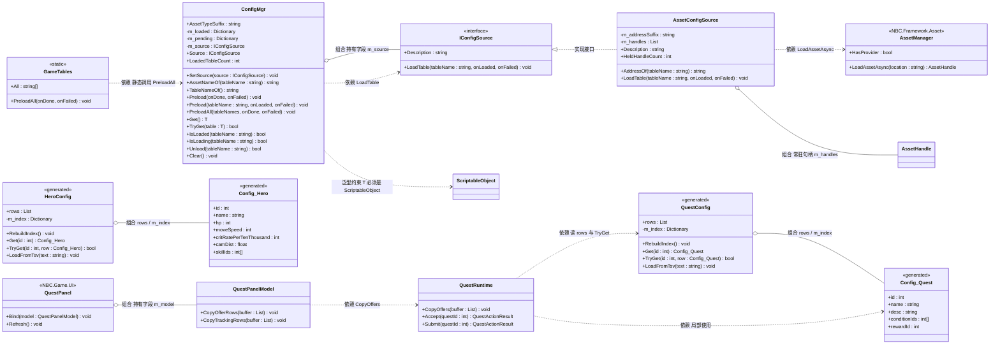
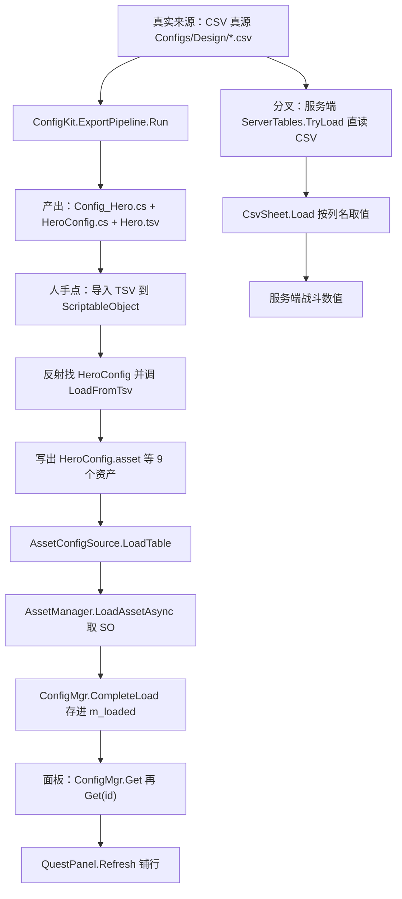

# C4 · 配置表运行时（`ConfigMgr`）

> **对应**：需求 8 / CFG-R1~R4；实施记录 `Docs\06-框架改造记录.md` §二十三；验收 `Docs\16-M1开工清单.md` C4
>
> ✅ **已收关（2026-09-22）**：EditMode 实测 **435/435 全绿**（`ConfigMgrTests` **14** 条）。
> 首轮是 433 绿 2 红（两个都是我自己的 bug），修完复跑全绿 —— 那两条的复盘在 §4.7，
> **比模块本身更值得看**。

---

# ① 问题是什么

**一句话**：配置表现在**能生成、能导入**了，但**游戏里还没法查**。

`ConfigKit` 那条链（C2/C3）解决的是"**策划填的表怎么变成资产**"；
C4 解决的是"**运行时代码怎么拿到这些数据**"。

看起来只是"查个表"，但有三件事必须想清楚：

| 要想清楚的事 | 想错的后果 |
| --- | --- |
| **同步还是异步查？** | 每次查询都异步 → 调用方代码被撕成一串回调，而配置表**根本不大** |
| **类型安不安全？** | 用反射按名字查 → 拼错表名要到运行时才炸，而且报错点离原因很远 |
| **查不到的时候说什么？** | 只说"找不到配置" → 而真实原因通常是**忘了预加载**，人却去查数据文件了 |

---

# ② 最小例子

### 错的写法（两个极端，都很常见）

```csharp
// 极端一：每次查询都去加载（异步传染）
public async Task<int> GetHpAsync(int heroId)
{
    var asset = await LoadAssetAsync<HeroConfig>("HeroConfig");   // 每次都碰 IO
    return asset.Get(heroId).hp;
}
// → 于是所有调用方都变成 async，一路传染到战斗结算里

// 极端二：让业务代码自己认识资源系统
public int GetHp(int heroId)
{
    var asset = Resources.Load<HeroConfig>("Configs/HeroConfig");  // 绕过了 AB（FW-08 的老问题）
    return asset.Get(heroId).hp;
}
```

### 对的形状（本模块）

```csharp
// 启动时预加载一次（同步来源会当场完成；异步来源回调后完成）
ConfigMgr.Instance.SetSource(new XxxConfigSource());
ConfigMgr.Instance.Preload<HeroConfig>();
ConfigMgr.Instance.Preload<SkillConfig>();

// 之后任何地方：同步、类型安全、不碰 IO
int hp = ConfigMgr.Instance.Get<HeroConfig>().Get(heroId).hp;
```

**一眼看出差别**：**加载只有一次（启动）**，查询是**纯粹的字典查表**；
而"从哪加载"被 `IConfigSource` 挡在外面，业务代码只知道 `ConfigMgr`。

---

# ③ 需求要什么

| 编号 | 要求 | 本模块怎么落实 |
| --- | --- | --- |
| **CFG-R1** | 统一入口 `ConfigMgr.Get<T>()` | ✅ `ConfigMgr.Instance.Get<T>()`（单例） |
| **CFG-R2** | 走 AB，**不是** `Resources` | ✅ 由 `IConfigSource` 实现决定；本层一个 `Resources` 都没写 |
| **CFG-R3** | 支持从 Lua 读配置 | ⏳ 属 M2（Lua 还没接） |
| **CFG-R4** | Editor 下可直接引用 `.asset`；**缺表报错友好** | ✅ 报错三要素（哪张表 / 原因 / 怎么改）；Editor 直读由"换一个 `IConfigSource` 实现"完成 |

---

# ④ 做法

## 4.1 为什么 `Get<T>()` 敢做成**同步**的

因为**配置表小、查得极频繁**：

| | 配置表 | 大资源（模型/贴图） |
| --- | --- | --- |
| 体积 | 几百行文本 | 几 MB ~ 几十 MB |
| 访问频率 | 战斗结算里**每帧**都可能查 | 加载一次用很久 |
| 该不该常驻内存 | **该** | 不一定 |

所以这里的选择是：**启动时一次性预加载进内存**，之后查询就是一次字典查找。
反过来如果做成"每次查询都异步"，那**整个代码库**都会为了等一个几百行的表而变成回调链 ——
代价远大于收益。

> 📌 这条判断值得记住：**"要不要异步"取决于数据的大小与访问模式，不取决于"它来自文件"**。

## 4.2 `IConfigSource`：把"怎么读"挡在外面

```csharp
public interface IConfigSource
{
    string Description { get; }
    void LoadTable(string tableName, Action<ScriptableObject> onLoaded, Action<string> onFailed);
}
```

留这道缝换来三件事（和 B2 的 `IAssetProvider`、E1 的 `IPerfCounterSource` 完全同构）：

| 收益 | 说明 |
| --- | --- |
| **EditMode 可测** | 测试塞一个**同步完成的假来源**，连一个真实 `.asset` 都不需要 |
| **真实现可以晚点接** | 走 YooAsset 的实现等 **B4/B5 打包**做完再加 —— **`ConfigMgr` 一行都不用改** |
| **换来源只加文件** | 编辑器直读 `.asset` / 服务端下发，都只是多一个实现 |

### 接口为什么用**回调**而不是 `async/await`

和 A9 的 `UIManager` 是同一条理由：`await` 的续体会被投递回
`UnitySynchronizationContext`，而 **EditMode 没有帧循环** —— 续体永远等不到执行，
测试会卡死。回调是"完成那一刻直接调用"，**在 EditMode 里确定性地能跑**。

### 接口为什么只给**表名**、不给 `Type`

加载器要的是"**资产地址字符串**"（`HeroConfig`），不是 C# 类型。
把 `Type` 塞进接口会把"资产系统"和"反射"绑在一起；
而**表名 ↔ 类型名**那点映射，`ConfigMgr` 按命名约定自己就能推（见 4.4）。

## 4.3 同一个表名，同时只有一条加载任务

```csharp
if (m_pending.TryGetValue(tableName, out pending))
{
    // 已经有人在加载了 —— **挂上去**，不要再加载一次
    if (onLoaded != null) { pending.OnSuccess.Add(onLoaded); }
    if (onFailed != null) { pending.OnFailure.Add(onFailed); }
    return;
}
```

这条语义是从 **A9 的 `UIManager`** 抄来的 —— 那边踩过"同一帧连点两下 =
加载两遍 + `Dictionary.Add` 抛重复键异常"。

⚠️ 它还牵连出一个实现细节：**回调可能是同步发生的**（缓存命中、或假来源）。
所以"继续下一张表"必须写在成功回调里：

```csharp
Preload(tableNames[index],
    asset => PreloadSequential(tableNames, index + 1, onDone, onFailed),
    onFailed);
```

**不要**写成"先调一次看有没有完成、再调一次等回调"那种两段式 ——
那会让同一张表被请求两次，语义②本身就白设了。
（我第一版就是那么写的，见 §4.7。）

## 4.4 行查询**不在这一层做** —— 于是不需要反射

```csharp
ConfigMgr.Instance.Get<HeroConfig>().Get(1001)
//                    ↑ 拿资产（本层）        ↑ 按主键取行（ConfigKit 生成的）
```

生成的 `<表>Config` 自带 `Get(id)` / `TryGet(id, out row)` 与主键索引（C2 的产物）。
所以 `ConfigMgr` **既不用反射、也不用定义新接口**，而且类型安全。

**命名约定是硬要求**：`HeroConfig ↔ Hero`（后缀 `Config`）。名字不符时：

```csharp
throw new ArgumentException("[ConfigMgr] 类型名必须是 `<表名>Config` 的形状（例如 HeroConfig ↔ 表 Hero）…");
```

**不猜** —— 猜出来的后果是"去加载一个不存在的表"，报错点离真正原因很远。

## 4.5 报错三要素（CFG-R4 点名的"友好"）

"找不到配置"最常见的原因是**忘了预加载**，而不是表真的不存在。所以报错要往那儿引：

```
[ConfigMgr] 表「Hero」还没加载（NBC.Game.Config.HeroConfig）。
已加载的表：（一张都没有）
最常见的两个原因：
  ① **忘了预加载** —— 在启动流程里调用 ConfigMgr.Instance.Preload<HeroConfig>()
  ② 预加载失败了但没接失败回调（那种情况 Console 里会有一条 LogError）
查表用法：ConfigMgr.Instance.Get<HeroConfig>().Get(id)
```

三要素：**哪张表** + **最常见原因** + **怎么改**。
这和 A9 那条"让错误自己说出来"是同一条原则。

## 4.6 加载失败**绝不静默**

```csharp
if (pending != null && pending.OnFailure.Count > 0) { /* 交给调用方 */ return; }

// 没人接失败回调：**不能静默吞掉**
Debug.LogError(message + "\n（这次加载没有任何失败回调，所以它只出现在这里。）");
```

"没人接回调就什么都不做"会造成一次**无声的加载失败** ——
而它的下游表现是"某张表查不到"，你根本不会往"加载失败"上想。

## 4.7 ⚠️ 首轮 2 条红：两个都是我的 bug（这一段最值钱）

首轮 **433 绿 2 红**。两条都不是"测试写错了"，而是产品代码的问题：

### ① 报错消息里出现了 `Outer+Nested`

```
Preload<NBC.Tests.EditMode.ConfigMgrTests+HeroConfig>()   ← 修前
Preload<HeroConfig>()                                     ← 修后
```

根因：我用了 `typeof(T).FullName`。嵌套类型的 `FullName` 是 `Outer+Nested`，
**既难看、又不能直接粘进代码** —— 而这段文字的全部意义就是"让人照抄去改"。
修法：**代码片段用简单名**，完整名只留在"是哪张表"那一句里做消歧义。

### ② `PreloadAll_StopsAtFirstFailure`：**我上一次那条"清理编辑"报了成功，代码却还在**

那次编辑我要删掉一段写乱的 `PreloadAll`（它对每张表调**两次** `Preload`，
其中一次**不挂任何回调**），但删除**没生效**。于是文件里同时存在：
① 那段乱代码 ② 干净的串行实现。

后果链条完全对得上：

```
两张表都被请求了一遍
   → 乱代码里那次 Preload 没挂任何回调
   → 触发"没人接失败回调"的 LogError（测试输出里那条）
   → Skill 也被加载了
   → 断言 IsLoaded("Skill") == false 红了
```

> 📌 **教训：删除类改动必须回读确认。**
>
> | | 改动没生效时 |
> | --- | --- |
> | **新增** | 下一步编译/测试**马上暴露**（找不到符号） |
> | **删除** | 多出来的那段**仍然能跑**，只是行为不对 —— 不报错，只以"另一条测试红了"的面目出现 |
>
> 也就是说：**删除类改动是一种静默失败**，而静默失败正是本项目一直在防的东西。
> 从那以后我的做法是：改完删除，**回读文件 + 数关键字出现次数**确认
> （这次就是靠 `remaining` / `firstFailure` 计数为 0 才敢说"真删掉了"）。

---

# ⑤ 自测 4 题

**1.** 为什么 `Get<T>()` 敢做成同步的？换成"每次查询都异步"会发生什么？
**2.** `IConfigSource` 这道缝换来了哪三件事？
**3.** 为什么不把行查询（按 id 取行）也做进 `ConfigMgr`？
**4.** "删除类改动必须回读确认"这条教训，本质是什么？

<details>
<summary>点开看答案</summary>

**1.** 因为**配置表小（几百行）、查得极频繁（战斗结算里每帧都可能查）**，
所以"启动时一次性预加载进内存、之后纯字典查"是划算的。
换成每次查询都异步，**整个代码库**都会为了等一个几百行的表变成回调链 ——
代价远大于收益。**判据：要不要异步取决于数据大小与访问模式，不取决于"它来自文件"。**

**2.** ① **EditMode 可测**（塞个同步完成的假来源，不需要任何真实资产）；
② **真实现可以晚点接**（走 YooAsset 的实现等 B4/B5 打包完再加，`ConfigMgr` 一行不改）；
③ **换来源只加一个文件**（编辑器直读 `.asset` / 服务端下发）。

**3.** 因为**生成物自己已经带了**（`ConfigKit` 为每张表生成了 `Get(id)` / `TryGet(id,out)`
和主键索引）。做进 `ConfigMgr` 就必须靠反射或额外接口 —— 前者丢掉类型安全、
后者是重复造轮子。**本层的职责就一条：管缓存 + 提供入口。**

**4.** 本质是**"删除"是一种静默失败**：新增没生效会被编译器抓住，
而删除没生效时那段代码**还能跑**，只是行为不对 —— 你要靠"另一条测试红了"去倒推。
所以**验证方式也要换**：新增看编译，删除**回读文件 + 数关键字**。

</details>

---

# ⑥ 30 秒验证

| # | 操作 | 预期 |
| --- | --- | --- |
| 1 | Test Runner → **EditMode** → **Run All** | 总数 **435**，全绿（`ConfigMgrTests` **14** 条在里面） |

⚠️ **本环境**：编译闸门用 `dotnet build Server\_api-probe\ApiProbe.csproj -m:1`（`-m:1` 的理由见 `Docs\11` §四之二）。

### 两个负向对照（不做，你不知道测试是不是在空转）

| # | 故意改坏什么 | 应该看到 |
| --- | --- | --- |
| 1 | 把 `ConfigMgr.Preload` 里"挂到已有任务上"那段删掉（改成直接再加载一次） | `Preload_SameTableTwice_LoadsOnce` **变红**（`RequestCount["Hero"]` 会变成 2）—— 证明语义②真的在被守 |
| 2 | 把 `Get<T>()` 的报错消息里"忘了预加载"那句删掉 | `Get_WithoutPreload_ThrowsActionableMessage` **变红** —— 证明"报错要能指导人"这条真的在被检查 |

---

# ⑦ 一分钟面试版

> **问：运行时配置表你是怎么设计的？**
>
> 分两层。**接缝层**是 `IConfigSource` —— "怎么把配置资产读进来"被挡在外面，
> 所以 `ConfigMgr` 不认识 YooAsset，测试里塞一个同步完成的假来源就能验全部逻辑；
> 真正的 AB 实现等资源打包做完再接，**本层一行都不用改**。
>
> **查询层**是同步的：配置在启动时预加载进内存，之后 `Get<HeroConfig>()` 就是一次字典查找。
> 理由很清楚 —— 配置表只有几百行、而战斗结算里每帧都可能查；
> 如果每次查询都异步，**整个代码库**都会为了等一个几百行的表变成回调链。
> **要不要异步取决于数据大小与访问模式，不取决于它来自文件。**
>
> 另外两件事：**同一个表名同时只有一条加载任务**（第二次请求挂到同一条上，
> 这条是从我之前做 UI 管理器时踩的坑抄来的）；**行查询不在这层做** ——
> 生成的资产自己带主键索引和 `Get(id)`，所以这里既不用反射、也不用定义新接口，还类型安全。
>
> 报错按"三要素"写：**哪张表 + 最常见原因（忘了预加载）+ 怎么改**。
> 因为"查不到配置"的真实原因几乎都是忘了预加载，而不是表不存在 ——
> 报错的价值是**把人引到正确的方向**。
>
> 还有一条我印象很深的教训：首轮 2 条红里有一条是**我上一次的"删除代码"编辑没生效**，
> 那段多余的代码照常能跑，只是行为不对。**"删除"是一种静默失败** ——
> 所以从那以后，改完删除我会**回读文件 + 数关键字出现次数**，而不是相信"编辑返回成功"。

---

# 附：术语速查

| 词 | 人话解释 |
| --- | --- |
| **预加载（preload）** | 启动时先把资源读进内存，之后查询不再碰 IO |
| **接缝（seam）** | 留一道可以替换的接口，把"会变的东西"隔离在一处 |
| **`IConfigSource`** | 本模块的接缝：**配置资产从哪来** |
| **`Singleton<T>`** | 框架里的纯 C# 单例（A1），`ConfigMgr` 用它做统一入口 |
| **回调 vs `async/await`** | 前者"完成那一刻直接调用"，后者要把续体投递回同步上下文 —— **EditMode 没有帧循环，会卡死** |
| **pending（在途请求）** | 正在加载、还没回来的那些表；同名请求挂到同一条上 |
| **命名约定（`HeroConfig ↔ Hero`）** | 表名与资产类型名的对应关系；不符时**当场报错**而不是猜 |
| **静默失败** | 出错了但不报错 —— 本项目反复出现的头号敌人；"删除没生效"就是其中一种 |

---

## 附 · 类图与数据流（2026-09-26 补）

这张类图解决"接缝在哪"：`ConfigMgr` **只持有一个 `IConfigSource` 字段**，
所以它从头到尾不认识资源系统；真实现 `AssetConfigSource` 才去依赖 `AssetManager`。
数据流图把**两条消费路径**画在一起：服务端直接读 CSV 真源，Unity 读的是生成物 SO ——
这两条分叉是这一章最值钱的一张图。



**看图时最容易画错的地方**：

| 容易画错 | 事实 | 证据 |
| --- | --- | --- |
| 以为 `ConfigMgr` 与 `<表>Config` 之间有接口/抽象基类 | **没有编译期契约**：只有命名约定（`HeroConfig ↔ Hero`）+ `where T : ScriptableObject` | `ConfigMgr.cs:102`、`:259`、`:46` |
| 以为 `Config_<表>` 是**泛型基类** | 它是**每张表一个具名类**（`Config_Hero`），不是泛型 | `Config_Hero.cs:11`、`CodeGen.cs:126` |
| 以为 `Config_<T>` 是手写的 | 是**生成物**，头三行就是 `auto-generated` 警告 | `Config_Hero.cs:1-3`、`HeroConfig.cs:1-3` |
| 以为 `ConfigMgr` 认识资源系统 / YooAsset | 它的 `using` 里**没有** `NBC.Framework.Asset`；`AssetManager` 只出现在 `AssetConfigSource` | `ConfigMgr.cs:34-38`、`AssetConfigSource.cs:46` |
| 以为 `AssetConfigSource` 用完会释放句柄 | 句柄**常驻不 `Dispose`**（配置表在进程内常驻，是有意为之） | `AssetConfigSource.cs:34-36`、`:136` |
| 以为判成功看「句柄非 null」 | 用 `IsValid`（= 成功 **且** 资产非 null），句柄非 null 但资产是 null 真会发生 | `AssetConfigSource.cs:38-41`、`:129` |
| 以为 `Get<T>()` 是异步的 | **同步**（启动预加载进内存，之后纯字典查） | `ConfigMgr.cs:13-15`、`:259` |
| ⚠️ **以为「有 9 张表」就等于「启动预加载 9 张」** | **两个不同的集合**：`GameTables.All` 只有 **7** 张（Hero / Skill / Level / Monster / Quest / QuestCondition / Reward），而 `Generated\` 与 `Configs\` 里有 **9** 张表的产物（多出 `Dungeon` / `DropTable`） | `GameTables.cs:33-45`；`dir` 实测 `Generated\` 9 个 `*Config.cs` + 9 个 `.tsv`、`Configs\` 9 个 `.asset` |

> 📌 最后一条值得单独记住：**「有哪些表」是生成器的产物清单，「启动预加载哪些表」是游戏自己的需求清单**
> —— 后者是 `GameTables.All` 这一个数组，加表时只改它。`Dungeon` / `DropTable` 目前只有**服务端**在用
> （`ServerTables` 直读 CSV），Unity 侧不预加载它们。

数据流：**CSV 真源 → ConfigKit → TSV/生成 C# → Unity 导入菜单 → SO 资产 → `ConfigMgr.Get<T>()` → 面板取数**，
并在左边标出**服务端那条分叉**：



**面试版怎么讲**：运行时这一层只做两件事 —— **管缓存 + 提供查询**，别的都不做。
「怎么把资产读进来」被 `IConfigSource` 挡在外面，所以 `ConfigMgr` 不认识资源系统，
测试里塞一个同步完成的假来源就能验全部逻辑，真实现（走资源层）后来接上时**本层一行都没改**。
查询是**同步**的：表只有几百行、而战斗结算里每帧都可能查，异步只会把整个代码库撕成回调链 ——
**要不要异步取决于数据大小与访问模式，不取决于它来自文件**。
还有一条容易被讲漏的分叉：**Unity 侧读的是生成物 SO，服务端读的是 CSV 真源**（源表才是唯一真源），
所以「改过表却没生效」这类问题在两个进程上的表现完全不同。
