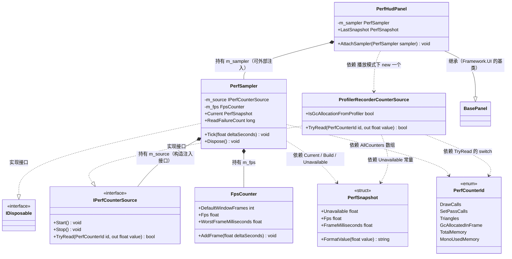
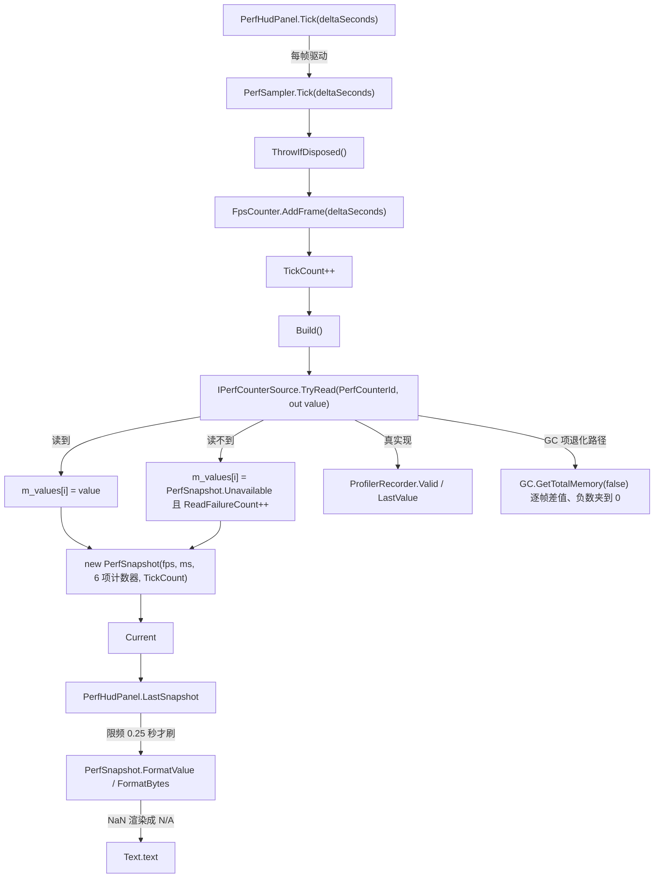

# E1 · 性能看板（`PerfHUD`）

> **对应**：需求 `FW-M12`；实施记录 `Docs\06-框架改造记录.md` §二十一；操作单 `Docs\16-M1开工清单.md` §10.2.18 + §10.2.19
>
> ✅ **已收关（2026-09-22）**：EditMode **420/420** 全绿、PlayMode **56/56** 全绿，并在场景里肉眼确认。
> 收关后补了一条守门用例（`DefaultRefreshInterval_IsUsedWhenNothingConfigured`），
> 所以 EditMode 总数现在是 **421** —— 下次跑应当看到 421。
> 文中标"实测"的数字都有出处；**手算的**（50.70 / 57.88 / 58.92、15 倍）都写明了算法。

---

# ① 问题是什么

**一句话**：让屏幕告诉你"这一帧到底花了多久、画了多少东西、分配了多少内存"，而且**别骗你**。

听起来很简单，但"在屏幕上显示 FPS"这件事有三个经典骗法：

| 骗法 | 现象 | 为什么 |
| --- | --- | --- |
| **抖** | 数字疯狂跳，60、43、58、12、61……根本读不出趋势 | 每帧的耗时本来就抖，直接显示"这一帧的倒数"就是噪声 |
| **掩盖** | 一直显示"平均 60 FPS"，可你**明明感觉到每 3 秒卡一下** | 平均值会把少数几帧的巨大耗时摊薄 |
| **编数字** | 显示"DrawCall = 0" | 有些统计在正式包里**根本读不到**，代码里一顺手就填了 `0` —— 那不是"没有"，是"不知道" |

这篇文档基本上就是在讲**怎么把这三种骗法一个个堵掉**。

**为什么这个模块必须先做**：M1 之后全是性能敏感的东西（帧同步、网络、战斗），
而你没法优化你**看不见**的东西。看板是后面所有性能工作的**眼睛**。

---

# ② 最小例子

### 错的写法（很多人第一版就是这个）

```csharp
// 每帧刷新，直接算倒数
void Update()
{
    m_fpsText.text = "FPS " + (1f / Time.deltaTime).ToString("F0");
}
```

两个问题：

1. **抖**：`1 / Time.deltaTime` 是"这一帧"的瞬时值，一帧抖 1 毫秒，数字就跳好几位。
2. **它自己在分配内存**：`"FPS " + 数字.ToString(...)` 每次都会拼出一个**新字符串**。
   每帧一次，就是每秒 60 个字符串垃圾。

问题 2 尤其讽刺 —— 这个看板要显示的其中一项就是"**本帧分配了多少内存**"，
**结果它自己每帧都在分配**。

### 对的写法（本模块的形状）

```csharp
// 每帧：只采样，不碰文本
public void Tick(float deltaSeconds)
{
    if (m_sampler == null) { return; }

    m_sampler.Tick(deltaSeconds);          // ← 每帧都做（FPS 需要每一帧的耗时）

    m_accumulated += deltaSeconds;
    if (m_accumulated >= m_refreshInterval) // ← 默认 0.25 秒才走到下面
    {
        m_accumulated = 0f;
        Refresh();                          // ← 刷文本（这里才会分配字符串）
    }
}

// 刷文本时，先判空，再拼字符串
if (m_fpsText != null)
{
    m_fpsText.text = snapshot.Fps.ToString("F1") + " FPS";
}
```

**一眼看出差别**：`Tick` 和 `Refresh` 被拆成了两件事 ——
**采样每帧做，文字限频刷**。这一条是 E1 显示侧最核心的设计。

---

# ③ 需求要什么

`FW-M12` 点名要这几项：

| 项 | 含义 | 本模块 |
| --- | --- | --- |
| **FPS** | 每秒帧数 | ✅ 滑动窗口平均 + 最差帧 |
| **DrawCall** | "这一帧向显卡提交了几次绘制命令" | ✅ 读 Profiler 计数器 |
| **SetPass** | "着色器/材质状态切换了几次" | ✅ 同上 |
| **Tris** | 这一帧画了多少三角形 | ✅ 同上 |
| **GC Alloc** | "这一帧在托管堆上分配了多少字节" | ✅ 两手准备（见 4.3） |
| **内存** | 已用总内存 / 托管堆 | ✅ 同上 |
| **网络 / 回滚次数** | 收发字节、状态回滚 | ⏳ **不在 M1**：网络在 M3、帧同步在 M4。接缝已经留好（`PerfCounterId` 加两个枚举值即可） |

> **顺带解释几个词**（第一次出现，后面直接用）：
> - **DrawCall（绘制调用）**：CPU 让 GPU 画一批东西的"一次指令"。次数太多，CPU 光在发指令就忙不过来。
> - **SetPass**：换材质/着色器时要重新设置一遍渲染状态，比 DrawCall 更贵。它高通常说明**材质没合批**。
> - **托管堆 / GC**：C# 里 `new` 出来的对象住在"托管堆"上，由垃圾回收器（GC）自动清理。
>   分配太多就会频繁触发 GC，而 GC 一跑，那一帧就明显变长 —— 所以**每帧分配量**是卡顿的主要嫌疑之一。
> - **Profiler**：Unity 自带的性能分析窗口（`Window → Analysis → Profiler`），本模块的数据源就是它。

---

# ④ 做法

## 4.1 接缝：把"从哪读"和"怎么算"分开

看板有两件完全不同的事：

```
PerfSampler.Tick(deltaSeconds)
    ├── 算帧率        ← 纯数学，跟 Unity 一点关系都没有
    └── 读各种计数器  ← 只有这里才需要 Profiler
```

于是定义一个**接缝**（英文 seam，指"留一道可以替换的接口"）：

```csharp
public interface IPerfCounterSource
{
    void Start();
    void Stop();
    bool TryRead(PerfCounterId id, out float value);
}
```

- **真实现**：`ProfilerRecorderCounterSource`（问 Unity 的 Profiler 要数据）
- **测试实现**：`FakePerfCounterSource`（一个字典，想返回什么就返回什么）

**回报是什么**：全项目**只有一个文件**真的依赖 Profiler。
E1 的测试一共 **51** 条（采集侧 28 + 显示侧 23），其中绝大多数**一个 Profiler 都不需要**就能跑 ——
帧率算法、NaN 的传播、"读不到时的行为"、"总共推进了多少帧"全都能离线测。

> 这就是 A9 / B2 都讲过的那件事又一次出现：**依赖倒置不是为了"架构好看"，
> 是为了让"真机上才有的东西"变成"可以随便伪造的东西"，从而可测。**

## 4.2 ⚠️ 滑动窗口 + 最差帧：平均值会掩盖卡顿

**滑动窗口**（sliding window）就是"只看最近 N 帧"：
每来一帧就把**最旧的那一帧**挤出去，永远对这 N 帧求平均。

```csharp
public void AddFrame(float deltaSeconds)
{
    if (deltaSeconds <= 0f) { return; }                    // 暂停帧/算错的，丢掉
    if (deltaSeconds > MaxTrackedFrameSeconds)             // 夹到 1 秒
    {
        deltaSeconds = MaxTrackedFrameSeconds;
    }

    if (m_count < m_frameSeconds.Length)                   // 窗口没满：直接放
    {
        m_frameSeconds[m_nextIndex] = deltaSeconds;
        m_sum += deltaSeconds;
        m_count++;
    }
    else                                                   // 窗口满了：换掉最旧的
    {
        m_sum -= m_frameSeconds[m_nextIndex];
        m_frameSeconds[m_nextIndex] = deltaSeconds;
        m_sum += deltaSeconds;
    }
    // ...推进 m_nextIndex
}
```

两处细节都是踩出来的：

- **为什么夹到 1 秒**：你在编辑器里打个断点停 10 秒，这一帧的 `deltaTime` 就是 10 秒。
  不夹的话，**那一帧会污染整个窗口十几秒**，之后一段时间看板全是假的。
- **为什么丢掉非正数**：`deltaSeconds` 是 0 会出现"除以 0"，负数会得出"负耗时"，
  两种都是没有意义的统计。

### 只有平均值还不够

假设窗口 60 帧（约 1 秒），你每 3 秒卡一次、每次卡 200 毫秒：

| 窗口长度 | 一次 200ms 卡顿后的平均 FPS | 卡顿占窗口的比例 |
| --- | --- | --- |
| 60 帧（约 1 秒） | **50.70** | 17% |
| 300 帧（约 5 秒） | **57.88** | 4% |
| 600 帧（约 10 秒） | **58.92** | 2% |

**三个数都是手算核对过的**（`窗口帧数 ÷ 总耗时`），不是估的。

看第 2、3 行：窗口一长，"57.88"、"58.92" 看上去**都挺健康**，
可你**确实每 3 秒卡一次**。所以除了平均，还必须报出窗口里**最慢那一帧**：

```csharp
public float WorstFrameMilliseconds   // 窗口里最慢那一帧花了多少毫秒
{
    get
    {
        float worst = 0f;
        for (int i = 0; i < m_count; i++)
        {
            if (m_frameSeconds[i] > worst) { worst = m_frameSeconds[i]; }
        }
        return worst * 1000f;
    }
}
```

📌 **所以"窗口该多长"没有标准答案**：
短窗口反应快但数字抖，长窗口数字稳但会把突发卡顿抹平。
**唯一正确的做法是平均和最差帧一起看。**

### ⚠️ 这里我连续栽了三次（这一段是本篇最值钱的部分）

这三个数字不是一次写对的。三轮测试，三次红，**三次都是"阈值"的问题**：

| 轮次 | 我写的断言 | 实际值 | 我错在哪 |
| --- | --- | --- | --- |
| 第 1 次 | `平均 FPS > 55` | **50.7042389** | 我拍了个 55。按模型算是 60 / 1.183 = **50.70** —— **产品是对的，阈值是估的** |
| 第 2 次 | `平均 FPS > 59` | **58.919693** | ⚠️ 更值得说：我上一轮的修法是"**先手算一张表再写阈值**"，表里明明写着 **58.92**，然后我在断言里写了 **`> 59`** |
| 第 3 次 | 去掉了阈值本身 | —— | 改成用**独立模型**和**比值**表达意图 |

第 2 次是关键：**我算了，但写的时候还是把它当成"大概的数"。**

所以最终的修法不是"下次算仔细点"，而是：

| 断言类型 | 怎么写 |
| --- | --- |
| **期望值** | 用**独立于实现的模型**算：`窗口帧数 ÷ ((帧数-1) × 1/60 + 卡顿秒数)` |
| **意图 / 倾向** | 用**比值或关系**表达：`短窗口的偏离 ÷ 长窗口的偏离 > 5`（实测 8.61），而不是 `> 59` |
| **确实需要界限时** | 写成"**主张 + 余量**"，并**注明模型值是多少**（例：模型 2.12，断言 `< 3.0`） |

📌 **结论升级版**：前两次的教训是"要算不要估"，
**而第二次证明了那还不够** —— 我算了，仍然写错。
**真正的解法是把"阈值"这个形式本身从断言里去掉；一个拍出来的阈值，红的时候你分不清是"实现错了"还是"阈值错了"，那正好浪费掉这次测试的全部价值。**

## 4.3 ⚠️ "读不到"必须和"是 0"分开

```csharp
public readonly struct PerfSnapshot
{
    /// <summary>读不到数据时的值。**显示层请渲染成 `N/A`。**</summary>
    public const float Unavailable = float.NaN;
```

`PerfSampler` 读到就记值，读不到就填 `NaN`（Not a Number，"不是数字"）：

```csharp
if (m_source.TryRead(AllCounters[i], out value))
{
    m_values[i] = value;
}
else
{
    m_values[i] = PerfSnapshot.Unavailable;   // NaN，不是 0
    ReadFailureCount++;
}
```

显示层：

```csharp
public static string FormatValue(float value)
{
    return float.IsNaN(value) ? "N/A" : value.ToString("F0");
}
```

**为什么这么较真**：正式包（非开发版）里，Unity 的绝大多数渲染统计**根本不存在** ——
因为那些统计要靠 Profiler 采集，而正式包不会为了看板一直开着它。

这时如果填 `0`，看板会**很自信地**显示：

```
DC 0
```

而你看到 `0` 会想"哦，这个场景没有 DrawCall"——
**这是一个看起来完全正常的假数字**，比"看不见"危险得多。

> 这和 A9 那个"兜底字符串 `Unknown(99)`"是**同一类问题**：
> 宁可说"不知道"，也别编一个。**静默失败比崩溃难查十倍。**

### 附带的一个诚实标注：GC 分配有两种语义

GC 那项是**两手准备**：

| 来源 | 语义 | 可用性 |
| --- | --- | --- |
| Profiler 计数器 `GC Allocated In Frame` | **这一帧分配了多少**（准确） | 可能拿不到 |
| `GC.GetTotalMemory(false)` 逐帧差值 | **托管堆净增长了多少**（近似） | 永远拿得到 |

⚠️ **别把后者当成前者**：一帧里"分配了 1KB 又回收了 1KB"，
在后者眼里是 **0**，在前者眼里是 **1KB**。
代码里用 `IsGcAllocationFromProfiler` 把这个差别**暴露出来**，而不是悄悄混过去。

## 4.4 ⚠️ 观测工具不能自己制造被观测的问题

这是 E1 显示侧的**核心矛盾**，值得单独一节。

看板要显示 **GC 分配**。而 `Text.text = ...` **每次赋值都会分配字符串**。
如果按最直白的写法（每帧刷全部文本）：

| 写法 | 字符串分配（按 60 FPS、4 个文本算） |
| --- | --- |
| 每帧刷 | 4 × 60 = **240 次/秒** |
| 限频到 4 Hz（`DefaultRefreshInterval = 0.25`） | 4 × 4 = **16 次/秒** |
| | → **少 15 倍** |

> ⚠️ **记一笔我自己的错**：第一版注释里我写的是"降了**两个数量级**"。
> 实际是 **15 倍**，一个数量级多一点。**"两个数量级"是我顺手写的，没算。**
> 本项目第 N 次栽在同一件事上：**凡是数字，先算再写。**

### 还有一个更隐蔽的同源错误

第一版我是这么写的：

```csharp
// ❌ 错的
public void Refresh()
{
    SetText(m_fpsText, snapshot.Fps.ToString("F1") + " FPS");
    // ...
}

private static void SetText(Text target, string value)   // ← 在方法里判空
{
    if (target != null) { target.text = value; }
}
```

看起来"控件不存在就跳过"，很对。**但没用。**

因为 **C# 是先把实参算出来，再传进方法**：
`snapshot.Fps.ToString("F1") + " FPS"` 这句拼接，
在 `SetText` 那个 `if` **之前**就已经执行完了。

也就是说：**控件不存在时，字符串照样被拼出来，然后被丢掉。**
`if (target != null)` 拦的是"赋值"，拦不住"分配"。

正确的写法是**先把判空挪到拼接之前**：

```csharp
// ✅ 对的
if (m_fpsText != null)
{
    m_fpsText.text = snapshot.Fps.ToString("F1") + " FPS";
}
```

> **这条和 E2 日志系统的 `IsEnabled` 是同一个道理**
> （"过滤必须发生在字符串拼接之前"）。
> 两个模块独立踩到了同一个坑 —— 说明这不是巧合，而是 C# 求值顺序的**固有陷阱**：
> **只要你在方法参数里拼字符串，任何写在方法内部的过滤都已经晚了。**

## 4.5 显示侧：所有控件都是可选的

`PerfHudPanel` 用 `GetControl<Text>(名字)` 而不是 `RequireControl<Text>(名字)`：

```csharp
protected override void OnInit()
{
    m_fpsText      = GetControl<Text>(FpsControlName);       // 取不到返回 null，不报错
    m_drawCallText = GetControl<Text>(DrawCallControlName);
    m_gcAllocText  = GetControl<Text>(GcAllocControlName);
    m_memoryText   = GetControl<Text>(MemoryControlName);
    m_detailText   = GetControl<Text>(DetailControlName);
    // ...
}
```

认识的五个控件名（按 GameObject 名字精确匹配）：

| 名字 | 显示 |
| --- | --- |
| `FpsText` | `60.0 FPS` |
| `DrawCallText` | `DC 42` |
| `GcAllocText` | `GC 2.0 KB` |
| `MemoryText` | `Mem 100.0 MB` |
| `DetailText` | 一行全量：`FPS 60.0 \| DC 42 \| SetPass 7 \| Tris 12345 \| GC 2.0 KB \| Mem 100.0 MB` |

**为什么允许任性配置**：看板长什么样是**调试需求**决定的 ——
排查 GC 时你只想看那一行，排查渲染时只想看 DrawCall。
不该逼着所有人用同一套固定布局。

> 这和 A9 的 `LoadingMaskPanel` 是同一个取舍。
> ⚠️ 但注意 A9 里说过："**这是框架里少数故意不 fail-fast 的地方**" ——
> 意思是：**这里不报错是有意的，不是忘了写检查**。有测试专门钉住这一点，
> 免得以后有人"顺手"改成 `RequireControl`，美术换个预制体就崩。

## 4.6 ⚠️ 为什么这组测试必须分 EditMode / PlayMode 两边

A1 的结论是"**EditMode 下 Unity 根本不调用 `Awake`**"。
E1 显示侧撞上的是它的**镜像**：

| 要验的事 | 为什么 EditMode 里**测不到** |
| --- | --- |
| 面板**不注入也能自己活起来** | EditMode 下 `Application.isPlaying == false`，面板**故意不建采样器**（Profiler 没在跑，`ProfilerRecorder` 只会打噪音日志） |
| **每帧被驱动** | 面板靠 `MonoManager` 的每帧回调推进，而 EditMode **连 `Awake` 都不调**，更没有帧循环 |
| 销毁时把回调摘干净 | `OnDestroy` 也是播放模式才有的事 |

所以：

| 环境 | 放什么 | E1 里的条数 |
| --- | --- | --- |
| **EditMode** | 纯逻辑：限频、可选控件、`NaN` 渲染、采样器归属 | `PerfHudPanelTests` **13** |
| **PlayMode** | 生命周期：自动建采样器、每帧驱动、`ShowMe`/`HideMe`/`OnDestroy` | `PerfHudPanelPlayModeTests` **9** |

**只看其中一边会漏掉一半。**

⚠️ 还有一个**测试隔离**上的坑：EditMode 那 13 条**必须自己注入采样器**。
否则面板一旦自动建采样器，`ProfilerRecorder` 在编辑模式会往 Console 打噪音，
而**测试里任何一条没被声明的日志都会让用例失败**。所以：

```csharp
// 只在播放模式自动建采样器
if (m_sampler == null && Application.isPlaying)
{
    m_sampler = new PerfSampler(new ProfilerRecorderCounterSource());
    m_ownsSampler = true;
}
```

这和 A5 / A8 / A9 用 `Application.isPlaying` 挡住编辑模式是**同一个套路**。

## 4.7 `Start()` 自举：一个只给调试看板的特权

看板正常的上屏路径是 `UIManager.ShowPanel("PerfHud", ...)`
—— 那需要 **YooAsset 打包（B4/B5）先做完**。

于是会出现一个荒唐的局面：**"看得见数字"要等资源系统先跑通**。
而排查问题时，最不想做的事就是**先修资源系统**。

所以 `PerfHudPanel` 多了一个自举：

```csharp
private void Start()
{
    if (IsInitialized) { return; }

    Initialize();
    ShowMe();
}
```

### 为什么它不会和 `UIManager` 打架（一条**时序**论证）

`UIManager` 在 `Instantiate` 之后**同步**就调了 `Initialize()`，
而 `Start` 要等到**下一帧**才跑。所以被管理的面板走到 `Start` 时
`IsInitialized` 已经是 `true`，**空操作**。

这条推论被两个测试间接钉住（它们都断言"每帧回调**恰好是 1 条**"）：

- `ShowMe_TwiceAddsOnlyOneListener`
- `Destroy_RemovesListenerAndReleasesSampler`

### ⚠️ 为什么别的面板**不许**抄这一招

| | 调试看板 | 业务面板（`LoadingMaskPanel` 等） |
| --- | --- | --- |
| 什么时候该出现 | **随时** —— 排查问题时恰恰最不想先修资源系统 | 由玩法逻辑决定 |
| 谁来决定 | 谁把它拖进场景就归谁 | **必须**是 `UIManager` |
| 自举的代价 | 无（`Initialize()` 幂等） | 会把 A9 修掉的毛病（**面板自己决定什么时候出现**）引回来 |

> A9 的 P-08 明确禁止面板自己初始化。**看板是例外，但例外必须写清理由** ——
> 不然下一个人会照着抄，然后把 A9 的成果拆掉。

## 4.8 ⚠️ 收关后撞到的一个 Unity 常识：**`const` 和属性都不会出现在 Inspector 里**

**事情经过**：我在操作单里写了"在 Inspector 里把 `Refresh Interval` 改成 `0.1`"，
负责人在场景里翻遍 Inspector **找不到这一格**，回报"这个没在 Inspector 面板显示"。

**我错在哪**：当时它是这么写的：

```csharp
public const float DefaultRefreshInterval = 0.25f;                    // ← const：编译期常量
private float m_refreshInterval = DefaultRefreshInterval;
public float RefreshInterval { get => m_refreshInterval; set => ... } // ← 属性
```

两条关于 Unity 序列化的硬规则：

| 东西 | 会出现在 Inspector 里吗 | 为什么 |
| --- | --- | --- |
| **`public` 字段** | ✅ 会 | Unity 默认序列化 public 字段 |
| **私有字段 + `[SerializeField]`** | ✅ 会 | `[SerializeField]` 就是"把它也存进去"的意思 |
| **属性（property）** | ❌ **永远不会** | 属性本质是**方法**（get/set），不是数据 —— 序列化器只搬数据 |
| **`const`** | ❌ 永远不会 | 编译期就被替换进代码里了，运行时**根本没有这个变量** |

**所以那一格本来就不可能存在** —— 我不是"忘了配"，是**写下了一句做不到的操作说明**。

### 修法

```csharp
[SerializeField]
[Tooltip("文字刷新间隔（秒）。0.25 = 4 Hz；0 = 每帧都刷（不建议）。")]
[Min(0f)]
private float m_refreshInterval = DefaultRefreshInterval;
```

属性保留（代码里改它仍然有用），**但它只是这个字段的门面**。

### ⚠️ 修完还要知道一个坑

**一旦某个值在预制体/场景里存过，改上面的字段初始值就不再影响它了** ——
序列化数据会**盖掉**字段初始值。想让已有实例回到新默认值，得在 Inspector 里点 **Reset**，
或者把组件删掉重挂。

这也是为什么我补了一条守门用例：`m_refreshInterval` 的初值现在同时被
"`DefaultRefreshInterval` 常量"和"序列化数据"两个来源决定，
**两者一旦不同步，就会出现"新挂的组件和老实例刷新速度不一样"这种鬼故事**。

> 📌 **这条教训和前面那些"校验器有 bug"是同一类，但方向相反**：
> 前面是"**检查空转了却没发现**"，这次是"**文档里承诺了一个平台做不到的操作**"。
> 共同点是 —— **我把"我以为"当成了"事实"**。
> 而"属性不进 Inspector"这件事**可以从类型系统直接推出来**，没有理由写错。

## 4.9 已知局限（写清楚，不藏）
| # | 局限 | 说明 |
| --- | --- | --- |
| 1 | **6 个 Profiler 计数器名字是照文档写的** | 名字错时 `ProfilerRecorder` **不报错**，只表现为一直 `N/A` —— 和"平台不支持"症状**一模一样**。所以那 6 个名字做成了**公开静态字段**，并把"去 Profiler 窗口核对真名"写进了操作单 |
| 2 | **发布版大部分渲染统计拿不到** | 那是 Unity 的设计。看板显示 `N/A` 是**正确答案** |
| 3 | GC 分配**两种语义混在一个字段里** | 见 4.3 末尾。用 `IsGcAllocationFromProfiler` 暴露差别 |
| 4 | 没有**网络 / 回滚次数**两项 | 留到 M3 / M4（接缝已留好） |
| 5 | 自举**只在 `Start` 那一次** | 运行中把 `PerfHud` 关掉再打开不会自动重新接上驱动。刻意不做 —— "停掉就别自己回来" |

---

# ⑤ 自测 6 题

**1.** 为什么不用 `1f / Time.deltaTime` 直接显示 FPS？
**2.** 既然有了平均 FPS，为什么还必须有"最差帧"？
**3.** 读不到计数器时为什么不能填 `0`？举一个它**会骗到人**的具体场景。
**4.** 这个看板自己会造 GC 吗？`SetText(f, x + " FPS")` 这个写法的问题在哪？
**5.** 为什么这组测试不能全放在 EditMode？
**6.** `Start()` 自举为什么不会和 `UIManager` 抢着初始化面板？

<details>
<summary>点开看答案</summary>

**1.** 因为它显示的是**这一帧**的瞬时值。帧耗时本来就抖（一帧抖 1 毫秒，数字就跳好几位），
   屏幕上会变成一串读不出趋势的乱跳数字。滑动窗口（看最近 N 帧的平均）才看得出趋势。

**2.** 因为**平均值会掩盖卡顿**。文中的表就是证据：300 帧窗口下一次 200ms 卡顿后平均还有 **57.88 FPS**，
   看着很健康，可你**每 3 秒真的卡一次**。
   📌 而且"窗口取多长"没有标准答案：短窗口反应快但抖，长窗口稳但会抹平突发卡顿 ——
   **所以平均和最差帧必须一起看。**

**3.** 因为"读不到"和"确实是零"是**两件事**。
   具体场景：**正式包（非开发版）里渲染统计根本不存在**。这时填 `0`，
   看板会显示 `DC 0`，你一看会想"哦，这个场景没有 DrawCall" ——
   而真相是"**这个数字我根本不知道**"。
   **一个看起来正常的假数字，比 `N/A` 危险得多**（静默失败）。

**4.** **会**。`Text.text = ...` 每次赋值都分配字符串：
   每帧刷 4 个文本 = **240 次/秒**，而限频到 4 Hz 是 **16 次/秒**（少 **15 倍**）。
   这个看板要显示的其中一项就是 GC 分配，**它自己每帧分配就是本末倒置**。
   `SetText(f, x + " FPS")` 的问题：**C# 先算实参再进方法**，
   所以那句拼接在 `SetText` 内部的 `if (target != null)` **之前**就执行完了 ——
   **控件不存在时字符串照样被拼出来、然后丢掉**。
   正确做法是把判空挪到**拼接之前**。（和 E2 日志的 `IsEnabled` 同一个道理。）

**5.** 因为看板最要紧的两件事**都只在播放模式才存在**：
   ① "不注入也能自己活起来" —— EditMode 下 `Application.isPlaying == false`，面板**故意不建采样器**；
   ② "每帧被驱动" —— EditMode **连 `Awake` 都不调**，更没有帧循环。
   连"销毁时摘干净回调"也依赖 `OnDestroy`。
   **所以证据必须是 EditMode 13 条 + PlayMode 9 条，只看一边会漏一半。**

**6.** 因为一条**时序**：`UIManager` 在 `Instantiate` 之后**同步**就调 `Initialize()`，
   而 `Start` 要等**下一帧**才跑。所以被管理的面板走到 `Start` 时 `IsInitialized` 已经是 `true` → 空操作。
   （这也是为什么"自举"没破坏 A9 的规矩：**被管理的面板行为完全没变**。）

</details>

---

# ⑥ 30 秒验证

### 步骤

| # | 操作 | 预期 |
| --- | --- | --- |
| 1 | Test Runner → **EditMode** → **Run All** | ✅ **实测已过**：**420/420** 全绿（采集侧 28 + 显示侧 13）。<br>⚠️ 收关后补了 1 条守门用例，所以**现在**应是 **421** |
| 2 | Test Runner → **PlayMode** → **Run All** | ✅ **实测已过**：**56/56** 全绿（含显示侧 9） |
| 3 | 按 `Docs\16` §10.2.19 C 节搭一个场景，进播放模式 | ✅ **你已确认**：数字正常显示 |

### 已经做掉的负向对照（这段留着当模板）

| # | 故意做错什么 | 应该看到 |
| --- | --- | --- |
| 1 | 把场景里 `FpsText` **改名**成 `FpsText2` | 看板**一片空白**，但 **Console 干干净净** —— 这证明"没报错"**不等于**"在工作"（`GetControl` 找不到就返回 null，这是设计如此） |
| 2 | 把 `ProfilerRecorderCounterSource.DrawCallsCounterName` 改成 `"Draw Calls Count XXX"` | DrawCall 那一格变成 **`N/A`** —— 这证明 `N/A` 这条路**真的能走到**，而不是永远显示数字 |
| 3 | 把 `PerfHud` 的 `Refresh Interval` 在 Inspector 里改成 `0`，再改成 `1` | 数字刷新速度明显变化 —— 这证明限频**真的在生效**（不然 4.4 那节课就白讲了） |

> ⚠️ 对照 3 是**这一轮唯一翻车的地方**：我第一次写这步时 `Refresh Interval` 还是个**属性**，
> Inspector 里**根本没有这一格**，你当然找不到。
> 现在它已经是 `[SerializeField]` 字段了，这一格真的存在。
> **经过见 §4.8。**

对照 2 是**最有价值的一个**：它同时验证了
"名字写错会静默变成 N/A"这个已知局限**是真的**（所以我们才需要 `Docs\16` §10.2.19 D 节去 Profiler 窗口核对真名）。

---

# ⑦ 一分钟面试版

> **问：性能看板你是怎么做的？**
>
> 分两侧。**采集侧**先把"从哪读"和"怎么算"分开：`PerfSampler` 只负责把计数器组装成一份快照，
> 真正的数据源藏在 `IPerfCounterSource` 后面，所以全项目**只有一个文件**依赖 Unity Profiler，
> 其余测试不需要 Profiler 就能跑。
>
> 帧率我用**滑动窗口平均**，因为 `1/Time.deltaTime` 抖得没法看；
> 但平均会掩盖卡顿 —— 60 帧窗口里塞一次 200 毫秒，平均还有 50.7 FPS，
> 长窗口下一次卡顿能藏到平均 58.9 —— 所以**同时报最差帧**。
>
> 还有一条我坚持的原则：**读不到就填 `NaN`，显示 `N/A`，绝不填 0**。
> 正式包里渲染统计经常根本不存在，填 0 会让看板显示"DrawCall = 0"，
> 那是**一个看起来正常的假数字**，比看不见危险得多。
>
> **显示侧**最核心的矛盾是：**观测工具不能自己制造被观测的问题**。
> 这个看板要显示 GC 分配，而 `Text.text = ...` 每次都分配字符串 ——
> 每帧刷 4 个文本就是每秒 240 次分配。所以拆成"**采样每帧做、文字限频 4 Hz 刷**"，降到每秒 16 次，少 15 倍。
> 顺带踩到一个坑：`SetText(f, x + " FPS")` 这种写法**拦不住分配**，
> 因为 C# 先算实参再进方法，"控件不存在"时字符串照样被拼出来 —— 判空必须挪到拼接**之前**。
>
> 测试分两个环境：**EditMode 13 条**测纯逻辑，**PlayMode 9 条**测生命周期。
> 因为"每帧被驱动"和"Profiler 可用"这两件事**在 EditMode 里根本不存在** ——
> 这是 A1 那条"EditMode 不调 `Awake`"的镜像。

---

# 附：术语速查

| 词 | 人话解释 |
| --- | --- |
| **FPS** | Frames Per Second，每秒帧数 |
| **滑动窗口** | 只看"最近 N 帧"，新的一帧进来、最旧的一帧挤出去 |
| **最差帧** | 窗口里耗时最长的那一帧（卡顿看它，不看平均） |
| **DrawCall** | CPU 让 GPU 画一批东西的一次指令，太多会拖慢 CPU |
| **SetPass** | 切换渲染状态（材质/着色器）的次数，比 DrawCall 更贵 |
| **Tris** | 三角形数量（顶点数据的规模） |
| **GC / 托管堆** | C# 的自动内存管理；`new` 出来的对象住这，分配太多会频繁触发回收，回收那一帧会变长 |
| **GC Alloc（本帧分配）** | 这一帧在托管堆上分配了多少字节 —— 卡顿的主要嫌疑之一 |
| **Profiler** | Unity 的性能分析窗口，本模块的数据源 |
| **`ProfilerRecorder`** | Unity 提供的"程序里读 Profiler 计数器"的 API |
| **接缝（seam）/ 依赖倒置** | 把"具体从哪拿数据"藏到一个接口后面，方便替换和伪造 |
| **EditMode / PlayMode（测试）** | 前者在编辑器里跑、**没有帧循环也不调 `Awake`**；后者真进播放模式 |
| **限频 / 节流（throttle）** | 故意降低执行频率（例如 60 Hz → 4 Hz），用一点点实时性换掉大量开销 |
| **`NaN`** | "Not a Number"，浮点里表示"不是有效数字"。本模块用它表示"读不到" |
| **静默失败** | 出错了但不报错 —— 本项目反复出现的头号敌人 |

---

## 附 · 类图与数据流（2026-09-26 补）

**这张图解决什么问题**：采集侧四件事经常被画成一坨——`PerfSampler` 只**组装**，它组合的是**接口** `IPerfCounterSource`（构造注入），
真正读 Unity Profiler 的只有 `ProfilerRecorderCounterSource` 一个类；`FpsCounter` 是**纯逻辑叶子类**（不实现任何接口、也不引用别的类型）。
另外看板本体 `PerfHudPanel` **不在 `Framework\Perf\` 里**，它在 `Framework.UI\`（命名空间 `NBC.Framework.UI`），是这里唯一的消费者。



**看图时最容易画错的 6 处**

| # | 容易画错 | 事实 | 证据 |
| --- | --- | --- | --- |
| 1 | 把 `FpsCounter` 画成实现 `IPerfCounterSource` | 它是**叶子类**：不实现任何接口，文件里连 `using` 都没有 | `FpsCounter.cs:28`（全文 168 行无 `using`） |
| 2 | 把 `PerfSampler` 的组合画到 `ProfilerRecorderCounterSource` | 它组合的是**接口**，实现在构造时注入 | `PerfSampler.cs:50`、`:61`；`PerfHudPanel.cs:228` 才 `new` 具体实现 |
| 3 | 把 `PerfSnapshot` / `PerfCounterId` 画成 class | 一个是 **`readonly struct`**，一个是 **enum** | `PerfTypes.cs:54`、`:30` |
| 4 | 给 `ProfilerRecorderCounterSource` 画 `: IDisposable` | 它**没有**实现 `IDisposable`，只有 `Start()` / `Stop()`；`IDisposable` 在 `PerfSampler` 上 | `ProfilerRecorderCounterSource.cs:39`、`:105`；`PerfSampler.cs:34`、`:133` |
| 5 | 把 `PerfHudPanel` 画进 `Framework\Perf\` | 它在 `Framework.UI\PerfHudPanel.cs`，命名空间 `NBC.Framework.UI`，基类 `BasePanel` | `PerfHudPanel.cs:48`、`:53` |
| 6 | 把「读不到」画成返回 0 | 读不到 = `TryRead` 返回 `false` → 填 `float.NaN`（`Unavailable`）→ 显示 `N/A` | `PerfTypes.cs:57`；`ProfilerRecorderCounterSource.cs:130`；`PerfSampler.cs:162` |

**一次采样的数据流**（节点名写源码标识符，中文只在箭头上）



⚠️ 图里 `PerfSampler → IPerfCounterSource` 是**组合到接口**：把箭头画到具体实现，就丢掉了「全项目只有一个文件依赖 Profiler」这件事（`ProfilerRecorderCounterSource.cs:31`–`:32` 是唯一 `using Unity.Profiling` / `UnityEngine` 的地方）。

**面试版怎么讲（3 句）**

- 「采集侧就一个组装器 `PerfSampler`：它组合 `IPerfCounterSource`（构造注入）和一个纯逻辑的 `FpsCounter`，每帧 `Tick` 产出不可变的 `PerfSnapshot`——所以只有 `ProfilerRecorderCounterSource` 一个文件真依赖 Unity Profiler，其余全能在 EditMode 测。」
- 「`FpsCounter` 是**滑动窗口**（默认 60 帧，单帧夹到 1 秒）并另外报 `WorstFrameMilliseconds`——平均会把「每 3 秒卡一次」抹平。」
- 「读不到一律是 `float.NaN` 而不是 0：`TryRead` 返回 `false` → `Unavailable` → 显示 `N/A`，同时 `ReadFailureCount++` 让看板能分清「从来没有」和「偶尔抖动」。」
