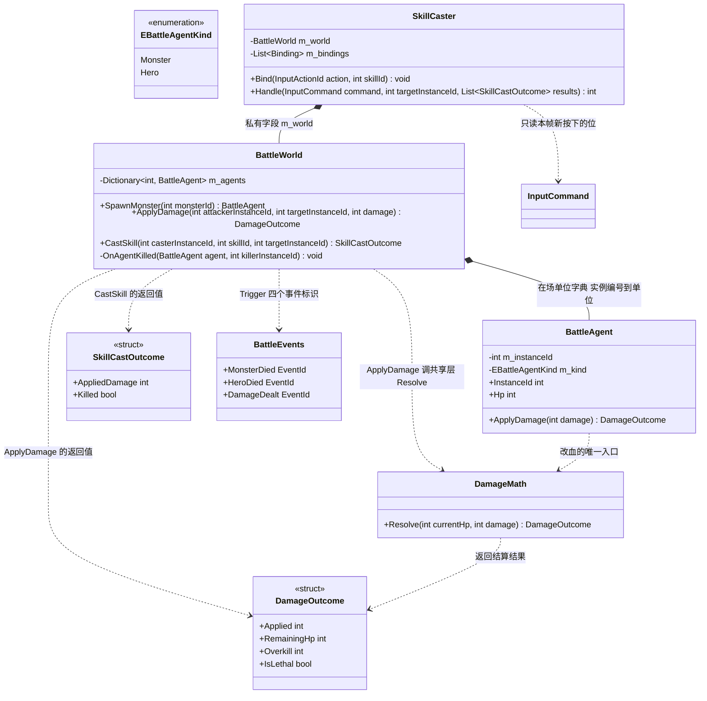
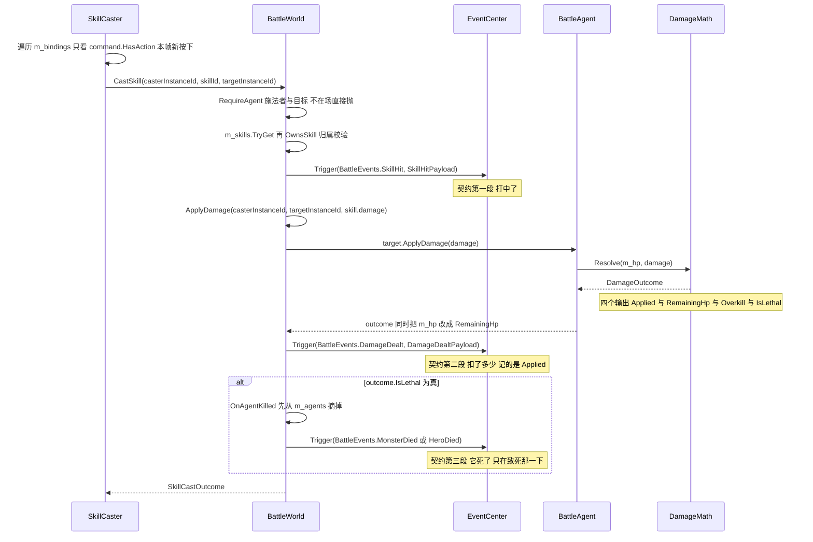

# M2-B · 单机 PVE 战斗内核

> **对应代码**
> · 共享层伤害结算：`Client\Assets\_Project\Shared\Battle\DamageMath.cs`
> · 客户端战斗：`Client\Assets\_Project\Game\Battle\`（`BattleEvents` / `BattleAgent` / `BattleWorld` / `SkillCaster`）
>
> **对应测试**
> · `Tests\EditMode\Game\DamageMathTests.cs`（9 条）
> · `Tests\EditMode\Game\BattleWorldTests.cs`（19 条）
> · `Tests\EditMode\Game\SkillCasterTests.cs`（13 条）
> · `Tests\EditMode\Game\BattleTestTables.cs`（共用的配置夹具）
> · `.NET 8` 实跑探针：`Server\_condition-probe\`（30 条，含 8 条伤害边界）
>
> **对应文档**：`Docs\22-M2开工清单.md` B 组、`Docs\20` §二「副本+组队」的最小闭环、`Docs\17` §十二（战斗数值禁用 float）

---

## ① 问题是什么（不用代码）

### 1.1 "打一下怪，怪掉血" 这件事为什么值得单独设计

听上去就是 `怪.Hp -= 伤害`。但真做起来，会陆续冒出六个问题：

| # | 问题 | 不处理会怎样 |
| --- | --- | --- |
| 1 | 血扣成负数了 | 血条画到屏幕外；"是不是死了"变成 `hp <= 0` 之外的算术题 |
| 2 | 打了 999 伤害、怪只有 10 血 | "这一下多疼"这个信息丢了 —— 伤害飘字、溢出统计、将来的"斩杀"技能都要它 |
| 3 | 对着尸体又打了一下 | **击杀数凭空多一个**。不崩、不报错，只在统计里慢慢偏 |
| 4 | 任务系统要知道"打死了一只野狼" | 要么战斗代码里写 `if (任务…)`，要么任务永远收不到消息 |
| 5 | 同屏两只一样的怪 | 给 A 上状态影响了 B；A 死了把 B 从场上摘掉 |
| 6 | 玩家按 J 放出的是**别的职业**的技能 | 静默生效，表现为"这技能伤害怎么不对" |

### 1.2 最直觉的写法（以及它会烂在哪）

```csharp
// ❌ 到处都在算血
void OnHit(Monster m, int dmg)
{
    m.Hp -= dmg;                       // 问题 1：会变负
    if (m.Hp <= 0) { m.Hp = 0; }
    DamageText.Show(dmg);              // 问题 2：过量伤害没单独算
    if (m.Hp == 0) { m.Dead = true; }  // 问题 3：再打一下就又"死"一次
    // 问题 4：任务怎么办？这儿加一句 if？还是发个事件？
    QuestMgr.OnKill(m.Id);             // ← 战斗代码开始认识任务
}
```

这段代码每一条问题都是**独立**的，而且都会在某个时刻以"另一个 bug"的面目出现。

---

## ② 最小例子（先看差别）

```csharp
// ❌ 错：谁都能改血
m.Hp -= dmg;

// ✅ 对：血量只有一条入口，而且结算是**纯函数**
DamageOutcome outcome = DamageMath.Resolve(m.Hp, dmg);
//  outcome.Applied     = 实际扣掉多少（不会超过剩余血）
//  outcome.RemainingHp = 结算后剩多少（一定 ≥ 0）
//  outcome.Overkill    = 打出去多出来的部分
//  outcome.IsLethal    = 这一下是不是把目标从"活着"打成 0
```

`Resolve` 是**纯函数**（给同样的输入永远给同样的输出、不改任何外部状态）。
这一点看着朴素，但它是下面所有事情的前提：

- 能单独测（不需要造一个怪、不需要 Unity）
- 能放进**共享层**（服务端也编同一份）
- "谁改血"这件事被收成了一个入口

---

## ③ 需求要什么（M2 的验收线）

`Docs\20` §三 的 M2 验收是一句话：**单机一局 PVE 里接到并完成一个任务，奖励真的发下去。**

那么战斗这一块要提供的**只有**：

| # | 要求 | 对应条目 |
| --- | --- | --- |
| V4 | 能刷怪、能打死、打死会**广播**出去 | `Docs\22` B1 |
| V5 | 广播出来的事件**真的能驱动任务条件**（不是测试里手搓） | `Docs\22` B2 + C |

⚠️ 所以 M2 的战斗内核**刻意不做**这些（写清楚，免得以后以为漏了）：

- **怪的 AI**（巡逻/追击/技能循环）→ 属 M3 的 BOSS 与行为树
- **命中判定**（范围/闪避/命中率）→ M2 的技能是**单体、必中**
- **移动与朝向** → 需要位置与定点数（D2），属 M3
- **表现层**（动画/特效/伤害飘字）→ 那是消费事件的人，不是战斗内核
- **普攻** → `Hero` 表里根本没有 attack 列，英雄的伤害**全部来自技能**

> 📌 **"最小可信闭环"的判据**在这里体现得很直白：
> 这一轮的验收是**任务闭环**，不是战斗手感。怪站着让你打，足够了。

---

## ④ 做法与关键决定

### 4.1 决定一：伤害结算放**共享层**（判据必须写清楚）

```
判据：**两端都必须算出同一个结果的东西，才放共享层。**

    ✅ 伤害、HP、命中判定 —— PVP 走帧同步（Q2 的决定）。
       客户端 A 算出"这一下打掉 80"、客户端 B 算出 81，两边就**永久分叉**，
       而且**不会报任何错**（D2 的定点数就是为这件事存在的）
    ❌ 刷怪、输入、表现、UI —— 只有一端会做，塞进共享层只是徒增约束
```

不写判据的话，共享层会变成"什么都往里塞"的垃圾场，然后**每一件东西都背上
"不许用 UnityEngine、不许有浮点"的枷锁**，而收益是零。

### 4.2 决定二：HP 钳位 + 过量伤害**单独算出来**

```csharp
int applied = damage > currentHp ? currentHp : damage;   // 实扣不超过剩余血
new DamageOutcome(applied, currentHp - applied, damage - applied, applied == currentHp);
//                ↑实扣      ↑剩血（≥0）        ↑过量            ↑致死
```

- **钳位**：`Hp` 永远 ≥ 0。UI 不会画出负血条，逻辑层不用每次判 `<= 0`
- **过量单独记**：`Overkill` 不是"顺便算的"，它有明确用途 ——
  伤害飘字要显示"这一下多疼"、统计要看溢出、以后的"斩杀"类技能也要它

### 4.3 决定三：打 **0 血**的目标，什么都不发生、也不算致死

```csharp
if (currentHp == 0) { return new DamageOutcome(0, 0, 0, false); }   // 不算致死
```

**为什么必须有这条**：条件系统按"致死"累加击杀数。如果尸体能"再死一次"，
击杀数就会**凭空多出来** —— 不崩、不报错，只在统计里慢慢偏。

⚠️ 顺带堵掉一个经典边界：`damage >= hp` 这个写法在 `damage = 0, hp = 0` 时**为真**，
会把"0 伤害打尸体"判成致死。本规则把这种情况直接挡在前面。

### 4.4 决定四：非法输入**抛异常**，不静默修正

| 输入 | 处理 | 理由 |
| --- | --- | --- |
| `currentHp < 0` | 抛 | 说明**上一个扣血的地方忘了钳位** —— 修那里，别在这里圆回来 |
| `damage < 0` | 抛 | 要么是"治疗"（那该另有一个函数），要么是配置填错（`Skill.damage` 规则行是 `min(0)`）。当成 0 会让"这技能怎么不掉血"变成悬案 |

### 4.5 决定五：**实例编号 ≠ 配置编号**

```csharp
ConfigId   = 6001（野狼）      // 任务条件、掉落、AI 用它
InstanceId = 世界运行期发号     // "这一个具体的怪"用它
```

M2 一局只刷一只狼，两者看起来可以合并。**但同一个 6001 刷两只就会撞号**：

- 给 A 上 debuff 会同时影响 B
- A 死了会把 B 从世界里摘掉

📌 这类 bug **只在"同屏两只同样的怪"时出现**，手测很难碰到。
所以现在就把两者分开（有用例：同一个配置刷两只，打 A 不影响 B）。

### 4.6 决定六：**两个**死亡事件，而不是一个带 `kind` 的

```csharp
// ❌ 一个事件 + 订阅方自己过滤
AgentDied { InstanceId, Kind, ConfigId, KillerId }
    → 任务桥里要写：p => p.Kind == Monster ? p.ConfigId : 0

// ✅ 两个事件
MonsterDied { InstanceId, MonsterConfigId, KillerInstanceId }
HeroDied    { InstanceId, HeroConfigId,    KillerInstanceId }
```

**为什么**：那个过滤写法里，`0` 恰好是**"任意目标"**的意思。
一旦 `Kind` 判断写错（或将来加了第三方阵营），"玩家死了"会被当成
"击杀了一个目标 0" → **任何**"击杀任意怪 N 只"的任务都会涨进度。
**静默、且看起来完全正常。**

两个事件 = 类型系统把这件事钉死，桥里一行过滤都不用写。代价只是多一个静态字段。

### 4.7 决定七：事件顺序是**契约**

```
CastSkill：  SkillHit  →  DamageDealt  →  （致死时）MonsterDied / HeroDied
             "打中了"     "扣了多少"        "它死了"
```

**顺序不写死会怎样**：条件系统按事件累加进度。
如果"击杀"先于"命中"发出，一个"**先命中 3 次、再击杀 1 只**"的任务
在**同一只怪**上会先完成击杀条件 —— 而玩家看到的是"我先杀死了它"。
这类问题会以"任务进度偶尔乱跳"的形式出现，极难定位。

### 4.8 决定八：删掉一个**永远走不到的分支**，并把它变成不变量

第一版我在 `ApplyDamage` / `CastSkill` 里都写了"目标已经死了就什么都不做"。
写测试时发现**没法构造这个场景** —— 因为死的单位**当场就被摘掉了**，
"在场但 0 血"这个状态**不存在**。

于是把它删掉，并把这条变成不变量：

```
                    **在场 ⇒ 活着**
```

有用例 `World_NeverHoldsDeadAgent` 钉住（打死一只之后，把所有在场单位查一遍，
不允许出现 `IsAlive == false`）。

> 📌 **一个永远走不到的分支比没有分支更糟**：读代码的人会以为存在那种状态，
> 于是照着它写下别的逻辑（比如"记得判断 IsAlive"），最后大家一起维护一个幻觉。
>
> ⚠️ 那"尸体被打"由谁防？由 `DamageMath` 防（规则③）——
> **它才是持有"血量"这个状态的地方**。防御要放在状态所在的那一层。

### 4.9 决定九：技能归属 —— 一处实现，**两个调用点**

```csharp
// BattleWorld：规则唯一实现
private static bool OwnsSkill(BattleAgent agent, int skillId) { ... }

// 两个调用点
public bool CasterOwnsSkill(int instanceId, int skillId)      // 给装配期用
public SkillCastOutcome CastSkill(...)                        // 结算期兜底
```

| 时间点 | 谁查 | 好处 |
| --- | --- | --- |
| **装配期** | `SkillCaster.Bind` | 绑错**当场报错**，不用等玩家按下按钮 |
| **结算期** | `BattleWorld.CastSkill` | 兜底：防"绕过 SkillCaster 直接调世界" |

**这不是"两套规则"**，是 **fail early + fail loud**：
规则只有一份实现，但值得在两个时间点各问一次。

⚠️ 这条规则是**被一条红逼出来的**（见 §⑧ 坑 3）：第一版 `Bind` 只查了
"技能表里有没有"，没查"这个英雄会不会"，于是"给法师绑剑士的技能"能绑上，
要等**玩家按下那个键**才炸 —— 而 `Bind` 的注释里明明写着"装配时就报错"。

### 4.10 决定十：输入 → 技能，**不用自己算"按下沿"**

```csharp
// InputCommand.ActionBits 的语义是"**本帧新按下**"（不是"现在按住"）
if (command.HasAction(binding.Action)) { m_world.CastSkill(...); }
```

A7 把 `ActionBits`（本帧新按下）和 `ActionReleaseBits`（本帧新松开）**两条边沿**都发了，
所以逻辑层能**精确重建**"持续按住"，而这一层根本不用存上一帧去比边沿。

⚠️ 如果哪天有人把 `ActionBits` 读成"现在按住"，现象是
**"按住不放 → 一秒 60 发技能"** —— 而且看起来还挺"跟手"，极难被判成 bug。
所以本模块**专门有用例把这条语义钉住**（喂一个只有"新松开位"的命令，必须不放技能）。

📌 这也是 A7 那条"把键盘变成**可传输的值**"的回报：
`Handle(command, target)` 是纯输入输出，EditMode 里**手搓一个 `InputCommand`**
就能测"按下 J 会发生什么" —— 不需要键盘、不需要帧循环。

---

## ⑤ 自测 5 问（先自己答，再看折叠答案）

<details><summary><b>问 1</b>：伤害结算凭什么放共享层，而刷怪不放？</summary>

判据是"**两端都必须算出同一个结果的东西才放**"。

伤害/HP 必须放：PVP 走帧同步，客户端 A 算出打掉 80、B 算出 81 就**永久分叉**，
而且不报任何错。刷怪/输入/表现只有一端会做，放进去只会白背"不许用引擎、不许用浮点"的枷锁。
</details>

<details><summary><b>问 2</b>：为什么"打 0 血的目标"要单独写成一条规则？</summary>

因为击杀数是**条件系统按"致死"累加**的。如果尸体能"再死一次"，击杀数会**凭空多出来** ——
不崩、不报错、只在统计里慢慢偏，属于最难发现的一类错。

顺带它还堵了一个经典边界：`damage >= hp` 在 `damage = 0, hp = 0` 时为**真**，
会把"0 伤害打尸体"判成致死。
</details>

<details><summary><b>问 3</b>：为什么要分「实例编号」和「配置编号」？</summary>

配置编号（6001 = 野狼）给任务条件/掉落/AI 用；实例编号是运行期发的唯一号，
给"这一个具体的怪"用。

合并的话，同一个 6001 刷两只就撞号：给 A 上状态会影响 B、A 死了会把 B 摘掉。
**这类 bug 只在同屏两只同样的怪时出现**，手测很难碰到。
</details>

<details><summary><b>问 4</b>：为什么怪物死亡和英雄死亡是两个事件？</summary>

因为订阅方（尤其是任务条件桥）要的是"**只有怪物死了才算击杀**"。
合用一个带 `kind` 的事件，桥里就得写过滤，而过滤里那个"不是怪物时给 0"的写法
会撞上"**0 = 任意目标**" —— 于是"玩家死了"让**任何**击杀类任务涨进度。

两个事件 = 类型系统钉死，一行过滤都不用写。
</details>

<details><summary><b>问 5</b>：我删掉了一个分支，为什么说"删掉比留着好"？</summary>

那个分支是"目标已经死了就什么都不做"，但它**永远走不到** ——
死掉的单位当场就被摘掉了，"在场但 0 血"这个状态不存在。

**走不到的分支比没有分支更糟**：读代码的人会以为存在那种状态，
于是照着它写下别的逻辑，最后大家一起维护一个幻觉。

正解是删掉它，并且把"**在场 ⇒ 活着**"变成一条**不变量**（有用例钉住）；
而"尸体被打"这件事交给**持有血量的那一层**（`DamageMath`）去防。
</details>

---

## ⑥ 你 30 秒能做的验证（含**负向对照**）

| # | 做什么 | 应该看到什么 |
| --- | --- | --- |
| 1 | Test Runner 跑全量 EditMode | **530 全绿**（M2-B 贡献 41 条） |
| 2 | 跑 `Server\_condition-probe` 的 exe | **30/30 全绿**，其中【二】是 8 条伤害边界 |
| 3 | **负向对照 A**：把 `Monster.csv` 里 `hp` 改成 `0`，重跑导出 | 报错定位到文件+表+行+列，退出码 2，**一个文件都不产出**（`range(1,999999)` 在挡） |
| 4 | **负向对照 B**：把某个英雄的 `skillIds` 改成别的职业的技能，跑 EditMode | `CastSkill_SkillNotOwnedByCaster_Throws` / `Bind_...` 这类用例会红 —— 证明**归属校验真的在工作** |

> 第 3、4 条的意义：**一条永远绿的检查等于没有检查**。
> 故意弄坏一次、看它会不会红，才能证明它真的在测东西（W9）。

---

## ⑦ 一分钟面试版（可以直接背）

> "M2 的战斗内核我做了三件事。
>
> 第一，**伤害结算放在双端共享层**，判据写死在文件头：
> '两端都必须算出同一个结果的东西才放共享层' —— 伤害和 HP 必须放，
> 因为 PVP 走帧同步，两边算出不同数就永久分叉而且不报错；
> 刷怪和输入不放，因为只有一端会做。
>
> 第二，我把三件容易出错的事**写成了规则**：
> HP **钳在 0**（不出现负血）、**过量伤害单独算出来**（伤害飘字和以后的斩杀技能要用）、
> **打 0 血的目标不判致死** —— 最后这条是因为击杀数是按'致死'累加的，
> 尸体能再死一次就会让统计慢慢偏。
> 顺带它还堵了一个经典边界：`damage >= hp` 在 `0 >= 0` 时为真。
>
> 第三，两处我刻意'多写了一点'：
> **实例编号和配置编号分开**（否则同屏两只同样的怪会撞号，而这只有那种情况下才复现）；
> **怪物死亡和英雄死亡是两个事件**而不是一个带 kind 的 ——
> 因为合用一个的话，桥里的过滤会撞上'0 = 任意目标'，
> 于是'玩家死了'会让任何击杀类任务涨进度，静默且看起来正常。
>
> 还有一个我自己很满意的自省：我第一版写了一个**永远走不到的分支**
> （'目标已经死了就什么都不做'），因为死的单位当场就被摘掉了。
> 我把它删了，并把'**在场 ⇒ 活着**'变成一条不变量 ——
> **一个走不到的分支比没有分支更糟**，读代码的人会以为存在那种状态。
>
> 这一轮同样有两条红是被'验证'逼出来的：一条是我自己算错了用例里的伤害
> （300 血的怪挨两发 120 不会死），另一条更值钱 ——
> **用例红了，但根因是代码少了一半检查**：技能'归属'只在结算期查，
> 装配期没查，而我的注释里写着'装配时就报错'。**注释写着 A、代码做的是 B**，
> 这类不一致比没注释更危险。"

---

## ⑧ 本轮踩的坑（**如实记，这一节比结论有用**）

### 坑 1 · 我自己算错了用例里的数字（第 4 次栽在"数字"上）

**现象**：写完用例自查算术时发现，300 血的野狼挨两发 120 **不会死**：

```
300 → 180 → 60        （我以为第二发就死了）
```

第一版我把第二发写成了致死。**如果没自查，这几条用例在 Unity 里会全红。**

**改法**：改成三发，并且**逐发核对数字**（含"致死那一下实扣只有 60，不是 120"）。
另有一处 `World_NeverHoldsDeadAgent` 也少打了一下。

📌 这是本项目"**断言里的数字必须算出来**"那条教训的**第 4 次**。
前三次在 E1（性能看板的阈值）。这次的新认识是：
**它不只发生在"阈值"上，也发生在"我以为的伤害数值"上** ——
只要断言里有一个需要推导的数字，就要拿笔算一遍。

### 坑 2 · 我写了一个永远走不到的分支（见 §4.8）

**怎么发现的**：给"打尸体"写用例时**构造不出那个场景** ——
死的单位当场就被摘掉了，`TryGetAgent` 直接返回 false。

**这是个好信号**：**当你写不出一个状态的测试时，先怀疑那个状态是否真的存在**，
而不是想办法硬造它。

删掉分支 + 把"在场 ⇒ 活着"变成不变量之后，代码反而更短、更好读。

### 坑 3 · 红的是用例，根因是**代码少了一半检查**（注释写着 A、代码做的是 B）

**现象**：负责人跑 Unity 得到 **528 绿 1 红**：

```
Handle_TwoActionsPressed_CastsBoth 红：
[BattleWorld] 法师（实例 #1，配置 1002）的技能列表里没有技能 2002
```

**表面**：用例在 `SetUp` 里拿的是法师（只有穿心箭 2003），却给它绑了冰箭 2002 —— 用例写错了。

**但根因在代码**：`SkillCaster.Bind` 的注释明写

> "技能编号**当场校验**（装配时就报错，好过等到玩家按下按钮才发现）"

而它**只查了"技能表里有没有"，没查"这个英雄会不会"**。
所以"给法师绑剑士的技能"**能绑上**，要等**玩家按下那个键**才炸。

📌 **注释写着 A、代码做的是 B**，这类不一致比"没有注释"更危险 ——
因为它会让后来的人**相信**那句注释，从而不再去读代码。

**改法**（两边都不放宽）：
1. `BattleWorld.CasterOwnsSkill` 公开 —— 归属规则仍然**只有一份实现**
2. `SkillCaster.Bind` 调它早检查 —— 于是有了**两个调用点**：装配期 + 结算期
3. **用例侧改的是用例**（换成真的会这两个技能的剑士），不是把校验放宽

### 坑 4 · 测试里用了"不属于它的东西"—— 我漏了两次

- 第一次在 `BattleWorldTests`：拿剑士（1001）去放**法师的**穿心箭（2003）
- 第二次在 `SkillCasterTests`：拿法师（1002）去绑**剑士的**冰箭（2002）

两次都是"测试自己胡来"，而且第二次是**被新加的校验抓出来的**。

**做法**：加完归属校验之后，我把两个测试文件里**所有 (英雄, 技能) 对**捞出来
对着配置表机械核了一遍：

```
剑士1001={2001,2002}  法师1002={2003}  野狼6001={2003}  蜘蛛6002={2002,2003}  狼王6003={2001,2002}
结论：除两条**故意的**反例（期望抛异常），其余全部合规 ✅
```

📌 **这类问题靠人眼扫必漏**（我一次轮次里就漏了两次）。
它**值得做成一条机械检查**（"测试里用到的技能必须属于那个单位"），已记进 `Docs\22` 的待办。

---

## ⑨ 本轮的数字（实测）

| 项 | 值 |
| --- | --- |
| 新增代码 | 共享层 1 文件 + 客户端 4 文件 |
| 新增 EditMode 用例 | **41**（伤害 9 / 战斗世界 19 / 输入 13） |
| EditMode 总数 | **530**（M1 435 + M2-A 54 + M2-B 41）—— 负责人实跑 **全绿** |
| `.NET 8` 探针 | **30/30**（含 8 条伤害边界） |
| 编译闸门 | **0 警告 0 错误**（产物字符串表正对照确认新类型真的编进去了） |
| 配置表 | **没动**（M2-B 没有新增表；复用 `Monster` / `Hero` / `Skill`） |

---

## 附 · 类图与数据流（2026-09-26 补）

**这张图解决什么问题**：M2-B 只有四个文件，但**谁改血**、**谁发事件**、**谁做校验**三件事是分开的，画错一处结论就反了。
最容易画错的：让 `BattleAgent` 发事件（它**不发**，只改自己的血，广播是 `BattleWorld` 的事）；让 `BattleWorld` 自己算伤害
（它调**共享层**的 `DamageMath.Resolve`）；把 `DamageOutcome` 画成 `class`（`readonly struct`）；
以及把技能归属校验画在一处（它是**一处实现、两个调用点**：装配期 + 结算期）。



⚠️ 一处**未读到**：`InputCommand`（`MoveX` / `ActionBits` 等）与 `InputActionId` 是 A7 的产物，本篇只读到**用法**（`NetSession.cs:521`~`:523`、`SkillCaster.cs:216`），没读到定义文件，所以图上没有它们的成员。

**看图时最容易画错的 6 处**

| # | 容易画错 | 事实 | 证据 |
| --- | --- | --- | --- |
| 1 | 让 `BattleAgent` 发事件 | 它**只改自己的血**，注释明写「不广播事件（那是 `BattleWorld` 的事）」 | `BattleAgent.cs:157`~`:168` |
| 2 | 让 `BattleWorld` 自己写伤害公式 | 它调共享层 `DamageMath.Resolve`（双端同一份） | `BattleWorld.cs:320`、`BattleAgent.cs:165`、`DamageMath.cs:125` |
| 3 | 把 `DamageOutcome` / `SkillCastOutcome` 画成 `class` | 两个都是 **`readonly struct`** | `DamageMath.cs:54`、`BattleWorld.cs:62` |
| 4 | 把技能归属校验画在一处 | **一处实现两个调用点**：装配期 `Bind` + 结算期 `CastSkill` | `BattleWorld.cs:288`、`:361`、`SkillCaster.cs:142`、`:156` |
| 5 | 把死亡事件画成一个带 `kind` 的 | **两个事件** `MonsterDied` / `HeroDied`，按 `Kind` 分派 | `BattleWorld.cs:440`~`:448`、`BattleEvents.cs:39`、`:42` |
| 6 | 把「先摘掉再广播」画反，或让「打 0 血」走致死 | 先 `m_agents.Remove` **再**广播；`currentHp == 0` 直接返回 `(0, 0, 0, false)` | `BattleWorld.cs:435`~`:438`、`DamageMath.cs:144`~`:149` |

**一次 `CastSkill` 的顺序契约**，以及 `DamageMath.Resolve` 的四个输出（顺序反了条件系统就会「先看到击杀、再看到命中」）：



**面试版怎么讲（4 句）**

- 「战斗内核只有三件东西：`BattleWorld`（在场单位 + 结算入口）、`BattleAgent`（一个单位的数据）、`SkillCaster`（动作到技能的绑定），配上共享层的 `DamageMath.Resolve`。**谁改血只有一个入口**，而它是纯函数 —— 所以能单独测、能放进共享层、服务端也编同一份。」
- 「三条写死的规则：HP **钳在 0**；**过量伤害单独算出来**（`Overkill` 给飘字与以后的斩杀技能用）；**打 0 血的目标什么都不发生、也不算致死** —— 最后这条是因为击杀数按『致死』累加，尸体能再死一次统计就会慢慢偏，顺带还堵掉 `damage >= hp` 在 `0 >= 0` 时为真的边界。」
- 「事件顺序是**契约**：`SkillHit` → `DamageDealt` →（致死时）`MonsterDied` / `HeroDied`；而且死亡是**两个事件**不是一个带 `kind` 的 —— 合用一个的话桥里那句『不是怪物就给 0』会撞上『0 = 任意目标』，于是『玩家死了』会让任何击杀类任务涨进度。」
- 「有一处我刻意多写了一点：技能归属是**一处实现、两个调用点**（装配期早报错 + 结算期兜底），这不是两套规则，是 fail early + fail loud；另外我把『**在场 ⇒ 活着**』变成不变量，死掉的单位当场从世界摘掉，所以『目标已经死了就什么都不做』那个分支根本走不到 —— **走不到的分支比没有分支更糟**。」
