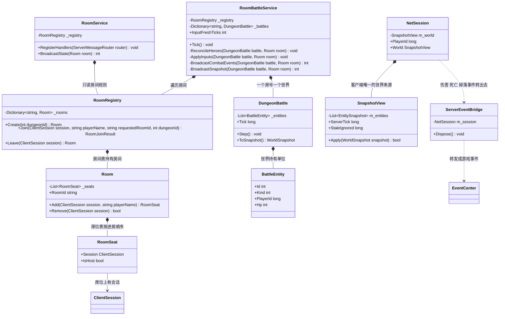
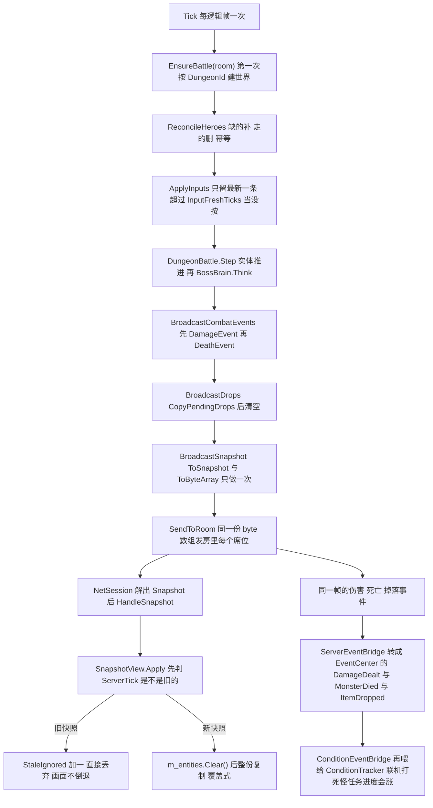

# M3-B · 房间与状态同步（一局联机是怎么跑起来的）

> 对应切片：**M3-S4（房间与席位）+ S5（快照下行）+ S5b（输入上行）**（`Docs\25-M3开工清单.md`）
> 留档日期：2026-09-23 · 结构按 `Docs\00` §15.3.1 的七段式 · 写法按 §15.3.1.1「说人话」

---

## ① 问题是什么（先不看代码）

`M3-A` 解决了"两端能说话"。这一课解决"**说了话之后，一局游戏怎么跑**"：

| # | 问题 | 不管它会怎样 |
| --- | --- | --- |
| 1 | **两个人在哪儿一起打？** | 没有"房间"的概念，就只是两条各自独立的连接 —— A 看到的怪和 B 看到的怪不是同一只 |
| 2 | **谁算数？** | 客户端自己算伤害/位置 → ① 改内存就能作弊 ② 两端算出不同结果（且**不报错**） |
| 3 | **客户端怎么知道"现在是什么样"？** | 每个客户端各跑一份逻辑 → 迟早分叉；网络一抖就永远对不上 |
| 4 | **玩家的操作怎么进去？** | 让客户端直接改世界 → 又回到第 2 条 |

一句话：**这一课就是把"谁说了算"落到代码上** —— 服务端是唯一的世界，客户端两件事：**只发意图**、**只显示快照**。

---

## ② 最小例子：两种写法的差别

**❌ 常见写法**（"每个客户端自己跑一份"）：

```csharp
// 客户端本地的怪：自己扣血、自己算位置
monster.Hp -= skill.Damage;          // A 的机器上算一次
monster.transform.position += move;  // 每台机器各算一次
```

三处硬伤：① **分叉**（float 在不同运行时舍入不同，一次不同之后步步放大）；
② **作弊**（改内存就能改血）；③ **对不上时无从查起**（两边都"算对了"，只是算得不一样）。

**✅ 我们的写法**（服务端权威 + 客户端两份"只读"）：

```
服务端：DungeonBattle（唯一的世界）
          ↑ PlayerInput（意图）              ↓ WorldSnapshot（每 tick 全量）
客户端：NetSession.SendInput        客户端：SnapshotView（只读副本）→ 表现层
```

判据一句话：**客户端那边没有"自己那份血条"。** 想显示什么，就看服务端刚发来的快照。

---

## ③ 需求到底要什么（这一课的决策）

| 决定 | 内容 | 为什么 |
| --- | --- | --- |
| **D3 权威** | 服务端算伤害/位置/掉落；客户端**只发意图** | 这是"服务器权威"的定义；也是 M4 的 PVP 能直接复用的前提 |
| **D5 粒度** | 每 tick **全量实体快照** + 事件 | 2~4 人、实体少 → 全量最省心（差分/压缩留 M5） |
| **D6 房间** | 一个房间 = 一个副本实例，2~4 席位，进程内房间表 | 最简单又能演示组队；服务端一重启房间就没了（**有意**，持久化是 M5+） |
| **D2 节奏** | 30Hz：**一 tick 一张快照** | 不做插值也不做预测（D4）→ 发得越勤画面越顺 |
| **A7 输入** | 轴量化成 -1000..1000（千分之一），动作是**位掩码** | "客户端采集 → 过网线 → 服务端重建"是**同一个值**，不需要浮点 |

---

## ④ 做法：六个决定，每条都带"不这么做会怎样"

### 决定 1 · 房间**规则**与**接线**分开（一个纯逻辑、一个碰网络）

| 类 | 职责 | 判据 |
| --- | --- | --- |
| `RoomRegistry`（+ `Room`/`RoomSeat`） | 谁能进、满没满、房主是谁、房空了要删 | ⚠️ **里面出现 `Send` 就是放错了地方**（规则要能脱离网络被用例钉住） |
| `RoomService` | 注册消息处理器、整份广播席位表、`SessionClosed` 时**自动退房** | 不退房 → 4 人房被 3 个僵尸占住，新的人进不来 |

房主规则故意做成**确定性**的（第一个进房的人；房主走了按进房顺序接替）—— 不确定的话，四个人看到的房主可能不是同一个。

### 决定 2 · **一个席位一个英雄**，而且每帧"对齐"一次

席位是新加的、走的、掉线的……如果每个地方各写一遍"补英雄/删英雄"，**迟早漏一个**。
所以 `ReconcileHeroes` 每帧做一次、**幂等**：缺的补（出生点按席位序号）、走的删。

> 📌 可复用判据：**当一个状态有多个入口会变时，不要在每个入口写一遍同步逻辑 —— 写一个幂等的对齐函数，每帧跑。**

### 决定 3 · 快照：**序列化一次、发多份**

```csharp
byte[] payload = new ServerMessage { Snapshot = battle.ToSnapshot() }.ToByteArray();  // 只做一次
for (每个席位) _transport.Send(seat.Session.SessionId, payload);                      // 同一份字节
```

⚠️ "每 tick 全量"最容易被写坏的地方就是这里：**全量 ≠ 每人算一遍**。

另外：**房间没人了就把世界回收**。不回收不只是漏内存 —— 房号一旦复用，
"上一局的世界"会被当成"这一局的"，表现为**刚进副本就看到怪已经死了**。

### 决定 4 · 客户端：`SnapshotView` 是**唯一**的世界来源

它有一条"旧快照直接丢掉"的分支。老实说：TCP 保证有序，所以**正常永远走不到**。
那为什么留着？防的是"重连/换了连接之后，旧连接上迟到的快照比新连接的还新地到达调用方" ——
不丢的话画面会**倒退**一下。

⚠️ 但本项目刚立过一条规矩：**走不到的分支比没有分支更糟**。所以它的处理方式不是"留个没人测的分支"，
而是：**它必须能被测**（`SnapshotViewTests.Apply_StaleSnapshotIsIgnored` 专门喂一张旧快照）。
能测 + 有价值，才允许存在。

### 决定 5 · 输入：**移动是状态、动作是事件**（这一课最要紧的认知）

| 类别 | 客户端在说什么 | 服务端怎么做 | 不做区分会怎样 |
| --- | --- | --- | --- |
| **移动**（轴） | "我现在按着什么方向" | 只留**最新一条**，每 tick 应用一次 | 客户端发 60 次/秒 就比发 30 次/秒 走得快（**速度取决于网速**） |
| **动作**（位掩码） | "我刚按下了技能1" | 收到**立刻判定**（射程/冷却/目标活着） | 把动作当状态 → "按住攻击每秒打 30 下" |

再加三条护栏：

* **输入保鲜期**（6 帧 = 200ms）：超时当**没有输入**
  → 不然"客户端发一次往前、然后崩了"会让英雄**永远往前走**
* **权威校验**：输入里的 `player_id` 必须是这个会话的玩家，否则回 `ErrorResponse` 并忽略
  → 不然客户端能驱动**别人的**英雄
* **轴钳位**：客户端给的轴一律钳到 -1000..1000（**不信任客户端**）

### 决定 6 · 两种"拒绝"要分开处理

| 拒绝的来路 | 处理 | 为什么 |
| --- | --- | --- |
| **权威被违反**（冒名 `player_id`） | 回 `ErrorResponse{1004}` | 这是客户端 bug 或作弊，必须**响亮** |
| **由世界状态决定**（射程外 / 冷却中 / 目标已经死了） | **只记日志** | 客户端自己那份世界看得到这些；回错误会在"按住攻击键"时变成**每帧一条错误** —— 那不是响亮，是刷屏 |

### 决定 7 · 位置用**整数毫米**、速度用"毫米/帧"

和 A7 的输入量化、D2 的定点数是同一条判据：**要过网线、要两端一致的东西不许是浮点**。
斜向不超速用 `1000/1414`（√2 的整数近似）修正 —— 否则"斜着走更快"这种手感 bug 会一直在。

---

## ⑤ 自测若干问（先自己答，再看）

<details><summary>1. "服务端权威"落到代码上是哪几句话？</summary>

① 伤害在服务端算（调共享层 `DamageMath`），客户端只发意图；
② 位置在服务端推进（整数毫米、按 tick），客户端只按快照显示；
③ 世界只有一个 —— 客户端那边没有"自己那份血条"，`SnapshotView` 的内容完全由快照决定。
</details>

<details><summary>2. 为什么"移动是状态、动作是事件"？不区分会怎样？</summary>

移动是**持续**的事实（"我现在按着右"），动作是**一次性**的事实（"我刚按下了攻击"）。
混起来写就一定会出现"按住攻击每秒打 30 下"（动作被当成状态反复应用）
或者"移动速度取决于客户端发送频率"（状态被当成事件逐条执行）。
</details>

<details><summary>3. 输入保鲜期是干什么的？设太短/太长分别会怎样？</summary>

防止"客户端断流后英雄一直走"。太短 → 网络抖一下玩家就"松手"了（操作发飘）；
太长 → 玩家松手后英雄还往前滑很久（手感黏）。我们取 6 帧（200ms）：比一个 RTT 宽、比人能察觉的卡顿窄。
**注意它是"最多还能滑 6 帧"，不是"立刻停"—— 这是有意的取舍，断言要按这个契约写。**
</details>

<details><summary>4. 为什么"射程不够"不回 `ErrorResponse`，而"冒名 player_id"要回？</summary>

前者是**世界状态**决定的（客户端自己那份世界里也算得出来），后者是**权威被违反**。
回前者会在按住攻击键时每帧一条错误（刷屏，反而淹没了真正的错误）；
回后者才能让"有人在驱动别人的英雄"这件事立刻暴露。
</details>

<details><summary>5. 快照要不要给每个客户端单独算一份？</summary>

不要。`ToSnapshot().ToByteArray()` 只做一次，同一份 `byte[]` 发给房里所有人 ——
"每 tick 全量"说的是**内容完整**，不是"每人算一遍"。这是这个决定最容易被写坏的地方。
</details>

<details><summary>6. 为什么"房间没人了要回收世界"不只是省内存？</summary>

因为**房号与世界是一一对应的**。不回收的话，一旦房号复用（或服务端重启后接着编号），
上一局的世界会被当成这一局的 —— 表现为"刚进副本就看到怪物已经死了"，而这种 bug 极难查。
</details>

---

## ⑥ 30 秒验证（你自己能跑，含负向对照）

### A. 服务端 + 探针（不用 Unity）

```powershell
cd "E:\U3D Projects\0_MyFile\3D联网战斗Demo"
dotnet build Server\NBC.sln -m:1
dotnet run --project Server\_net-probe\NetProbe.csproj --no-build
```

**应当看到：`通过 57，失败 0。 结果：✅ 全绿`**

其中【四】房间规则 6 条、【五】走网线 8 条、【六】状态同步 12 条、【七】输入上行 14 条。
**负向对照**（专门证明检查在工作）：

| 负向对照 | 期望结果 |
| --- | --- |
| 5 个人进 4 人房 | 第 5 个收到 `Error{1001 房间已满}`，**且一份含自己的席位表都没收到** |
| 已经在房里再进一次 | `Error{1002}`，房间数不变（不许偷偷再开一间） |
| 指定不存在的房号 | `Error{1003}`，且**不会**悄悄新建一个房间 |
| 客户端拔线（不发离开请求） | 服务端认出"对端关闭"→ **席位自动释放**，留下的人收到 1 人席位表 |
| 输入里写别人的 `player_id` | 回 `Error{1004}`，**谁都不动** |
| 一帧连发 10 条输入 | 英雄**只走一格**（限速在服务端） |
| 停发输入 | 最多再滑 6 帧，然后**彻底停** |
| 射程外攻击 | 不掉血，**且不回错误**（只记日志） |

### B. 两个真进程 + Unity 窗口

```powershell
# 窗口 1：服务端
Server\NBC.Server.Host\bin\Debug\net8.0\NBC.Server.Host.exe --port=7777
```

Unity 里打开 `Tools/NBC/网络/网络调试窗口` → 「连接」→「加入房间」→ 在「输入」区：
拖轴 + 勾「持续发送」→ **「世界」区里自己英雄的坐标在变**（服务端权威，客户端只是照着显示）；
点「自动选一只活怪当目标」→「普攻目标」→ 狼的 `HP` 掉 30（同一秒内再点**不掉血**，冷却 0.5 秒）。

服务端控制台应当出现：

```
[房间] 玩家 1（剑士）进入房间 r1（副本 1001，1/4 人），广播 1 份席位表
[战斗] 房间 r1 开打：副本 1001，2 个怪
[战斗] 玩家 1（剑士）进入副本，出生点 (-1000, 0)mm
[战斗] 玩家 1 普攻打中单位 1（30 点）
```

---

## ⑦ 一分钟面试版

> M3 我把"一局联机"跑通了：**两个客户端进同一个副本房间，各自只发意图、只看快照**。
>
> 结构上是**三层**：房间规则（`RoomRegistry`，纯逻辑，判据是"里面出现 `Send` 就是放错了地方"）、
> 接线与广播（`RoomService`）、权威世界（`DungeonBattle` + 每 tick 全量快照）。
> 客户端那边只有 `SnapshotView` —— **没有"自己那份血条"**，内容完全由服务端快照决定。
>
> 输入这一块我最看重三条判据：**移动是状态、动作是事件**（混起来就是"速度取决于网速"或"按住攻击每秒 30 下"）、
> **输入保鲜期 6 帧**（否则客户端崩了英雄会一直走）、
> **两种拒绝分开**（冒名 `player_id` 回错误，射程不够只记日志 —— 后者回错误会变成每帧刷屏）。
>
> 细节上有个容易忽略的：快照**序列化一次、发多份**，"每 tick 全量"说的是内容完整，不是每人算一遍；
> 房间空了必须回收世界，否则房号复用时会出现"刚进副本怪就死了"。
> 英雄与席位是**每帧幂等对齐**的（缺的补、走的删），而不是在进房/退房/断线三个地方各写一遍。
>
> 验证上：端到端探针 **57 条全绿**（真 socket + 真 protobuf + 服务端生产代码，含上面那些负向对照），
> Unity 侧 **647 条 EditMode 用例**。这一版我自己的探针还红过 9 条 —— 根因是**夹具忘了注册消息处理器**
> （输入静默失效）和**推帧顺序与主循环不一致**（先 Tick 再收包），两条都写进留档了：
> **探针的推帧顺序必须和主循环一致，否则验的不是生产里跑的那个东西。**

---

## 附录 · 服务端知道客户端的场景数据吗？（2026-09-23 负责人问）

**一句话：不知道，也不该知道。** 服务端只持有自己那份**抽象世界**；场景（模型、地形、预制体、特效）是客户端的事，
两端靠**配置表编号 + 整数坐标**对齐。

### 一、三张"数据地图"（本项目现在真实的样子）

| 谁 | 手里有什么 | 代码位置 |
| --- | --- | --- |
| **服务端** | 实体：实例号 / **配置号** / 类型（英雄或怪）/ 血 / **毫米坐标** / 朝向 / 存活 + 巡逻参数 | `Server\NBC.Server.Game\DungeonBattle.cs` |
| **服务端眼里的"关卡"** | `Dungeon.csv`（阵容、出生点半径、BOSS）+ `Monster.csv`（血、攻击） | `Configs\Design\`（服务端读**源 CSV**，见 `ServerTables`） |
| **客户端** | 快照里的那 9 个字段 + **自己场景里的**模型 / UI / 相机 | `Game\Net\SnapshotView.cs` + Unity 场景 |

对齐只靠两条：**`config_id`**（6001 = 野狼 → 客户端去配置表找模型与名字）与
**`pos_x_mm / pos_z_mm`**（毫米整数 → 客户端自己换算成 Unity 单位，1mm = 0.001）。
`entity_id` 用来区分"同一只 6001 刷了两只"这种实例级差异（M2 早就记过这条）。

### 二、所以"场景数据"必须分成两类（这是问题的关键）

| 类别 | 服务端需要吗 | M3 现状 |
| --- | --- | --- |
| **纯表现**：模型、贴图、特效、动画、音效、UI、相机 | ❌ **完全不需要** | 客户端自己搞定（服务端连 UnityEngine 都没有） |
| **影响玩法的东西**：地形、障碍、碰撞、可行走区域、机关 | ✅ **需要一份"权威的、简化的"表示** | ⚠️ M3 **故意没有** —— 世界是"平地 + 整数毫米"，射程用切比雪夫距离，没有障碍物 |

### 三、⚠️ 什么时候它会变成真问题（提前想清楚，别等撞上）

如果技能/移动要考虑**墙体阻挡、地形高低、机关触发**，那么：

1. **服务端必须有一份几何数据** —— 从配置、或从场景**导出**给服务端一份（障碍列表 / 网格 / 高度图），
   由服务端做权威判定；
2. **绝不能让客户端上报"我能不能过去"** —— 那等于把判定权交给客户端（违反 D3，而且可以作弊）；
3. 这就是为什么很多游戏的服务端自带一套**导航网格 / 碰撞数据**，并且与客户端的美术场景
   **分开导出、各自验证**（两份数据要有一致性检查，否则"我这边能过、你那边不能过"）。

### 四、一个反过来说的坑（同样重要）

客户端场景里如果放了**影响数值的东西**（陷阱、可交互宝箱、传送门），而服务端**没有对应实体** →
那东西就"只在一端存在"：客户端以为自己捡到了，服务端不知道 → 表现与权威立刻不一致。

> 📌 **判据（可复用）**：**凡是影响数值的东西，都必须在服务端有一份对应实体**
> （客户端场景里那个物体只是它的"显示"，用配置表编号指过去）。
> 反过来，**不影响数值的东西（特效/音效/相机）不许进服务端** —— 那会把表现层耦合进权威世界。

### 五、后期（M4/M5/M6）到底会不会"把地形/障碍/机关发给服务端"？

**结论：会 —— 但"发给"的正确形式是"随服务端一起部署同一份源数据"，不是"客户端运行时上传"。**
三种含义要先分清（**这是回答这个问题的关键**）：

| "发给服务端"的三种含义 | 判断 | 为什么 |
| --- | --- | --- |
| ① **运行时上传**：客户端把场景几何发过去 | ❌ **不要** | 信任问题（客户端能伪造地图 = 能穿墙）、带宽、时序（谁先到？） |
| ② **导出并入库**：编辑器工具从场景**导出数值文件**，进仓库，两端**各读同一份** | ✅ **正解** | 一份源、两个读者；可 review、可 diff、可版本化 |
| ③ **随服务端部署**（②的部署形式） | ✅ | 服务端启动时读那份导出物（M3 已经在这么读配置表了） |

而且**两条线的答案不一样**，这正是既有裁决的用处：

| 线 | 服务端要不要几何数据 | 依据 |
| --- | --- | --- |
| **PVE 副本（状态同步，M3/M6）** | ✅ **必须要** —— 服务端是唯一模拟者，障碍/可行走区/机关都得它说了算 | M3 的 D3（服务器权威） |
| **PVP 帧同步（M4）** | ⚠️ **运行上不需要**（帧同步**不由服务端跑 AI/模拟**），但**需要它做校验与反作弊**（输入合法性、状态哈希对账） | `Docs\10-M0` 架构裁决 **A2/A3**（AI 分两套、帧同步不由服务端跑 AI、寻路分两套） |

**帧同步那条线有个额外硬约束**（本项目已经踩过并写了例外）：`Docs\00` **例外 E5** ——
已购的 A\* Pathfinding Pro 是**浮点 + 异步多线程**、Unity NavMesh 同理，**都不满足帧同步的"位级别一致"**，
所以帧同步下寻路必须**自研确定性实现**（复用 D2 的定点数学 + 流场/格点）。
⇒ 那么"可行走区/流场"这份数据在帧同步里是**双端各跑同一份确定性代码**，服务端手里那份主要是用来**复算校验**。

**机关属于哪一类？** 机关不是几何，是**实体 + 状态**（开启/关闭/冷却/触发范围）：
按第三节的判据，它**必须由服务端持有实体**（M3 已经立了这条：影响数值的东西必须在服务端有对应实体），
而它的**静态定义**（触发区、效果、参数）走配置表。

### 六、务实路线（M5/M6 真做的时候再照这个做，**别现在提前占坑**）

1. **先看够不够用**：如果副本一直是"平地 + 几个障碍"，`Dungeon` 表加一列障碍矩形（或一张 `DungeonObstacle` 表）
   就够了 —— **不必一上来就位图/导航网格**（本项目一贯判据：别提前占坑）。
2. 真需要时定义**关卡几何导出格式**（例：`DungeonNav.tsv` = 可行走位图 + 障碍 AABB 列表 + 机关触发区），
   由 **Editor 导出工具**从 Unity 场景生成（导出是**人的操作**，产物入库）。
3. **双端共用同一份**：客户端读它做寻路/表现，服务端读它做权威判定与校验。
4. **给它一个版本号并进握手/契约**（像 `CONTRACT_VERSION` 那样）——
   否则"地图改了、客户端还是旧的"会表现为**静默不一致**（帧同步下是直接分叉）。
5. **加过期检查**：导出物落后于场景时要点得出来（本项目已有 `ConfigStalenessCheck` 的现成套路，照抄）。

### 七、面试版

> 服务端**不认识 Unity 场景**，它只有一个用**整数坐标 + 配置表编号**描述的抽象世界，场景是纯表现层 ——
> 好处是两端的美术可以完全不同，游戏逻辑照样一致。
> 但**凡是影响数值的东西都必须由服务端持有**：真要做地形阻挡，我会给服务端**导出一份简化的几何数据**，
> 而不是让客户端上报碰撞结果（那样就变成"客户端权威"，等于把作弊的门打开）。

---

## 附 · 类图与数据流（2026-09-26 补）

**这张图解决什么问题**：M3-B 只有两件事 ——「房间里谁在」与「世界里现在是什么样」。源码把它们拆成三层
（纯规则的 `RoomRegistry`、接线的 `RoomService`、权威世界的 `RoomBattleService` + `DungeonBattle`），
客户端那侧**只有一份只读副本** `SnapshotView`。最容易画错的是把 `Room` 画成持有 `DungeonBattle`
（对应关系其实在 `RoomBattleService.cs:85` 那个以 `RoomId` 为键的字典里），以及把客户端画成「有自己那份世界」。



**看图时最容易画错的 6 处**

| # | 容易画错 | 事实 | 证据 |
| --- | --- | --- | --- |
| 1 | 把 `Room` 画成持有 `DungeonBattle` | 对应关系在 `_battles`（键 `RoomId`），`Room` 只认 `DungeonId` | `RoomBattleService.cs:85`、`:203`~`:218`、`RoomRegistry.cs:80` |
| 2 | 把 `RoomService` 画成装规则的 | 规则全在 `RoomRegistry`；它只注册处理器、整份广播、断线退房 | `RoomService.cs:80`~`:89`、`:96`~`:112`、`:66` |
| 3 | 把英雄与怪画成两个类 | 只有一个 `BattleEntity`，`Kind`（0 英雄 / 1 怪）+ `PlayerId`（0 = 无主）区分 | `DungeonBattle.cs:50`、`:58`~`:65` |
| 4 | 把「补/删英雄」画在 `Room.Add` / `Remove` 上 | 它在**每帧幂等**的 `ReconcileHeroes` 里：缺的补、走的删 | `RoomBattleService.cs:236`、`:239`~`:274` |
| 5 | 把快照画成「每人算一份」 | `ToSnapshot().ToByteArray()` **只做一次**，同一份 `byte[]` 发每个席位 | `RoomBattleService.cs:437`、`:416`~`:429` |
| 6 | 漏掉 `SnapshotView.Apply` 的「旧快照直接丢」 | `ServerTick <= ServerTick` 时 `StaleIgnored++` 并 `return false`，**不覆盖** | `SnapshotView.cs:110`~`:115` |

**一个 30Hz 逻辑帧里服务端做的 6 件事**，以及客户端收到快照后的**覆盖式更新**：



**面试版怎么讲（4 句）**

- 「服务端三层：`RoomRegistry`（纯逻辑，判据是**里面出现 `Send` 就是放错了地方**）、`RoomService`（注册进房/离房、整份广播席位表、`SessionClosed` 自动退房）、`RoomBattleService` + `DungeonBattle`（权威世界）。」
- 「每逻辑帧六件事，**顺序是契约**：`ReconcileHeroes` → `ApplyInputs` → `Step` → `BroadcastCombatEvents` → `BroadcastDrops` → `BroadcastSnapshot`；对齐必须在吃输入之前，否则**刚进房那一帧的输入会静默丢掉**（`RoomBattleService.cs:15`、`:184`~`:189`）。」
- 「三路广播共用 `SendToRoom`：`ToByteArray()` **只做一次**、同一份 `byte[]` 发给全房 ——『每 tick 全量』说的是内容完整，**不是每人算一遍**（`RoomBattleService.cs:408`~`:416`）。」
- 「客户端只有 `SnapshotView`：`Apply` 是**覆盖式**（先 `Clear` 再整份复制），`ServerTick` 不比当前新的**旧快照直接丢弃**；M4-S1 之后 `ServerEventBridge` 把 `NetSession` 的伤害/死亡/掉落事件接进了 `EventCenter`，于是**联机打死怪任务进度会涨**，而任务模块依旧不认识网络（`ServerEventBridge.cs:19`~`:21`、`:87`~`:89`）。」

