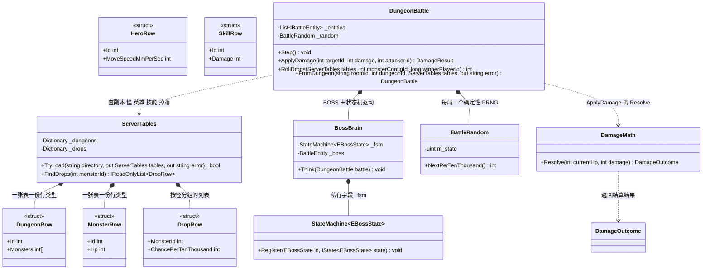
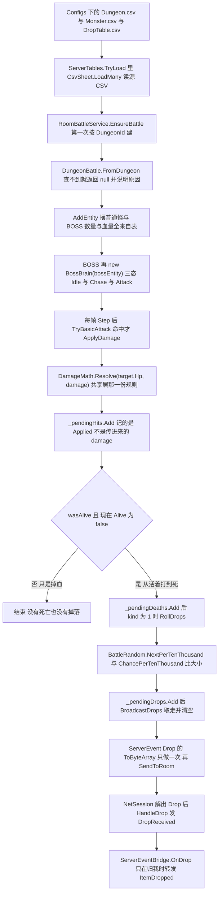

# M3-C · 副本、AI 与掉落（"一局能打完"是怎么做出来的）

> 对应切片：**M3-S6（副本+BOSS AI）+ S7（掉落一致）+ S8（网络模拟器）+ S9（端到端验收）**
> 留档日期：2026-09-23 · 七段式 · 写法按 `Docs\00` §15.3.1.1「说人话」

---

## ① 问题是什么

`M3-B` 让"两个客户端看到同一个世界"，但那个世界是**写死的**（2 只狼 + 1 个英雄），
而且打死怪之后**什么都没发生**。这一课解决四件事：

| # | 问题 | 不管它会怎样 |
| --- | --- | --- |
| 1 | **这一局有什么？**（几只怪、什么怪、在哪） | 关卡写死在代码里 → 改数值要改代码、还要重新编译服务端 |
| 2 | **怪会动、会打人吗？** | 只有玩家能打怪、怪站着挨打 → 不像"战斗" |
| 3 | **打死怪掉什么？怎么保证两边一样？** | 客户端各掷一次 → **两边掉的东西不一样**，而且**不报错** |
| 4 | **网络变差还成立吗？** | 只在"完美网络"上验过 → 上了真机全是问题 |

---

## ② 最小例子：两种写法

**❌ 写死 + 客户端掷骰**：

```csharp
// 服务端：关卡写死在代码里
battle.AddEntity(6001, hp: 120, x: 2000, z: 1000);   // 改数值要改代码 + 重编译
// 客户端：怪死了自己掷掉落
if (Random.value < 0.5f) inventory.Add(item);        // 两边各掷一次 → 必然不一致
```

**✅ 表决定 + 服务端掷 + 同一份字节**：

```
配置表(Dungeon/Monster/DropTable) → 服务端建世界 → 每 tick 全量快照 → 客户端只显示
                                          ↓ 怪死时服务端掷骰
                                    DropEvent 序列化一次 → 发给全房（同一份字节）
```

---

## ③ 需求要什么

| 决定 | 内容 |
| --- | --- |
| **配置表驱动** | 关卡阵容/数值走 `Configs\Design\*.csv`；**加表不改一行工具代码**（`Docs\17` 已冻结格式） |
| **AI 分两套**（`Docs\10-M0` 裁决 A1~A3） | **权威 AI 必须能在服务端跑**（纯 C#）；客户端那份只做表现 |
| **服务端权威掉落** | 掉落由服务端掷，客户端**只显示**（与伤害/位置同一条 D3） |
| **可验证的坏网络** | 能主动注入延迟/抖动/丢包（NET-07），否则"抗抖动"只是口头声明 |

---

## ④ 做法：四个决定 + 两个"必须算清"的地方

### 决定 1 · 关卡来自表：`ServerTables` 读**源 CSV**

⚠️ 实测发现：`Config_<表>.cs`（生成物）**只有数据字段**，**解析逻辑在被生成到 Unity 侧**的
`<表>Config.cs`（`using UnityEngine`）→ 服务端复用不了。三条路（改工具生成纯 C# 解析器 / 读 JSON / 读源 CSV）
里选了**读源 CSV**：源表才是**唯一真源**，格式由 `Docs\17` 冻结。
代价如实记：这是**第二份读表实现**，缓解办法是**探针读真表**（格式一漂移就红）。

### 决定 2 · AI 用 A10 的状态机（**但先要看清依赖链**）

`BossBrain` = `StateMachine<EBossState>` + 三态（Idle/Chase/Attack），状态里**只做判定与调用**，
世界改动一律回 `DungeonBattle`（规则一处实现）；时间用**逻辑帧号**（A10 硬要求）。

⚠️ **这一步撞出的最有价值的一条**：`Docs\25` §二 原写"A10 状态机纯 C#、服务端可复用" ——
真去编才发现**只对一半**：

```
StateBase.OnEvent(EventId) → EventId.cs → using UnityEngine（唯一用法：一句 Debug.LogWarning）
```

⇒ **判"能不能进服务端"要看整条依赖链**（D14 结论的第二层）。处置：`UnityEngineDebugShim.cs`
（10 行、只垫 `Debug`；红线写在文件头）+ 那 6 个双端文件按 `Shared\` 的规矩加 `#nullable disable`。

### 决定 3 · 掉落：**自己写 PRNG**，而且只有"从活着打到死"才掷

```csharp
// ❌ 不能用：System.Random 的算法在 .NET 版本之间变过（.NET 6 换过实现），Mono/IL2CPP 又是另一套
// ✅ 自己写 32 位 xorshift：算法写死 → 同种子同序列 → 可复现、可对账
```

判据：**掉落是"两端必须看到同一份"的东西**，随机数不可复现 → 掉落在单端测试全绿、联机时两边不一样（静默失败）。
另外：**只有 `wasAlive && !Alive` 那一下才掷**（打尸体不重复掉）。

### 决定 4 · 掉落广播：**序列化一次发全房**

与快照同一条规矩 —— "两边收到同一份"靠的是**同一份字节**，不是"两边各掷一次、结果正好一样"。

### 两条"必须算清"（我这一课栽了 5 次）

| 坑 | 现象 | 教训 |
| --- | --- | --- |
| 概率不是"必掉" | 狼的两条概率是 **50% / 30%** → **"啥都不掉"有 35%**；我却断言"必掉" | 🚨 **概率要算**：`1-(1-0.5)(1-0.3)=65%` 才有掉落 |
| 冷却决定"打几下" | 300 血 ÷ 100 伤害 = 3 下，但**冷却 15 帧**、循环 30 次只够 2 下 | 🚨 **帧数要算**：期望值写成 `血 ÷ 伤害`，循环上限按 `伤害次数 × 冷却` 给 |

---

## ⑤ 自测若干问（先自己答，再看）

<details><summary>1. 为什么服务端不用行为树？</summary>

D14 **实测**过：行为树（Behavior Designer）/ NavMesh 依赖 Unity 引擎对象，一碰就抛 `ECall`，
进不了纯 .NET 服务端。所以**权威 AI 只能纯 C#**；行为树落在**客户端表现层**（演出、阶段切换）。
</details>

<details><summary>2. "A10 状态机是纯 C#，所以服务端能用"这句话错在哪？</summary>

错在**只看自己那个文件**。它通过 `StateBase.OnEvent(EventId)` 引到 `EventId`，而 `EventId` 里有一句
`Debug.LogWarning` → **间接依赖 UnityEngine**。判据是**整条依赖链**。
</details>

<details><summary>3. 为什么不能用 `System.Random` 掷掉落？</summary>

它的算法**在 .NET 版本之间变过**（.NET 6 换过实现），Mono/IL2CPP 又是另一套 ⇒
同一个种子在不同运行时会给出**不同的序列**。而掉落是"两端必须一致"的东西 ⇒ 必须自己写算法写死的 PRNG。
</details>

<details><summary>4. 掉落为什么"序列化一次发全房"而不是每人算一次？</summary>

因为"两边一致"最可靠的保证是**同一份字节**。"各自算一次、结果相同"要靠两边实现完全相同 ——
那是把正确性押在"两份实现行为一致"上，而本项目已经吃过"两份拷贝一定漂移"的教训。
</details>

<details><summary>5. 网络模拟器为什么多一个 `Advance(deltaMs)`，而不改 `ITransport`？</summary>

`ITransport` 故意没有时间参数（两端同源、可复现）；而延迟必须挂在时间轴上。
所以模拟器**在实现上**多一个入口，用法是**先 `Advance` 再 `Pump`** —— **不污染接缝**，上层一行不改。
</details>

<details><summary>6. M3 走 TCP，那"注入丢包"还有意义吗？</summary>

对 M3 意义有限：TCP 保证可靠，**应用层丢一条就是永远不到**（连握手都会失败）。
所以 M3 的探针只注入**延迟/抖动**；**丢包**留给 **M4 的帧同步（UDP 式）**与客户端容错 ——
这条差别必须写清楚，否则会被误用成"随便丢都能跑"。
</details>

---

## ⑥ 30 秒验证（含负向对照）

```powershell
dotnet build Server\NBC.sln -m:1
dotnet run --project Server\_net-probe\NetProbe.csproj --no-build     # 应当：通过 83，失败 0
```

**负向对照（专门证明检查在工作）**

| 负向对照 | 期望结果 |
| --- | --- |
| 副本 9999（不在表里） | **开不了世界**并说明原因（不静默开一个空世界） |
| 副本 1001 的怪血量 | 每只都等于 `Monster.hp`（BOSS 现在是 1000；2026-09-26 从 2000 削下来的，见文末更新） |
| 英雄移速 | 等于 `Hero.moveSpeed ÷ 30Hz`（不是写死的 150） |
| 同一房号 + 同样击序列跑两局 | 掉落**完全相同**（PRNG 可复现） |
| BOSS（概率 10000） | **必掉**，且两边逐字段一致 |
| 狼（概率 50%/30%） | **可能不掉**，但两边一定一致（不能断言必掉） |
| 注入 200ms 延迟 | 握手仍成功，且**测出的 RTT ≥ 200ms** |

Unity 侧：`Tests_EditMode` 应为 **655 全绿**；窗口 `Tools/NBC/网络/网络调试窗口` 可手工看连接/房间/世界/输入。

---

## ⑦ 一分钟面试版

> M3 的最后一块是"**一局能打完**"：关卡阵容与数值来自**配置表**（加表不改工具代码），
> BOSS 用**与客户端同一份的纯 C# 状态机**驱动（Idle/Chase/Attack，时间用逻辑帧号 → 可复现），
> 掉落由**服务端掷**并且**序列化一次发全房**，随机数**自己写 xorshift**（因为 `System.Random` 跨版本不可复现）。
>
> 我还做了**网络模拟器**（包一层 `ITransport`，注入延迟/抖动/丢包）——
> 它让我能证明"200ms 延迟下仍然跑通、RTT 真的 ≥200ms"，而不是嘴上说抗抖动。
>
> 这一课我最想说的两个坑：① **"纯 C#"要看整条依赖链** —— A10 状态机通过 `EventId` 间接依赖 UnityEngine；
> ② **概率和帧数必须算** —— 我断言"狼必掉"（其实 35% 什么都不掉）、也按错循环次数（冷却 15 帧只够打 2 下）。
> 这两次都是**我的期望值错、不是代码错**，而它们**只能在真跑的时候才暴露**。

---

## 附 · 类图与数据流（2026-09-26 补）

**这张图解决什么问题**：M3-C 的四个决定（表驱动 / 纯 C# AI / 确定性 PRNG / 序列化一次发全房）落在**三个不同层**里，
很容易画成「一个类干完」。真去看源码：读表是 `ServerTables`（带一批 `readonly struct` 行类型），建副本是
`DungeonBattle.FromDungeon` 这个静态工厂，AI 是 `BossBrain` 持有 `StateMachine<EBossState>`，而伤害结算
**不在服务端** —— 它调共享层的 `DamageMath.Resolve`（`DungeonBattle.cs:745`、`DamageMath.cs:125`）。



**看图时最容易画错的 6 处**

| # | 容易画错 | 事实 | 证据 |
| --- | --- | --- | --- |
| 1 | 把行类型画成 `class` | `DungeonRow` / `MonsterRow` / `HeroRow` / `SkillRow` / `DropRow` **全是 `readonly struct`** | `ServerTables.cs:50`、`:79`、`:113`、`:152`、`:191` |
| 2 | 把服务端读表画成读生成的 `Config_<表>.cs` | 服务端读的是**源 CSV**（`CsvSheet.LoadMany`，表名 `Dungeon`/`Monster`/`Hero`/`Skill`/`DropTable`） | `ServerTables.cs:15`、`:368`、`:523`、`:529` |
| 3 | 把「建副本」画成构造函数 | 它是**静态工厂** `FromDungeon(...)`，失败返回 null + 人话 `error` | `DungeonBattle.cs:915`、`:919`~`:925` |
| 4 | 把 BOSS 单独画一个类 | BOSS 也是 `BattleEntity`（`IsBoss = true`），驱动它的是另一个类 `BossBrain` | `DungeonBattle.cs:995`、`:1001`、`BossBrain.cs:65` |
| 5 | 把三个状态画成 `BossBrain` 的字段 | `IdleState` / `ChaseState` / `AttackState` 是它的 **private 嵌套类** | `BossBrain.cs:82`~`:85`、`:128`、`:155` |
| 6 | 把掷骰画成 `System.Random`，或把伤害画进服务端 | 自己写 **xorshift32**、概率是**万分比**；伤害结算在共享层 | `BattleRandom.cs:34`、`:71`、`DungeonBattle.cs:745` |

**`Dungeon.csv` 到客户端 `DropReceived` 的完整链路**（掉落是**服务端掷、序列化一次、全房同一份字节**）：



M4-S1 之后新增的 `ServerEventBridge`（`Game\Battle\ServerEventBridge.cs`）把 `NetSession` 的
`DamageReceived` / `DeathReceived` / `DropReceived` 接进了 `EventCenter`（`ServerEventBridge.cs:87`~`:89`、`:134`、`:146`、`:171`）
—— 于是**联机打死怪、任务进度也会涨**，而任务模块一行都不用改、也完全不认识网络。

**面试版怎么讲（4 句）**

- 「关卡阵容与数值全来自**源 CSV**（`Dungeon` / `Monster` / `Hero` / `Skill` / `DropTable`），`ServerTables` 读成一批 `readonly struct` 行；**加表不改一行工具代码**。代价如实记：这是第二份读表实现，靠探针读真表防漂移（`ServerTables.cs:15`~`:19`、`:36`~`:37`）。」
- 「建副本是静态工厂 `DungeonBattle.FromDungeon`：副本人不在表里、怪编号查不到、英雄普攻算出来是 0 —— 三种都**返回 null + 人话原因**，绝不静默开一个空世界（`DungeonBattle.cs:919`~`:957`）。」
- 「BOSS 用 `StateMachine<EBossState>` 三态 Idle/Chase/Attack，时间用**逻辑帧号**不是真实时间；状态里只做判定与调用，改世界一律回 `DungeonBattle`（`BossBrain.cs:109`~`:112`）。」
- 「掉落是**服务端权威 + 确定性 PRNG**：自己写 xorshift32（`System.Random` 的算法在 .NET 版本之间变过），概率用万分比，只有**从活着打到死**那一下才掷；掷完**序列化一次、同一份字节发全房**，客户端只显示 —— 『两边一致』靠同一份字节，不是『两边各掷一次碰巧一样』。」

---

## ⚠️ 2026-09-26 更新 · BOSS 的决策表从三态变四条（附行号偏移说明）

**起因是负责人实测**：「玩家老是被 boss 打死，且目标不在范围内，难以测试」。
量出来的账：BOSS 原来**全图锁定**最近的活英雄（无仇恨范围），以 `Monster.attack`=60 / 15 帧（**120 dps**）
追着 1200 血的英雄打；而**英雄出生点 `(-1000, 0)` 距 BOSS `(-3000, 0)` 正好 2000mm = 它的普攻射程**
⇒ 一进房就贴脸，10 秒左右倒。副本里"先清小怪再打 BOSS"这条最基本的打法**根本不存在**。

**改了什么**（细节与验收数字见 `Docs\27-M4开工清单.md` §七）：

| 改动 | 值 | 语义 |
| --- | --- | --- |
| 加**仇恨范围** | `DungeonBattle.BossAggroRangeMm = 2200mm` | 圈外的英雄**视为没看见** ⇒ 「够得着就追，够不着就回家」 |
| 加 **leash（回位）** | `BossLeashSlackMm = 200mm` | 没目标且离家超松弛量 → 走回出生点（否则会被引到副本门口） |
| 出生点环半径 | `1000mm → 500mm` | 四个席位距 BOSS 最小 **2500mm > 2200mm** ⇒ 进房先安全 |

**同日还有一处配置改动**：负责人确认要把狼王**削成 1000 血** ⇒ 改的是**源表**
`Configs\Design\Monster.csv`（`6003` 行 `hp: 2000 → 1000`），随后跑 ConfigKit 重新生成。
⚠️ 这一条值得单独记，因为**同一个坑当天踩了第二次**：「改了却没生效」—— 他在 Unity 的
`MonsterConfig.asset`（**生成物**）里改了血量，而**服务端读的是源 CSV**，所以测试时纹丝不动。
判据、正确流程与两道新机械检查见 `Docs\排查手册\06-改了却没生效（旧产物·生成物·真源）.md` §⑧。

⇒ **决策表现在是四条**：圈外无目标 → `Idle`（+回家）· 无活英雄 → `Idle` · 超出射程 → `Chase` · 射程内 → `Attack`。

⚠️ **行号已整体偏移**：本文上面的引用（`BossBrain.cs:109`~`:112`、`:82`~`:85`、`:128`、`:155`）写于改动**之前**，
加了几十行注释与构造逻辑之后不再对得上。**别照那些行号去找**，按名字找。改动后的位置：

| 事实 | 新位置 |
| --- | --- |
| 决策表注释（四条） | `BossBrain.cs:38` |
| 构造函数（抓"家"的位置：`HomeXmm` / `HomeZmm`） | `BossBrain.cs:84` |
| `Think`：**目标在仇恨圈外就当成没目标** | `BossBrain.cs:123` |
| `ReturnHome`（leash 回位） | `BossBrain.cs:146` |
| `IdleState`（没目标先回家） | `BossBrain.cs:176` |

> 📌 顺带一条方法论：**教学文档里写死"文件:行号"是有保质期的** —— 一改代码就过期，
> 而且过期后**不会报错**（读者照着去找一个不相干的函数）。
> 我们的取舍是：**保留行号（写的时候确实对、便于核对）+ 改动时追加一节说明偏移**，
> 而不是把行号全删掉（那就退化成"记不清出处"）。
