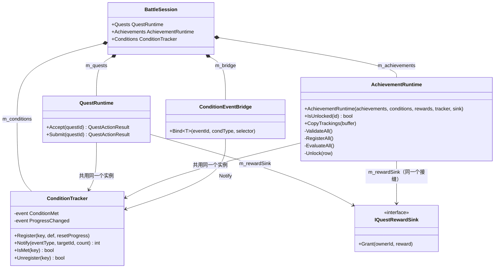
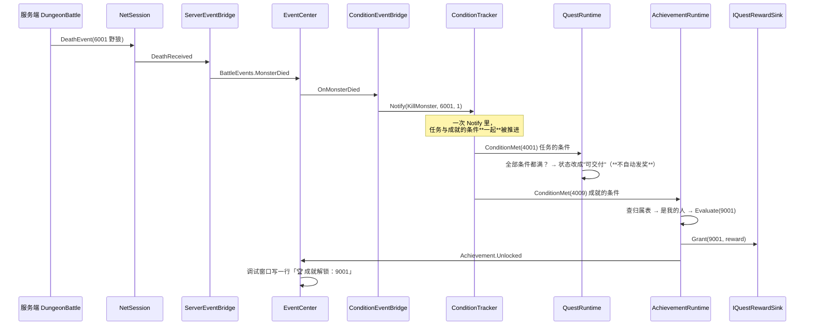

# M4-A · 成就与跨表校验（"成就和任务到底差在哪"）

> 对应切片：**M4-S2（成就）+ ConfigKit 跨表检查 CFG0023**
> 留档日期：2026-09-26 · 七段式 · 写法按 `Docs\00` §15.3.1.1「说人话」
> 对应代码：`Client\Assets\_Project\Game\Achievement\`（3 文件）、`Tools\ConfigKit\src\ConfigKit.Core\CrossTableChecks.cs`
> 对应测试：`Tests\EditMode\Game\AchievementRuntimeTests.cs`（15 条）、`Server\_condition-probe`（47 全绿）
> 对应文档：`Docs\27-M4开工清单.md` §十

---

## ① 问题是什么

任务系统 M2 就做完了。成就**看起来**是"再来一遍任务"，但其实**有三处不一样**。
这一课就解决三件事：

| # | 问题 | 不管它会怎样 |
| --- | --- | --- |
| 1 | 成就和任务**到底差在哪**？ | 照抄任务写一套 → 多出一堆没用的状态（"接取中""待交付"），而且**每多一个状态就多一处能不同步的地方** |
| 2 | "上次已经打了 10 只狼，这次登录该解锁"—— **怎么实现**？ | 玩家得**再打一只**才解锁。看起来像玄学，其实是一行 `resetProgress` 的差别 |
| 3 | 配置表**单看每张都对**，合起来却会**让游戏闪退**—— 谁去发现？ | 数据全绿，运行期一接任务就抛异常，而**配置表报告里一个字都没有** |

第 3 条是这一课最值钱的部分 —— 它跟"闸门绿 ≠ Unity 绿"是同一族问题。

---

## ② 最小例子：成就和任务的差别，就是**三行**

```csharp
// ---------------- 任务（M2 就有的 QuestRuntime）----------------
public QuestActionResult Accept(int questId)          // ① 玩家点「接取」才登记
{
    foreach (int id in quest.conditionIds)
        m_tracker.Register(id, def, resetProgress: true);   // ② 接了才开始算 → 清零
    ...
}

public QuestActionResult Submit(int questId)          // ③ 玩家点「交付」才发奖
{
    m_rewardSink.Grant(questId, reward);
}

// ---------------- 成就（M4-S2 的 AchievementRuntime）----------------
public AchievementRuntime(...)                        // ① 构造时就登记全部（没有接取）
{
    RegisterAll();                // 里面是 Register(id, def, resetProgress: false)
    EvaluateAll();                // ② 一直生效、不清零 ⇒ 已达成时当场解锁
}                                 // ③ 没有 Submit —— 条件一齐就发奖（在 Evaluate 里）
```

**看出来了吗**：成就**没有** `Accept`、**没有** `Submit`、`Register` 的第三个参数是 `false`。
其余（进度怎么算、条件怎么匹配、奖励怎么发）**一行都不用改** —— 因为
`ConditionTracker`（条件系统）和 `IQuestRewardSink`（发奖接缝）都是**通用的**。

> 📌 这就是 M2 那个"**通用层 + 多个消费者**"设计的兑现。
> 加一个成就模块，条件系统那一层**一个字符都没动**。

---

## ③ 原版错在哪：两个真实的坑

### 坑 1：成就"登录时不解锁"，而且**一行日志都没有**

`ConditionTracker` 的语义②写得很清楚：

```
Register(key, def, resetProgress: false)
    → 不清零，用既有进度
    → 如果**注册的那一刻就已经达成**，当场回调一次 ConditionMet
```

这条是**故意**的（不这么做，玩家得再打一只才解锁）。但它有个副作用：

```
构造函数里：
   Register(4009, ...)  ← 这一行**当场就回调了** `OnConditionMet(4009)`
        ↓
   OnConditionMet 去查 m_ownerOfCondition[4009] "这条条件归哪个成就"
        ↓
   ❌ 如果你写的是"登记一条 → 记一条归属"，此时**归属表还是空的**
        ↓
   认不出这是自己的条件 → 安静 return
        ↓
   成就永远不解锁，而且**没有任何报错、没有任何日志**
```

**正确写法是三段**（顺序是有理由的，不是凑数）：

```
① 先把**全部**归属记好      —— 因为第②步会重入回调，回调要靠这张表认自己人
② 再逐条登记（resetProgress: false）
③ 全部登记完**统一评一遍**  —— 见下，这一步不是冗余
```

**第 ③ 步为什么不能省**：`AreAllConditionsMet` 走的是 `m_tracker.IsMet`，
而**还没登记的条件 `IsMet` 恒为 false**。所以一个"两条条件都早已达成"的成就，
在 ② 的循环里**每条单独触发时都凑不齐**（另一条还没登记），只能靠 ③ 收尾。

### 坑 2：配置表**单看全绿**，运行期**一接任务就闪退**

`ConditionTracker.Register` 对**重复登记**是**当场抛 `InvalidOperationException`** 的
（它的注释写了理由：静默覆盖会让 bug 永远查不出来）。于是：

| 数据长什么样 | 单表校验 | 运行期 |
| --- | --- | --- |
| 任务 3001 和任务 3002 **都引用条件 4001** | ✅ 全绿（`ref:` 只查"4001 存在吗"） | 💥 后接的那个任务**抛异常** |
| 任务 3001 和成就 9001 **都引用条件 4001** | ✅ 全绿 | 💥 成就**在启动时就登记**，所以是"一接任务就闪退" |

**这类问题只有"把两张表放一起看"才能发现** —— 单表校验的判据（`range` / `len` / `unique` / `ref:存在性`）
**全是单表判据**。所以 M4-S1 那次我加了**跨表检查**（`CrossTableChecks`），这一片又加了一条 `CFG0023`。

---

## ④ 改造后的做法

### 4.1 成就运行时（`AchievementRuntime`）

```
构造函数：
   订阅 ProgressChanged / ConditionMet        ← **必须在登记之前**（坑 1）
   ValidateAll()                              ← 先全部校验，再动手登记
   RegisterAll()                              ← ① 记全部归属 ② 逐条登记(resetProgress:false)
   EvaluateAll()                              ← ③ 收尾统一评一遍

运行时：
   ConditionTracker.Notify(...)  →  OnConditionMet(key)
        ↓ 查归属表，认不出就**安静忽略**（任务的条件也走这里！）
   Evaluate(achievementId)  →  全部条件都满？  →  Unlock()  →  发奖 + 广播
```

三条设计取舍，每条都有理由：

| 取舍 | 理由 |
| --- | --- |
| **构造出错就抛异常**（不是返回值 + 原因） | 项目的规矩是"**玩家能触发的失败** → 返回值；**程序/配置错误** → 抛异常"。成就**没有玩家的那一下点击**，所以"返回值给谁看"不成立。抛的时候必须点名**是哪个成就、哪条条件、哪个奖励** |
| **认不出条件就安静忽略** | 任务与成就**共用同一个 `ConditionTracker`**，两边的回调都会收到**对方的**条件编号。安静忽略是"通用层 + 多消费者"必须守住的边界 |
| **解锁失败（缺奖励）时不抛异常，改成广播** | 此刻我们在 `ConditionTracker.Notify` 的**派发循环里**（一次击杀可能同时推进好几条条件），抛出去会把**别人**的进度派发一起打断。所以记录 + 广播 `Achievement.UnlockFailed` —— 问题**有痕迹**但不扩大伤害 |

### 4.2 跨表检查 CFG0023（"一条条件只能有一个持有者"）

```
对 QuestCondition 的每一行，去看 Quest 和 Achievement 两张表里
**有几个**在引用它：

   引用者数量 ≥ 2  →  CFG0023（**错误**，本次导出不产出任何文件）
```

报错信息里点名**两边都是谁**（"条件 4001 被**多个持有者**引用：任务 3001、成就 9001"），
因为 `ConditionTracker` 抛出来的消息里**只有条件编号**，没有"是谁跟谁抢"。

### 4.3 顺手修掉的两处**误报**（这条同样是真实教训）

加了 `Achievement` 表之后，`CFG0020`（"任务要杀的怪，副本里不够"）**立刻在真表上报了两个错**：

| 被误报的数据 | 为什么它是误报 |
| --- | --- |
| 「初出茅庐 · **累计**击杀 10 只野狼」，而副本只刷 2 只 | 成就是用 `resetProgress: false`，是**跨局累计**的 —— 打 5 局也能到 10。判据"一局能提供多少"**只对任务成立** |
| 「猎手的直觉 · 累计击杀 5 只**任意**怪」（`targetId = 0`） | `0` 表示"**任意**怪"，它**本来就不该**在任何副本的怪列表里 |

> 📌 **"天天误报的警告等于没有警告。"** 判据要跟着**语义**走，不能一刀切。

**但"不报"的用例天生容易变成假绿** —— 所以两条豁免都做了**变异测试**：

| 我故意改坏什么 | 期望 | 实测 |
| --- | --- | --- |
| 去掉「只查任务」这条豁免 | 成就那条变红、任意怪那条仍绿 | ✅ 55 通过 **1 失败** |
| 两条豁免都去掉 | 两条**都**变红 | ✅ 54 通过 **2 失败** |
| 还原 | 58 全绿 | ✅ **58 通过 0 失败** |

**这一步才是关键**：只写"某情况下不该报错"的用例，**你无法知道它是不是永远不报**。
必须先证明"**改坏了它就会红**"，那条阴性对照才算数。

---

## ⑤ 自测 5 问

1. 成就和任务的差别，用**一句话**说是什么？
2. 为什么成就构造时要**先记归属、再登记**？（提示：`resetProgress: false` 有个副作用）
3. 为什么"先登记、后记归属"的后果是**没有日志**的？
4. `CFG0023` 拦的是什么？为什么它是**错误**而不是警告？
5. 你为什么不能只写"这种情况下不该报错"的用例？

<details>
<summary>答案</summary>

1. **成就没有"接取"和"交付"这两个玩家动作，而且进度不清零** —— 所以它只有"锁着/解锁了"两态。
2. 因为 `resetProgress: false` 在**注册时若已达成会当场回调**，回调要靠归属表认自己人。
3. 因为认不出条件时的正确行为是**安静忽略**（共用条件系统，会收到别人的条件编号）——
   于是"该认出却没认出"和"本来就不该管"**长得一模一样**。
4. 拦"一条 `QuestCondition` 被多个持有者引用"。是错误，因为 `ConditionTracker.Register`
   **当场抛 `InvalidOperationException`** —— 这是运行期崩溃，不是"不涨进度"。
5. 因为**它可能永远不报**（判据写空了也是绿的）。必须用变异测试证明"改坏了它会红"。

</details>

---

## ⑥ 你 30 秒能做的验证

```powershell
# ① 配置表：真表应当 0 错 0 警告、写出 40 个文件
Tools\ConfigKit\src\ConfigKit.Cli\bin\Debug\net8.0\NBC.ConfigKit.Cli.exe `
    --source Configs\Design --out Client\Assets\_Project\Game\Config\Generated

# ② 跨表规则的自测（含两条豁免的阴性对照 + CFG0023 两条）
Tools\ConfigKit\tests\ConfigKit.SelfTest\bin\Debug\net8.0\NBC.ConfigKit.SelfTest.exe

# ③ 条件系统那两条"顺序坑"的可跑证据
Server\_condition-probe\bin\Debug\net8.0\NBC.ConditionProbe.exe
```

在 Unity 里：

1. 菜单 **Tools/NBC/配置表/导入 TSV → ScriptableObject**（一次导入全部 tsv）；
2. 跑 EditMode，期望 **683**；
3. 打开 **Tools/NBC/网络/网络调试窗口** → 「成就」区会列出 3 个成就与每条条件的 `几/几`。
   打怪时**成就与任务一起涨**，条件一齐当场解锁（日志会出现 `🏆 成就解锁：…`）。

> ⚠️ **成就与任务的进度条会一起涨，这不是 bug**：它们共用同一个 `ConditionTracker`，
> 条件是**分开编号**的（4001-4007 给任务、4009-4011 给成就），所以"打一只狼"会同时推进两边。
> 这正是"一条条件只允许一个持有者"（CFG0023）存在的意义。

---

## ⑦ 面试一分钟版本

> 我做完任务系统之后加了成就。成就**看起来**是"再写一遍任务"，但其实只有**三处不同**：
> 成就没有接取、没有交付，而且进度**不清零**（跨局累计）。
> 所以成就运行时里**没有状态枚举** —— 只有"锁着 / 解锁了"两态。
>
> 条件系统和发奖接缝都是通用的，所以加这个模块时**那一层一行都没改** ——
> 这是 M2 那个"通用层 + 多个消费者"设计的兑现。
>
> 有意思的是挖出两件事。第一，`ConditionTracker` 在"注册时已达成"会**当场回调**，
> 所以构造函数里会**重入**到自己的回调 —— 要是先登记、后记归属，回调查不到自己是谁，
> 就**安静地什么都不做**，表现是"成就永远不解锁而且没有任何日志"。
> 我把它写成了三条能跑的对照用例。
>
> 第二，配置表**每张单看都对**，合起来却会让游戏闪退：两个任务（或任务与成就）引用同一条条件，
> 运行期 `Register` 直接抛异常。单表校验全是"这张表自己合不合规"的判据，**发现不了这事**。
> 所以我加了跨表检查规则：一条条件只允许一个持有者。
> 加这条规则时它还顺手误报了成就的"跨局累计"条件 —— 我修的时候给两条豁免都做了**变异测试**，
> 因为"不该报错"的用例**天生容易变成假绿**：不证明"改坏了它会红"，就等于没测。

---

## 附 · 类图与数据流（2026-09-26 补）

### 类图：成就复用了任务那一整条链



⚠️ **这张图最容易画错的一处**：`QuestRuntime` 与 `AchievementRuntime`
**指向同一个 `ConditionTracker` 实例**（不是各持一个）。
画成两个 tracker 就完全错了 —— 那会变成"打怪不涨成就进度，而且不报错"。
证据：`BattleSession.cs` 里成就收到的是 `m_conditions`（同一个字段）。

### 数据流：从"打死一只狼"到"成就解锁"



⚠️ **这张图里两处刻意的不对称**（都是设计，不是漏画）：
- **任务收到"条件满了"只改状态**，发奖要等玩家点「交付」；
  **成就收到就直接发奖** —— 这就是"没有交付"在图上的样子。
- 两边都会收到 `ConditionMet`，但**各自只认自己的条件编号**（`m_ownerOfCondition`）。
  认不出来就安静忽略 —— 若在这里抛"未知条件"，任务与成就就没法共用一个条件系统了。
