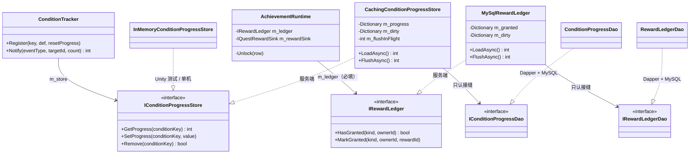
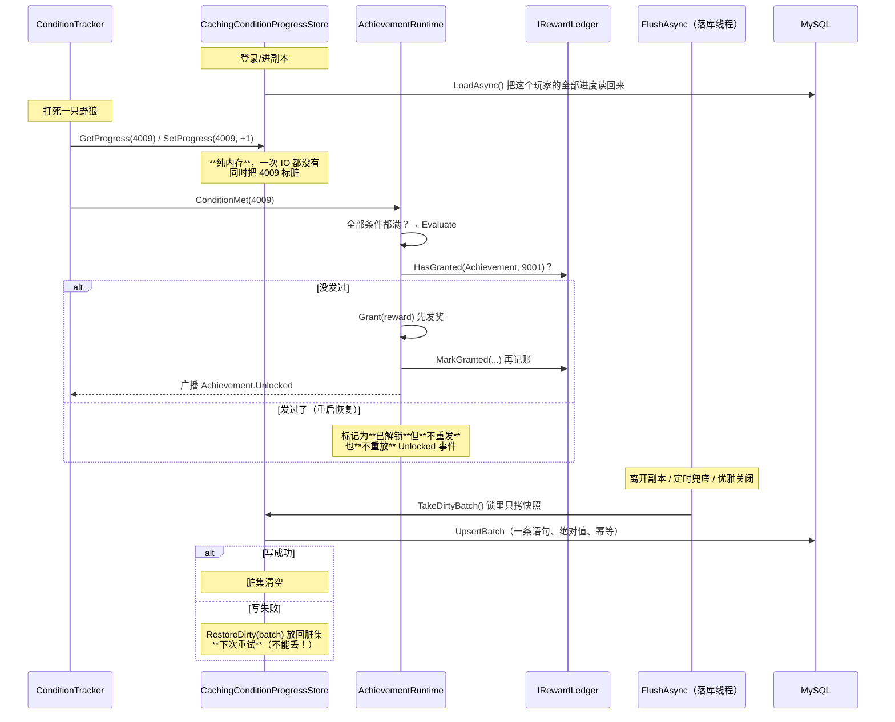

# M4-B · 持久化与写回缓存（"进度真的存进数据库"是怎么做的）

> 对应切片：**M4-S3（持久化：`IConditionProgressStore` 的 MySQL 实现 + 落库时机 + 防重复发奖台账）**
> 留档日期：2026-09-27 · 七段式 · 写法按 `Docs\00` §15.3.1.1「说人话」
> 对应代码：`Server\NBC.Server.Data\`（6 文件）、`Client\Assets\_Project\Shared\Reward\`、`Docs\08b-数据库迁移-M4S3-进度表.sql`
> 对应测试：`Server\_db-probe`（**51 全绿**）、`AchievementRuntimeTests`（**22 条**，含 7 条台账用例）
> 对应文档：`Docs\27-M4开工清单.md` §十一 / §十三

---

## ① 问题是什么

成就的定义性行为是**"跨局累计"**（"累计击杀 10 只野狼"）。
但 M4-S2 做完时，那个"累计"是**假的** —— 因为进度存在内存里：

```
服务端重启 → 进度全没了 → 玩家上次打了 8 只，这次从 0 开始
```

这一课要解决三件事，**第二件是加了第一件之后才冒出来的**：

| # | 问题 | 不管它会怎样 |
| --- | --- | --- |
| 1 | 进度**存哪**？怎么存？ | 成就的"累计"只在一次进程生命周期内成立 —— 一个**说了但没做到**的设计 |
| 2 | ⚠️ 存起来之后，**"登录即解锁"变成了"每次重启重复发奖"** | 玩家每重启一次服务器就白拿一次奖励，而且**看起来像功能正常** |
| 3 | 主循环 30Hz 每帧都在读写进度，**怎么不把数据库拖死**？ | 打死一只怪就卡一下，而且卡在**逻辑线程**上 |

第 2 条是这一课最值钱的地方 —— 它不是"新代码写错了"，
**是原有代码隐含假设了"进度会随进程消失"**。

---

## ② 最小例子：两种写法

**❌ 每次 `Set` 就写一次库**（最直觉的写法）：

```csharp
public void SetProgress(int conditionKey, int value)
{
    m_progress[conditionKey] = value;
    using (var conn = new MySqlConnection(connStr))
    {
        conn.Open();                                   // ← 每写一条就开一次连接
        conn.Execute("UPDATE condition_progress ...");  // ← 每一只怪都往返一次数据库
    }
}
```

**这段代码"能工作"**，而且在单机上跑起来一点问题都没有。它错在哪，见 ③。

**✅ 内存工作集 + 脏集 + 异步落库**：

```
GetProgress / SetProgress / Remove   ← 纯内存，一次 IO 都没有
                                       （主循环 30Hz 每帧都在调它们）

LoadAsync()   ← 进副本/登录时调一次（异步、脱离主循环线程）
FlushAsync()  ← 按"落库时机"调（异步、脱离主循环线程）
```

> 📌 一句话：**内存里是权威工作集，数据库是它的持久化副本。**

---

## ③ 原版错在哪（三个真实的坑）

### 坑 1：为什么"每次 Set 就写库"不行 —— 看一眼调用点就明白了

```csharp
// ConditionTracker.Notify 里（Shared\Condition\ConditionTracker.cs）
foreach (已登记的条件)
{
    int before = m_store.GetProgress(pair.Key);     // ← 每个条件读一次
    ...
    m_store.SetProgress(pair.Key, after.Current);   // ← 每个条件写一次
}
```

打死一只怪可能触发**十几次 `Get` + 十几次 `Set`**，30Hz 下每秒几百次。
一旦这里做同步查询 = "打一只怪卡一下"，而且卡在**逻辑线程**上。

⚠️ 而且接口 `IConditionProgressStore` 的三个方法**本来就是同步的**
（它刻意只收 `int`、只有三个方法 —— 见那个文件头）。

⇒ **接口是同步的，实现就必须是内存的。**
这不是优化，这是**唯一能同时满足"接口好用"+"不在主循环里做同步查询"的做法**。

### 坑 2（最值钱）：持久化**自己制造了一个 bug**

成就用 `resetProgress: false` 登记条件，而条件系统的语义②是：

> **注册的那一刻若已达成，当场回调一次**（这正是"上次已经打了 10 只、这次登录就该解锁"要的行为）

以前进度存内存、进程一重启就没了 ⇒ **永远不会走到"已达成"那条分支**。
但进度一旦落库：

```
服务端重启
  → LoadAsync() 读回"条件已达成"
  → 构造函数里 Register 当场回调
  → Evaluate 判定"全部条件都满"
  → Unlock  →  **再发一次奖**
```

**每重启一次，所有已完成的成就再发一遍。**

> 📌 **这不是"新代码写错了"，是原有代码隐含假设了"进度会随进程消失"。**
> 加一个正确的东西，会暴露另一个地方的错误假设 —— 这是最典型的一种。

**怎么修**：把"状态"和"事件"分开。

| | 能不能从进度推导 |
| --- | --- |
| **"解锁了吗"** = 该成就全部条件是否都 ≥ 需求 | ✅ 能推导 |
| **"发过奖吗"** = 一个**已经发生过的动作** | ❌ **推导不出来，必须记账** |

⇒ 所以有了 `reward_granted` 台账（`IRewardLedger`）。

### 坑 3：接缝放错了程序集（编译器把我逼回来的）

`IRewardLedger` 我一开始放在 `Game\Quest\`（和 `IQuestRewardSink` 做伴）。
写完数据层才发现：**`NBC.Server.Data` 只引用 `NBC.Shared`，
而 `Game\` 是 Unity 程序集** ⇒ **服务端根本实现不了这个接缝**。

> 📌 **判据（比"谁用它"更难想到的那一问）**：**"谁要实现它？"**
> 一个要被**服务端**实现的接缝，必须住在双端共享层。
> 对照：`IConditionProgressStore` 一开始就放对了（`Shared\Condition\`）—— **我抄错了位置**。

**还有一个同族的（`Docs\27` §十三）**：类型还可以**通过"被调方法的签名"泄漏**，
而那连"按 `using` 扫"的守卫都看不见 —— 详见 §⑥。

---

## ④ 改造后的做法

### 4.1 表设计：两个决定，各有一个理由

```sql
CREATE TABLE `condition_progress` (
  `player_id`     BIGINT UNSIGNED NOT NULL,
  `condition_key` INT             NOT NULL COMMENT '对应 Config_QuestCondition.id',
  `progress`      INT             NOT NULL DEFAULT 0,
  PRIMARY KEY (`player_id`, `condition_key`),
  ...
);
```

| 决定 | 理由 |
| --- | --- |
| 主键是**「玩家 + 条件」**，不是「玩家 + 任务」 | 任务与成就**共用同一套条件系统**，而 `IConditionProgressStore` 说话的单位就是**条件编号** ⇒ **一张表同时承载两者**，将来加别的"条件消费者"也不用再建表 |
| 存**绝对值**，不存增量 | 落库因此是**幂等**的（`INSERT ... ON DUPLICATE KEY UPDATE` 重发一次不会算两遍）。存增量就必须再配一张"已应用"表 |

**台账单独一张表**（`reward_granted`），因为它的**语义不同**：

> 进度是"**玩家的数据**"，台账是"**系统的承诺**"（发过就不能再发）—— 生命周期与语义都不一样。

### 4.2 写回缓存的**三条线程语义**（最容易写错的地方）

| # | 语义 | 违反了会怎样 |
| --- | --- | --- |
| ① | **绝不持锁做 IO** —— 锁里只拷一份脏集快照，出了锁再发 SQL | 持锁发 SQL = 主循环卡在等网络上，**等于没写缓存** |
| ② | **单飞（single-flight）** —— 上一次没写完就不开新的 | 两次写若**乱序落地**，后落的那次会把**旧的**绝对值写进库 = **静默数据回退**。⇒ 单飞是**正确性**，不是优化 |
| ③ | **`Remove` 要写 0**（不是只删内存） | "内存删了、库里还在" ⇒ 下次登录又读回来，表现是**"我明明重置过，怎么又有了"**（一条只在重启后才出现的悬案） |

**落库时机**（需求文档 DB-04：异步 + 脱离主循环线程）：

| 时机 | 为什么 |
| --- | --- |
| 进副本 / 登录时 `LoadAsync()` | 进度是跨局累计的，**必须先把全部读回来**（否则"这个成就早该解锁"会被漏掉） |
| 离开副本 / 成就解锁时 `FlushAsync()` | 成就解锁是"里程碑时刻"，值得立刻落盘 |
| 定时兜底（主循环低频） | 崩溃时最多丢一个周期 |
| 优雅关闭（SRV-17） | 等一次 `FlushAsync` 完成再退 |

### 4.3 台账为什么能比进度缓存**简单得多**（不是复制粘贴）

| | 进度表 | 台账 |
| --- | --- | --- |
| 值的性质 | **会变**（1→2→3，还能 `Remove`） | **单调**（发过就是发过） |
| 写冲突 | "旧值覆盖新值" = **静默回退** | 不存在：重复写同一行无副作用 |
| 需要的机制 | 脏集 + 单飞 + **`MarkUnflushed` 要比值** | 脏集 + 单飞（**失败时无条件放回**） |

> 📌 **同一个模式，复杂度取决于数据语义。** 缩水不是偷懒，
> 是"这份数据本来就不需要那些机制"。

### 4.4 数据库连不上时，报错要说人话

`DbConnectionFactory` 把 MySQL 的原生异常**翻译成"该怎么办"**：

```
数据库连接失败：MySql root@127.0.0.1:3306/nbc_db（密码：已设，7 位）
**密码不对**。注意：**显式给的值优先于环境变量** ——
  如果你在代码/测试里给了密码，它会盖掉 `NBC_DB_PASSWORD`。
原始错误：[1045] Access denied for user 'root'@'localhost' (using password: YES)
```

> 📌 MySQL 原生抛的是 `Access denied ... (using password: NO)` ——
> 对一个没写过数据库代码的人来说，**根本看不出"你该去设环境变量"**。
> 而且**翻译不吞掉原始异常**（原文留在末尾）—— 翻译是为了让人看懂，不是为了掩盖证据。

⚠️ 顺带一个很细但很关键的取舍：台账写库用
`ON DUPLICATE KEY UPDATE` 而**不是** `INSERT IGNORE` ——
后者会把**所有**错误降级成警告，包括"外键不存在（`player_id` 是假的）"，
那就成了"发奖记录悄悄没写进去且不报错"。

---

## ⑤ 自测 5 问

1. 为什么"每次 `SetProgress` 就写一次库"是错的？（提示：看一眼调用点）
2. 加了持久化之后，成就为什么会在**每次重启**时重复发奖？
3. "解锁了吗"能推导，"发过奖吗"为什么不能？
4. 写回缓存里**"单飞"**是优化还是正确性？为什么？
5. `Remove` 为什么必须往库里写一个 0，而不是只删内存？

<details>
<summary>答案</summary>

1. 因为 `ConditionTracker.Notify` 里**对每个已登记条件各读一次、各写一次** ——
   打死一只怪就是十几次往返，30Hz 下每秒几百次。而且那些调用**在逻辑线程上**。
2. 成就用 `resetProgress: false` 登记，条件系统的语义是"**注册时若已达成，当场回调**"
   （这是"登录即解锁"要的行为）。进度落库后，"已达成"这个状态**活过了重启**
   ⇒ 每次启动都会走一遍"解锁 → 发奖"。以前进度在内存里，所以这条分支**永远走不到**。
3. "解锁了吗"是**状态的函数**（全部条件 ≥ 需求），状态在库里 ⇒ 能算。
   "发过奖吗"是**一个已经发生过的动作**，库里没有它的痕迹 ⇒ 只能**记账**。
4. **正确性。** 两次落库若乱序落地，后落的那次写的是**更旧的**绝对值 ⇒ 进度**静默回退**。
   单飞保证"同一时刻只有一次在飞"，从根上排除乱序。
5. 因为内存删了不等于库里删了。只删内存的话，**下次登录 `LoadAsync` 又把它读回来** ——
   玩家看到的是"我明明重置过，怎么又有了"，而且**只在重启后才复现**。

</details>

---

## ⑥ 你 30 秒能做的验证

```powershell
cd "E:\U3D Projects\0_MyFile\3D联网战斗Demo"

# 真库往返（51 条；需要 NBC_DB_PASSWORD）
$env:NBC_DB_PASSWORD = [Environment]::GetEnvironmentVariable("NBC_DB_PASSWORD","User")
Server\_db-probe\bin\Debug\net8.0\NBC.DbProbe.exe
```

**要看的两条**（它们就是这一课的验收线）：

```
✅ 真库：**重启后进度还在**（这正是持久化的意义）
✅ 真库台账：**重启后还记得发过**（这是防重复发奖的全部依据）
```

⚠️ 探针第二/五块**没有密码时会明确打印"跳过 + 怎么给密码"**，而不是安静少跑一半 ——
"探针全绿"可能其实是"那两块一条都没跑"，那正是本项目一直在防的假绿。

---

## ⑦ 面试一分钟版本

> 成就的定义性行为是"跨局累计"，但 M2 做完时那个累计是假的 —— 进度在内存里，服务端一重启就归零。
> M4-S3 把它落进 MySQL。
>
> 有意思的是这一片**最值钱的发现不是"怎么存"，而是"存起来之后坏了一个地方"**：
> 成就用 `resetProgress: false` 登记条件，而条件系统有条语义是
> "注册时若已达成，当场回调一次" —— 那是"登录即解锁"要的行为。
> 以前进度在内存里，这条分支永远走不到；进度一落库，**每次重启都会把所有已完成的成就再发一遍奖**。
>
> 所以我把"状态"和"事件"分开了：**"解锁了吗"能从进度推导，但"发过奖吗"推导不出来，必须记账。**
> 加了一张 `reward_granted` 台账。这不是新代码写错 —— 是原有代码**隐含假设了"进度会随进程消失"**。
>
> 另一半是"怎么不把数据库拖死"。接口是同步的、主循环 30Hz 每帧都在读写，
> 所以实现必须是**写回缓存**：内存是权威工作集，脏集 + 异步落库。
> 三条线程语义都有具体后果：**绝不持锁做 IO**（否则等于没缓存）、
> **单飞**（两次写乱序落地 = 静默数据回退，所以它是正确性不是优化）、
> **`Remove` 要写 0**（否则"我明明重置过，怎么又有了"）。
>
> 还有一条我很想讲的：加了这个新检查（asmdef 边界闸门）之后，
> 我**先用变异证明它会红** —— 结果第一次它**没红**。因为 MSBuild 的工程引用**会传递**，
> 而 Unity 的 asmdef 引用**不会**，我恰好违反了本项目自己记了十几次的规则。
> 那次如果没做变异测试，我就会交付一个**看起来很像检查的摆设**。

---

## 附 · 类图与数据流（2026-09-27 补）

### 类图：接缝在共享层，实现分在两端



⚠️ **这张图最容易看错的一处**：**两个 `..|>` 的实现分居两个程序集** ——
`InMemory*` 在 `NBC.Shared`（双端都能用），`Caching*` / `MySql*` 在 `NBC.Server.Data`。
**这就是"接缝必须住在共享层"的原因**：接缝一旦放进 `Game\`（Unity 程序集），
服务端就**实现不了它**（本片真实踩过，见 ③坑 3）。

⚠️ **第二处**：两个 Store 都**只认 DAO 接缝**（`IConditionProgressDao` / `IRewardLedgerDao`），
不认具体的 MySQL 实现 —— 这样"脏集合并 / 单飞 / 失败后放回"这些**最容易错、又最不需要数据库**的逻辑，
可以在没有 MySQL 的机器上验（`_db-probe` 第一、四块）。

### 数据流：从"打死一只怪"到"进度落库"



⚠️ **图里三处刻意的不对称**（都是设计，不是漏画）：

| 不对称 | 为什么 |
| --- | --- |
| **先 `Grant` 再 `MarkGranted`** | 反过来的话，`Grant` 抛异常就变成"记了账但没发" ⇒ 玩家**永远拿不到**。现在最坏是"发了但没记上" ⇒ 下次重启**补发**。两个方向都不完美，但**少给玩家比多给更糟** |
| **恢复的解锁不发 `Unlocked` 事件** | 那是"刚刚解锁"的庆祝信号；重放会让玩家以为又拿了一次。**恢复状态 ≠ 发生事件**（同 M3-B：移动是状态、动作是事件） |
| **失败时必须 `RestoreDirty`** | `MarkGranted` 是"内存里已经有它就不再标脏" ⇒ 脏集一旦被取走又没写成功，那个键**再也不会标脏** ⇒ "发了奖但台账没落库"**永久丢失** ⇒ 下次重启**再发一遍**（等于台账白装） |
