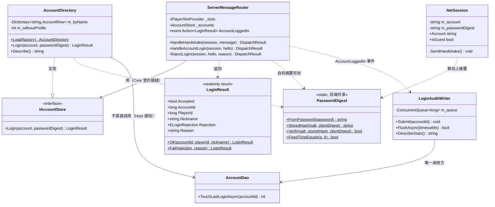
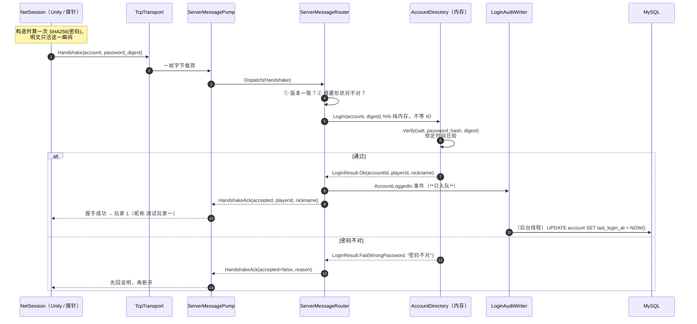

# M4-C · 真正的登录（"你是谁"这件事，终于有了答案）

> 对应切片：**M4-S3 / SRV-06 收口（账号登录：`IAccountStore` + `AccountDirectory` + 登录审计 + 协议新增字段）**
> 留档日期：2026-09-27 · 七段式 · 写法按 `Docs\00` §15.3.1.1「说人话」
> 对应代码：`Server\NBC.Server.Core\IAccountStore.cs`、`Server\NBC.Server.Data\AccountDirectory.cs` / `AccountDao.cs` / `LoginAuditWriter.cs`、`Client\Assets\_Project\Shared\Auth\PasswordDigest.cs`、`Server\NBC.Server.Core\ServerMessageRouter.cs`、`Client\Assets\_Project\Game\Net\NetSession.cs`
> 对应测试：`Server\_net-probe`【十五】**13 条**（共 106）、`Server\_db-probe`【八】**25 条**（共 103）、**跨进程登录 4 条**（`--session=9000 --login=test01:123456`）
> 对应文档：`Docs\27-M4开工清单.md` §十九、`Docs\08c-数据库迁移-M4S3-登录摘要.sql`

---

## ① 问题是什么

SRV-06 之前，玩家的 `player_id` 是**"第几个连上来的"**：

```
第 1 个连上来的 → player_id = 1
断开，再连      → 可能还是 1，也可能是 2（看有没有人占着）
```

这句话听起来像个"临时方案"，但它有**三个具体的后果**，而且都在真实测试里出现过：

| # | 后果 | 现场 |
| --- | --- | --- |
| 1 | **重连换人** | 你打了一局，断开重连，战绩记到了**别人**头上（累计击杀看着不对，但你不会怀疑是"身份变了"） |
| 2 | **名额用完就丢数据** | 4 个档案槽位发完，第 5 个连接拿不到档案 ⇒ 写战绩明细时**被外键拒绝**，而代码选择"跳过并只报一次"（静默） |
| 3 | **同机器两个人分不清** | 两个客户端连上来，服务端只知道"1 号"和"2 号" —— 谁是老板、谁是测试小号，无从判断 |

> ⚠️ 第 2 条最容易骗人：**"第 5 个人之后战绩就不入库了"这件事，界面上一切正常。**
> 它不是崩溃，是"少写了一些数据"。

**为什么 M3 会用这种写法**：那时**根本没有账号系统**，也没有注册流程，
而"战绩要能落库"是 M4 的硬需求（SRV-13）——
`PlayerProfileSlots` 是当时**能在一天内做完**的最小解，它把"名额"和"连接"绑在一起，
**明确记了欠账**（见 `IPlayerSlotProvider` 与 `PlayerProfileDao` 的文件头）。
这一课就是把那个欠账结掉。

---

## ② 最小例子：两种写法

同一件事（"给这个连接一个身份"），两种写法：

```csharp
// ❌ 老：身份来自**连接**（第几个连上来的）
long ClaimSlot() {
    if (_freeSlots.Count > 0) return _freeSlots[0];   // 断开要还回来，否则用完
    return _nextPlayerId++;                            // 还回来可能换人
}

// ✅ 新：身份来自**账号**（你是谁）
LoginResult Login(string account, string digest) {
    AccountRow row = _byName[account];                 // 启动时读进内存的一张表
    if (!PasswordDigest.Verify(row.salt, row.hash, digest))
        return LoginResult.Fail(WrongPassword, $"账号 \"{row.username}\" 的密码不对。");
    return LoginResult.Ok(row.accountId, row.playerId, row.nickname);   // 你自己的档案
}
```

**关键差别不是"多了个密码"，而是"身份挂在哪"**：

| | 老（槽位） | 新（账号） |
| --- | --- | --- |
| 身份属于 | **连接** | **账号** |
| 重连 | 可能换号 | 永远是同一个人 |
| 人数上限 | = 档案数（4） | 与连接数**无关** |
| 断开时要做什么 | **必须 Release**，否则槽位泄漏 | **什么都不用做**（身份不属于连接） |

最后一行最值得记：`Release` 这类"必须记得还"的东西一旦漏了就会静默泄漏。
**能设计成"不需要还"的，就不要设计成"要记得还"。**

---

## ③ 三个坑（这一课最值钱的部分）

### 坑 1：⭐ **一片红的时候，先问"我的尺子准吗"**（阳性对照救了我一次）

我写探针时先立了一条**阳性对照**：

> 库里那 4 行 `password_hash`，用我自己的实现算一遍，**必须逐字符相同**。

第一版跑出来：

```
❌ 真库阳性对照：每个种子账号的 password_hash == SHA256(salt + SHA256("123456"))
      0/4 对得上；第一个不对的：test04：库里 2560cab1…，我算 3d5bdce0…
❌ 真库：test01 + 123456 登录成功 —— 被拒(WrongPassword)：账号 "test01" 的密码不对。
```

**一共 8 条红。**

假如我只写了后面那几条"登录应该成功"，我会看到一片红，然后打开
`AccountDirectory.cs` 一行行看 —— 而**那份代码是对的**。
真凶是**种子数据还是旧配方**（`Docs\08` 当时写的是 `SHA256(salt + 密码)`）。

> 📌 **"先证明 bug 真的存在"有一个镜像用法**：
> 它不只用来证明"我的新检查会红"，它还负责**把"数据不对"和"代码不对"分开**。
> 这两者的表象一模一样（登录失败），修法却完全不同。
> **一片红的时候，第一个该问的问题不是"我哪里写错了"，而是"我的尺子准吗"。**

### 坑 2：**假实现和真实现共用同一份算法 ⇒ 它验不了算法**

`_net-probe` 的假账号表（`FakeAccounts`）**两头都用** `PasswordDigest`：
它自己算一遍"库里该存的值"，再用同一份实现验客户端发来的摘要。

于是我把配方改成 `SHA256(摘要 + salt)`（顺序写反，**真的错了**）：

| 探针 | 结果 | 为什么 |
| --- | --- | --- |
| `_net-probe`【十五】 | **全绿** 😱 | 自己和自己对，永远对得上 |
| `_db-probe`【八】阳性对照 | **立刻红** ✅ | 它对着**真库**里那 4 行逐字符对账 |

> 📌 **写假实现时先问一句**：「它和被测代码**共享**了什么？」
> 共享的那部分就**绝对验不出来** —— 必须另找**外部真源**
> （真库里的行、源 CSV、真 socket 对端、官方工具）。
> 这条已记进 `Docs\00` 的 **W14**。

### 坑 3：**握手在网络泵里 ⇒ 登录绝对不能查库**

登录发生在 `ServerMessagePump` 的握手里，那是**主循环线程、每帧都跑**的地方。
在那里 `await` 一次 MySQL 往返 = **整个服务端卡住**（所有房间、所有玩家一起等这一个人）。

```csharp
// ❌ 这样做整个服务端会跟着一起卡
public DispatchResult HandleHandshake(ClientSession s, ClientMessage m) {
    var row = _db.QueryAsync("SELECT ...").GetAwaiter().GetResult();   // 主循环里等 IO
}

// ✅ 启动时读进内存，握手只在内存里比一次摘要
private readonly Dictionary<string, AccountRow> _byName;   // Load() 一次填好，之后只读
```

**代价（如实记录）**：**新注册的账号要重启服务端才认**。
这是刻意的取舍 —— M4 还没有注册流程，多加一套缓存失效机制是**没人用的复杂度**；
而且它和上一版的槽位表是**同一套理由**，不是新发明的例外。

> ⚠️ 注意"启动时可以阻塞"这条**不是双标**：
> `Program.cs` 里那句 `.GetAwaiter().GetResult()` 发生在**主循环之前**，
> 几百毫秒换来"启动横幅明说账号能不能登、战绩能不能落库"，是划算的。
> **判据是"这段代码跑在哪条时间线上"，不是"有没有用同步等待"。**

---

## ④ 改造后的做法

### 4.1 四块拼图，各管一段

| 组件 | 住在哪 | 只管一件事 |
| --- | --- | --- |
| `IAccountStore`（接缝） | `NBC.Server.Core` | 声明"账号 → 玩家身份"这件事**长什么样**（同步、只查内存） |
| `AccountDirectory`（实现） | `NBC.Server.Data` | 启动时一次 `account JOIN player_profile` 读进内存；登录时比摘要 |
| `AccountDao`（写） | `NBC.Server.Data` | 只写 `last_login_at = NOW()` |
| `LoginAuditWriter`（排队写） | `NBC.Server.Data` | 入队 + 单飞排空（**握手里绝不等它**） |

> 📌 为什么接缝在 Core、实现在 Data：**网络层不许认识 MySQL**。
> 这与 `IPlayerSlotProvider` 是同一套手法（见 `M4-B` 的坑 3）。

### 4.2 配方是**契约**：一份实现，两端编译

```csharp
// Client\Assets\_Project\Shared\Auth\PasswordDigest.cs —— 双端**同一份源码**
public static string FromPassword(string password)                    // 客户端：明文 → 线上摘要
    => Hex(Sha256(Encoding.UTF8.GetBytes(password)));

public static string StoredHash(string salt, string clientDigest)     // 服务端：摘要 + salt → 入库值
    => Hex(Sha256(Encoding.UTF8.GetBytes(salt + clientDigest)));
```

- 线上**不出现明文密码**（客户端先算一次摘要）。
- 服务端**不存**能直接登录的凭据（还叠了每账号独立的 salt）。
- 比较用**恒定时间**（`FixedTimeEquals`）—— 普通字符串比较"发现不同就返回"，
  会泄漏"前几个字符猜对了"。

> ⚠️ **改配方要连带改种子数据**：`Docs\08` 的 4 行 + `Docs\08c` 迁移。
> 而"有没有改漏"由**阳性对照**盯着 —— 这正是坑 1 的价值。

### 4.3 协议只加字段，不动版本号

```proto
message Handshake {
    int32  protocol_version = 1;
    string client_version   = 2;
    string player_name      = 3;
    string account          = 4;   // 留空 = 游客（老客户端一字不改）
    string password_digest  = 5;
}
message HandshakeAck {
    ...
    string nickname         = 7;   // 服务端认定的显示名
}
```

proto3 里**未知字段会被忽略**，所以：老客户端 → 游客；老服务端 → 也当游客。
⇒ `CONTRACT_VERSION` **保持 1**（判据：只有删字段 / 改类型 / 改语义才 +1）。

### 4.4 身份**不许静默降级**

```csharp
if (!string.IsNullOrEmpty(hello.Account))
    return HandleAccountLogin(session, hello);   // 给了账号 ⇒ 必须登进去，失败就拒
// 否则才是游客（走老路）
```

- 没接数据库时：**明确拒绝**并说明下一步（"留空用游客 / 设 `NBC_DB_PASSWORD`"），
  **不是**"那就当游客吧" —— 那会让玩家以为自己登录了，战绩却记到别人头上。
- 密码错、账号不存在、没有档案：**三种原因分开说**（本项目的取舍，见 §4.5）。
- 摘要**没有任何出口**：不进日志、不进拒绝理由、不进 `LoginResult`。

### 4.5 ⚠️ 取舍（写清楚，别装）

**没做到的**：
1. **没有 TLS** ⇒ 抓到线上那个摘要就能**重放**（等于临时密码）。
2. 客户端摘要**未加盐**（就是 `SHA256(密码)`）⇒ 弱密码仍可能被彩虹表反查。
3. 没有失败次数限制 / 没有验证码 / 没有会话令牌。
4. **"账号不存在"和"密码不对"分开说** = 白送一个账号枚举接口。
   真实系统应当合并成一句"账号或密码不对"；本项目选"说人话"，
   因为它是**本机演示**，而负责人要能一眼分清"用户名打错了"还是"密码打错了"。

**真正的做法**：TLS + 挑战应答（nonce）+ 服务端慢哈希（PBKDF2/Argon2/bcrypt）。
**本切片刻意不做** —— 它的目标是"身份属于账号"，不是"做一套能上线的账号系统"。
把没做到的部分写出来，比装作做到了更可信。

---

## ⑤ 自测 5 问

1. **登录为什么不能查库？** 它在网络泵的握手里跑，那是主循环线程、每帧都跑 —— 等一次 IO 会把整个服务端（所有房间）一起卡住。
2. **"新账号要重启服务端才认"是不是 bug？** 不是，是取舍：启动时读一次内存。理由与槽位表相同（没有注册流程，缓存失效机制是没人用的复杂度），且写进了 `Describe()`/文档。
3. **为什么接缝在 Core、实现在 Data？** 网络层不许认识 MySQL。反过来（把 `IAccountStore` 放 Data）会让 Core 反过来依赖 Data，直接成环。
4. **为什么用 `OrdinalIgnoreCase` 而不是区分大小写？** 因为库里的 `username` 是 `utf8mb4_general_ci` 的 UNIQUE —— MySQL 眼里 `Test01` 和 `test01` 是同一个账号。内存里若区分大小写，就会出现**「库里查得到、内存里查不到」**这种最难查的不一致。
5. **`LoginAuditWriter` 和 `BattleRecordWriter` 长得一样，为什么不抽公共基类？** 它们的**载荷**和**失败语义**都不同，硬抽只会让两边都难读。"看起来像"不等于"应该共用" —— 判断依据是**将来会不会一起改**。

---

## ⑥ 你 30 秒能做的验证

```powershell
# ① 真库：配方阳性对照 + 登录（103 条；需要 NBC_DB_PASSWORD）
$env:NBC_DB_PASSWORD = [Environment]::GetEnvironmentVariable("NBC_DB_PASSWORD","User")
dotnet run --project Server\_db-probe\DbProbe.csproj -m:1

# ② 进程内（真 socket，不碰数据库；106 条）
dotnet run --project Server\_net-probe\NetProbe.csproj -m:1

# ③ 跨进程：真客户端 → 真 Host → 真库（服务端要先在 9000 上跑着）
dotnet run --project Server\_net-probe\NetProbe.csproj -m:1 -- --session=9000 --login=test01:123456

# ④ 库里有没有留下"登录过"的证据（这才是"真的写进去了"的凭据）
mysql -u root -p -e "SELECT username, last_login_at FROM nbc_db.account;"
```

Unity 里那一步（点按钮）：见 `Docs\27` §19.0 —— 填 `test01` / `123456` 连接，
看 `playerId = 1`、昵称"测试玩家一"，断开重连**还是 1**，密码打错要看到"密码不对"。

---

## ⑦ 面试一分钟版本

> "我们的 `player_id` 一开始是**第几个连上来的**，所以断开重连就可能换人 ——
> 战绩会记到别人头上，而且第 5 个连上来的人干脆写不进库（外键拒绝后被跳过，界面上看不出来）。
>
> 我把身份从**连接**改成了**账号**：客户端先算一次密码摘要再上线（明文不过网络），
> 服务端把摘要叠上 salt 入库；账号表在**启动时一次 JOIN 读进内存**，
> 所以握手是纯内存比较 —— 登录在网络泵里跑，**绝对不能在那里等数据库**。
> 代价是新注册的账号要重启服务端才认，这是刻意取舍，和上一版槽位表同一套理由。
>
> 有两件事我觉得比代码更值得说：
> 一是我给种子数据立了**阳性对照**，第一版跑出来 8 条红 ——
> 但真凶是**数据还是旧配方**，代码是对的。**一片红的时候先问自己的尺子准不准。**
> 二是**假实现如果和被测代码共用同一份算法，它就验不了算法**：
> 我故意把配方顺序写反，进程内探针照样全绿，只有对着真库对账的那条红了。
> 所以'算法对不对'这类判据，必须用**外部真源**。"

---

## ⑧ 补丁（同日）：**游客不落库** —— 以及一个差点交付的哨兵 bug

> SRV-17a。加进这一课的理由：它和"身份"是同一件事的两半 ——
> 前面讲"登录的人是谁"，这一节讲"**没登录的人算什么**"。

### 8.1 问题：游客拿的是**账号的**档案号

登录做完之后，回头一看发现旧账：游客的 `player_id` 来自 `PlayerProfileSlots`
（"领一个空闲档案槽位"），发出去的是 **1、2、3…** ——
而那恰好是 `player_profile` 里**4 个账号的档案 id**。

```
游客打一局 → 结算 → 写 battle_player_detail(player_id=1) → total_kill 从 12 涨到 24
                                                     ↑ 这是 test01 的档案
```

**这是真实发生过的污染**，而且完全静默：界面正常，只有对着 `Docs\08` 的种子值才发现不对。

### 8.2 修法：**负数 = 游客**（一条约定，三个好处）

```csharp
// 游客分支
session.PlayerId = _nextGuestId--;    // -1, -2, -3, …
```

| 好处 | 为什么 |
| --- | --- |
| **取值不相交** | 账号恒 `> 0`、游客恒 `< 0` ⇒ 永远撞不上 |
| **不需要"还"** | 身份属于**连接**，连接没了就没了（旧写法漏一次 `Release` 就永久泄漏槽位） |
| **落库被结构性挡住** | 三个外键（明细/进度/台账）都指向 `player_profile`，负数在那里不存在 |

同时**删除**了 `IPlayerSlotProvider` / `PlayerProfileSlots` / `PlayerProfileDao` ——
不是注释掉，是删掉：**留着它等于留着一个 bug 源**（"不需要还的设计"比"要记得别用"强）。

### 8.3 ⭐ 坑：**改了取值范围 ⇒ 所有"拿 0 当哨兵"的地方全是 bug**

改完之后 `_net-probe` **立刻红了 3 条**：

```
❌ 一局里的怪数量 = Dungeon 表写的数量 —— 怪 4 只，英雄 0 个
❌ A 一直往右按 → A 的英雄往右走 —— A 没有英雄
```

**根因不在新代码。** 服务端有 5 处拿 `player_id` 和 0 比大小，而它们想表达的是**三件事**：

| 想表达 | 正确写法 | 原来的写法 | 后果 |
| --- | --- | --- | --- |
| 「这是**某个玩家**的实体」（0 = 无主） | `!= 0` | `> 0` | 游客的伤害/击杀**一条都不记** |
| 「这个席位**还没有身份**」 | `== 0` | `<= 0` | 游客**建不出英雄**、他的英雄**永远移不出世界** |
| 「按玩家 id 找席位」 | `== 0` | `<= 0` | 找不到游客的席位 ⇒ 以为他走了 ⇒ 英雄反复移出/重建 |

```csharp
// ❌ 旧（默认了"不存在非正值"，这个前提已经不成立）
if (playerId <= 0) { continue; }              // 游客的输入全被丢
// ✅ 新（只有一个意思：还没有身份）
if (playerId == 0) { continue; }
```

> 📌 **判据（`Docs\00` W15）**：**改一个字段的取值范围之前，先 grep 出所有拿它和 0 比较的地方，
> 逐个问"这里想表达的是哪一个意思"。**
>
> 这类 bug 三连：**编译通过** / **不报错** / **只在"新取值"这条路径上出现** ——
> 老路径（登录玩家，正数）全好，所以第一反应往往是"我是不是改坏了别的地方"。
> ⭐ 这次是**探针当场抓住的**：这正是"改完立刻跑全量探针"的价值。

### 8.4 两类"没写进去"必须分开报

| 情况 | 含义 | 日志 |
| --- | --- | --- |
| `player_id < 0` | 游客，**设计如此** | `游客 N 人按设计不记明细`（平静） |
| `player_id > 0` 却查不到档案 | ⚠️ **数据不一致** | `❌ 有 N 个玩家的战绩没写进库`（要响） |

> 不分的话，"游客不记明细"（每局都有）会把"某人的战绩丢了"（故障）**淹掉**。
> 同一个道理在 `Docs\00` 里有另一条：**同一句日志不许同时表示正常和故障**。

### 8.5 自测（本补丁）

| 验证 | 结果 |
| --- | --- |
| `_net-probe` | **113 全绿**（106 → 113：游客 id 断言改负数 + 反向对照"登录玩家必须正数" + 草稿里"游客如实记账" 4 条） |
| `_db-probe` | **103 全绿**（槽位 11 条退役、游客不落库 11 条补上 —— ⚠️ **总数没变**） |
| 变异：DAO 不再单独分流游客 | `_db-probe` **红 1 条** |
| 变异：英雄生成判据改回 `<= 0` | `_net-probe` **红 3 条**（就是 8.3 那三条） |
| 变异：记账判据改回 `PlayerId > 0` | `_net-probe` **红 1 条**（草稿里游客的击杀变成 0） |

⚠️ **诚实说明**：`_db-probe` 的**总数一样**（103 → 103），但内容换了 11 条。
**数一样不代表内容一样 —— 别用总数当判据。**

---

## 附 · 类图与数据流（2026-09-27 补）

### 类图：接缝在 Core，实现分居 Data；配方在共享层



> ⚠️ 图里三个**方向**是刻意画的：
> ① `IAccountStore` 在 **Core**（网络层不许认识 MySQL）；
> ② `AccountDirectory` **实现**它在 Data；
> ③ **配方在共享层**，两端编**同一份源码**（`NBC.Shared`）。
> 最后一条是"两端算出的字符串必须逐字符相同"这件事的**结构性**保证 ——
> 靠"两边都别写错"是保证不了的。

### 时序图：一次跨进程登录（真客户端 → 真 Host → 真库）



> 📌 图里那个 `W->>DB` 是**虚线之外的另一次执行**：它跑在别的线程上。
> 这正是 `LoginAuditWriter` 存在的理由 —— **握手里只允许入队**。
